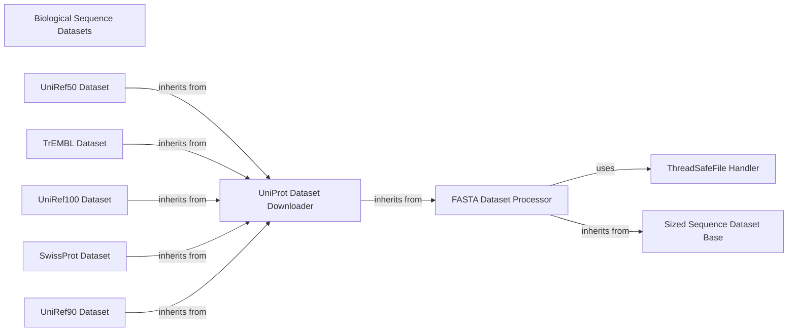

## Component Details

This graph represents the 'Biological Sequence Datasets' subsystem, which is designed to provide specialized datasets for protein sequences, including large-scale databases like UniProt and general FASTA files. The main flow involves the efficient reading, indexing, and retrieval of sequence data, with a focus on handling large files and ensuring thread-safe operations. The system is built upon a hierarchical structure, starting from a base for sized sequences, extending to a FASTA file processor, and further specializing for UniProt data and its various subsets.

### Biological Sequence Datasets
Provides specialized datasets for protein sequences, including large-scale databases like UniProt and general FASTA files, with functionalities for indexing and efficient retrieval.

**Related Classes/Methods**:

- <a href="https://github.com/Genentech/beignet/blob/master/src/beignet/datasets/_uniref50_dataset.py#L9-L39" target="_blank" rel="noopener noreferrer">`beignet.src.beignet.datasets._uniref50_dataset.UniRef50Dataset` (9:39)</a>
- <a href="https://github.com/Genentech/beignet/blob/master/src/beignet/datasets/_uniprot_dataset.py#L13-L79" target="_blank" rel="noopener noreferrer">`beignet.src.beignet.datasets._uniprot_dataset.UniProtDataset` (13:79)</a>
- <a href="https://github.com/Genentech/beignet/blob/master/src/beignet/datasets/_trembl_dataset.py#L9-L39" target="_blank" rel="noopener noreferrer">`beignet.src.beignet.datasets._trembl_dataset.TrEMBLDataset` (9:39)</a>
- <a href="https://github.com/Genentech/beignet/blob/master/src/beignet/datasets/_uniref100_dataset.py#L8-L38" target="_blank" rel="noopener noreferrer">`beignet.src.beignet.datasets._uniref100_dataset.UniRef100Dataset` (8:38)</a>
- <a href="https://github.com/Genentech/beignet/blob/master/src/beignet/datasets/_swissprot_dataset.py#L9-L39" target="_blank" rel="noopener noreferrer">`beignet.src.beignet.datasets._swissprot_dataset.SwissProtDataset` (9:39)</a>
- <a href="https://github.com/Genentech/beignet/blob/master/src/beignet/datasets/_uniref90_dataset.py#L8-L38" target="_blank" rel="noopener noreferrer">`beignet.src.beignet.datasets._uniref90_dataset.UniRef90Dataset` (8:38)</a>
- <a href="https://github.com/Genentech/beignet/blob/master/src/beignet/datasets/_fasta_dataset.py#L16-L103" target="_blank" rel="noopener noreferrer">`beignet.src.beignet.datasets._fasta_dataset.FASTADataset` (16:103)</a>
- <a href="https://github.com/Genentech/beignet/blob/master/src/beignet/datasets/_fasta_dataset.py#L69-L103" target="_blank" rel="noopener noreferrer">`beignet.src.beignet.datasets._fasta_dataset.FASTADataset._build_index` (69:103)</a>
- <a href="https://github.com/Genentech/beignet/blob/master/src/beignet/datasets/_fasta_dataset.py#L57-L67" target="_blank" rel="noopener noreferrer">`beignet.src.beignet.datasets._fasta_dataset.FASTADataset.get` (57:67)</a>
- <a href="https://github.com/Genentech/beignet/blob/master/src/beignet/datasets/_sized_sequence_dataset.py#L8-L21" target="_blank" rel="noopener noreferrer">`beignet.src.beignet.datasets._sized_sequence_dataset.SizedSequenceDataset` (8:21)</a>

### ThreadSafeFile Handler
Provides a mechanism to safely share file objects across multiple threads, ensuring that file operations are synchronized and thread-local.

**Related Classes/Methods**:

- <a href="https://github.com/Genentech/beignet/blob/master/src/beignet/io/_thread_safe_file.py#L9-L56" target="_blank" rel="noopener noreferrer">`beignet.io._thread_safe_file.ThreadSafeFile` (9:56)</a>

### Sized Sequence Dataset Base
An abstract base class for sequence datasets that explicitly manage the sizes of sequences, providing a common interface for length-aware sequence data.

**Related Classes/Methods**:

- <a href="https://github.com/Genentech/beignet/blob/master/src/beignet/datasets/_sized_sequence_dataset.py#L8-L21" target="_blank" rel="noopener noreferrer">`beignet.src.beignet.datasets._sized_sequence_dataset.SizedSequenceDataset` (8:21)</a>
- <a href="https://github.com/Genentech/beignet/blob/master/src/beignet/datasets/_sized_sequence_dataset.py#L9-L18" target="_blank" rel="noopener noreferrer">`beignet.src.beignet.datasets._sized_sequence_dataset.SizedSequenceDataset:__init__` (9:18)</a>

### FASTA Dataset Processor
Manages the reading, indexing, and retrieval of sequences from FASTA formatted files, including building an internal index for efficient access.

**Related Classes/Methods**:

- <a href="https://github.com/Genentech/beignet/blob/master/src/beignet/datasets/_fasta_dataset.py#L16-L103" target="_blank" rel="noopener noreferrer">`beignet.src.beignet.datasets._fasta_dataset.FASTADataset` (16:103)</a>
- <a href="https://github.com/Genentech/beignet/blob/master/src/beignet/datasets/_fasta_dataset.py#L17-L44" target="_blank" rel="noopener noreferrer">`beignet.src.beignet.datasets._fasta_dataset.FASTADataset:__init__` (17:44)</a>
- <a href="https://github.com/Genentech/beignet/blob/master/src/beignet/datasets/_fasta_dataset.py#L46-L52" target="_blank" rel="noopener noreferrer">`beignet.src.beignet.datasets._fasta_dataset.FASTADataset:__getitem__` (46:52)</a>
- <a href="https://github.com/Genentech/beignet/blob/master/src/beignet/datasets/_fasta_dataset.py#L69-L103" target="_blank" rel="noopener noreferrer">`beignet.src.beignet.datasets._fasta_dataset.FASTADataset._build_index` (69:103)</a>
- <a href="https://github.com/Genentech/beignet/blob/master/src/beignet/datasets/_fasta_dataset.py#L57-L67" target="_blank" rel="noopener noreferrer">`beignet.src.beignet.datasets._fasta_dataset.FASTADataset.get` (57:67)</a>

### UniProt Dataset Downloader
Extends the FASTA dataset functionality to specifically handle UniProt data, including downloading files from specified URLs using pooch and decompressing them.

**Related Classes/Methods**:

- <a href="https://github.com/Genentech/beignet/blob/master/src/beignet/datasets/_uniprot_dataset.py#L13-L79" target="_blank" rel="noopener noreferrer">`beignet.src.beignet.datasets._uniprot_dataset.UniProtDataset` (13:79)</a>
- <a href="https://github.com/Genentech/beignet/blob/master/src/beignet/datasets/_uniprot_dataset.py#L14-L68" target="_blank" rel="noopener noreferrer">`beignet.src.beignet.datasets._uniprot_dataset.UniProtDataset:__init__` (14:68)</a>
- <a href="https://github.com/Genentech/beignet/blob/master/src/beignet/datasets/_uniprot_dataset.py#L70-L79" target="_blank" rel="noopener noreferrer">`beignet.src.beignet.datasets._uniprot_dataset.UniProtDataset:__getitem__` (70:79)</a>

### UniRef50 Dataset
A specialized dataset for UniRef50 protein clusters, inheriting core functionalities from the UniProt Dataset Downloader for data handling and retrieval.

**Related Classes/Methods**:

- <a href="https://github.com/Genentech/beignet/blob/master/src/beignet/datasets/_uniref50_dataset.py#L9-L39" target="_blank" rel="noopener noreferrer">`beignet.src.beignet.datasets._uniref50_dataset.UniRef50Dataset` (9:39)</a>
- <a href="https://github.com/Genentech/beignet/blob/master/src/beignet/datasets/_uniref50_dataset.py#L10-L39" target="_blank" rel="noopener noreferrer">`beignet.src.beignet.datasets._uniref50_dataset.UniRef50Dataset:__init__` (10:39)</a>

### TrEMBL Dataset
A specialized dataset for TrEMBL protein sequences, inheriting core functionalities from the UniProt Dataset Downloader for data handling and retrieval.

**Related Classes/Methods**:

- <a href="https://github.com/Genentech/beignet/blob/master/src/beignet/datasets/_trembl_dataset.py#L9-L39" target="_blank" rel="noopener noreferrer">`beignet.src.beignet.datasets._trembl_dataset.TrEMBLDataset` (9:39)</a>
- <a href="https://github.com/Genentech/beignet/blob/master/src/beignet/datasets/_trembl_dataset.py#L10-L39" target="_blank" rel="noopener noreferrer">`beignet.src.beignet.datasets._trembl_dataset.TrEMBLDataset:__init__` (10:39)</a>

### UniRef100 Dataset
A specialized dataset for UniRef100 protein clusters, inheriting core functionalities from the UniProt Dataset Downloader for data handling and retrieval.

**Related Classes/Methods**:

- <a href="https://github.com/Genentech/beignet/blob/master/src/beignet/datasets/_uniref100_dataset.py#L8-L38" target="_blank" rel="noopener noreferrer">`beignet.src.beignet.datasets._uniref100_dataset.UniRef100Dataset` (8:38)</a>
- <a href="https://github.com/Genentech/beignet/blob/master/src/beignet/datasets/_uniref100_dataset.py#L9-L38" target="_blank" rel="noopener noreferrer">`beignet.src.beignet.datasets._uniref100_dataset.UniRef100Dataset:__init__` (9:38)</a>

### SwissProt Dataset
A specialized dataset for SwissProt protein sequences, inheriting core functionalities from the UniProt Dataset Downloader for data handling and retrieval.

**Related Classes/Methods**:

- <a href="https://github.com/Genentech/beignet/blob/master/src/beignet/datasets/_swissprot_dataset.py#L9-L39" target="_blank" rel="noopener noreferrer">`beignet.src.beignet.datasets._swissprot_dataset.SwissProtDataset` (9:39)</a>
- <a href="https://github.com/Genentech/beignet/blob/master/src/beignet/datasets/_swissprot_dataset.py#L10-L39" target="_blank" rel="noopener noreferrer">`beignet.src.beignet.datasets._swissprot_dataset.SwissProtDataset:__init__` (10:39)</a>

### UniRef90 Dataset
A specialized dataset for UniRef90 protein clusters, inheriting core functionalities from the UniProt Dataset Downloader for data handling and retrieval.

**Related Classes/Methods**:

- <a href="https://github.com/Genentech/beignet/blob/master/src/beignet/datasets/_uniref90_dataset.py#L8-L38" target="_blank" rel="noopener noreferrer">`beignet.src.beignet.datasets._uniref90_dataset.UniRef90Dataset` (8:38)</a>
- <a href="https://github.com/Genentech/beignet/blob/master/src/beignet/datasets/_uniref90_dataset.py#L9-L38" target="_blank" rel="noopener noreferrer">`beignet.src.beignet.datasets._uniref90_dataset.UniRef90Dataset:__init__` (9:38)</a>

### [FAQ](https://github.com/CodeBoarding/GeneratedOnBoardings/tree/main?tab=readme-ov-file#faq)