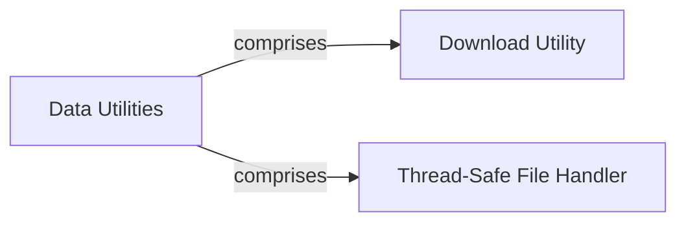

## Component Details

This graph illustrates the `Data Utilities` component, which serves as a foundational layer for data input/output operations. It encompasses functionalities for downloading and extracting external data dependencies through the `Download Utility` and ensures safe concurrent file access via the `Thread-Safe File Handler`. These utilities are crucial for various dataset components, enabling them to efficiently manage and access their underlying data.

### Data Utilities
Provides essential low-level utilities for data input/output, including downloading files, extracting archives, and ensuring thread-safe file access, crucial for managing external data dependencies.

**Related Classes/Methods**:

- `beignet.io.download_and_extract_archive` (full file reference)
- `beignet.io.download` (full file reference)
- <a href="https://github.com/Genentech/beignet/blob/master/src/beignet/io/_thread_safe_file.py#L9-L56" target="_blank" rel="noopener noreferrer">`beignet.io._thread_safe_file.ThreadSafeFile` (9:56)</a>

### Download Utility
This component encapsulates functionalities related to downloading files and extracting archives from various sources (URLs, S3).

**Related Classes/Methods**:

- `beignet.io.download_and_extract_archive` (full file reference)
- `beignet.io.download` (full file reference)

### Thread-Safe File Handler
A utility class that provides a thread-safe way to access file objects by storing them in thread-local storage. This prevents issues when multiple threads try to access the same file.

**Related Classes/Methods**:

- <a href="https://github.com/Genentech/beignet/blob/master/src/beignet/io/_thread_safe_file.py#L9-L56" target="_blank" rel="noopener noreferrer">`beignet.io._thread_safe_file.ThreadSafeFile` (9:56)</a>

### [FAQ](https://github.com/CodeBoarding/GeneratedOnBoardings/tree/main?tab=readme-ov-file#faq)