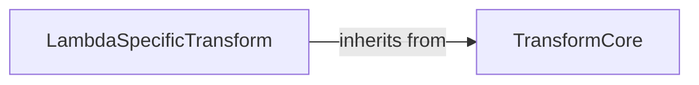

## Component Details

This subsystem provides a flexible framework for defining and applying various data transformations. It includes a core `Transform` class that establishes a common interface for transformations, handling input validation and parameter management. Building upon this foundation, specific transformations like `Lambda` are implemented, allowing users to apply custom functions to data.

### TransformCore
This component represents the foundational framework for defining and applying generic transformations to various data types, providing a base `Transform` class with mechanisms for input validation and parameter handling.

**Related Classes/Methods**:

- <a href="https://github.com/Genentech/beignet/blob/master/src/beignet/transforms/_transform.py#L11-L195" target="_blank" rel="noopener noreferrer">`beignet.src.beignet.transforms._transform.Transform` (11:195)</a>
- <a href="https://github.com/Genentech/beignet/blob/master/src/beignet/transforms/_transform.py#L25-L32" target="_blank" rel="noopener noreferrer">`beignet.src.beignet.transforms._transform.Transform._check_inputs` (25:32)</a>
- <a href="https://github.com/Genentech/beignet/blob/master/src/beignet/transforms/_transform.py#L113-L171" target="_blank" rel="noopener noreferrer">`beignet.src.beignet.transforms._transform.Transform._transformables` (113:171)</a>
- <a href="https://github.com/Genentech/beignet/blob/master/src/beignet/transforms/_transform.py#L34-L46" target="_blank" rel="noopener noreferrer">`beignet.src.beignet.transforms._transform.Transform._get_params` (34:46)</a>
- <a href="https://github.com/Genentech/beignet/blob/master/src/beignet/transforms/_transform.py#L48-L70" target="_blank" rel="noopener noreferrer">`beignet.src.beignet.transforms._transform.Transform._transform` (48:70)</a>
- <a href="https://github.com/Genentech/beignet/blob/master/src/beignet/transforms/_transform.py#L72-L111" target="_blank" rel="noopener noreferrer">`beignet.src.beignet.transforms._transform.Transform.forward` (72:111)</a>
- <a href="https://github.com/Genentech/beignet/blob/master/src/beignet/transforms/_transform.py#L22-L23" target="_blank" rel="noopener noreferrer">`beignet.src.beignet.transforms._transform.Transform.__init__` (22:23)</a>

### LambdaSpecificTransform
This component implements a specific type of transformation using a user-provided lambda function, extending the `Transform` class to apply the given function to the input.

**Related Classes/Methods**:

- <a href="https://github.com/Genentech/beignet/blob/master/src/beignet/transforms/_lambda.py#L6-L70" target="_blank" rel="noopener noreferrer">`beignet.src.beignet.transforms._lambda.Lambda` (6:70)</a>
- <a href="https://github.com/Genentech/beignet/blob/master/src/beignet/transforms/_lambda.py#L9-L26" target="_blank" rel="noopener noreferrer">`beignet.src.beignet.transforms._lambda.Lambda.__init__` (9:26)</a>
- <a href="https://github.com/Genentech/beignet/blob/master/src/beignet/transforms/_lambda.py#L28-L49" target="_blank" rel="noopener noreferrer">`beignet.src.beignet.transforms._lambda.Lambda._transform` (28:49)</a>

### [FAQ](https://github.com/CodeBoarding/GeneratedOnBoardings/tree/main?tab=readme-ov-file#faq)