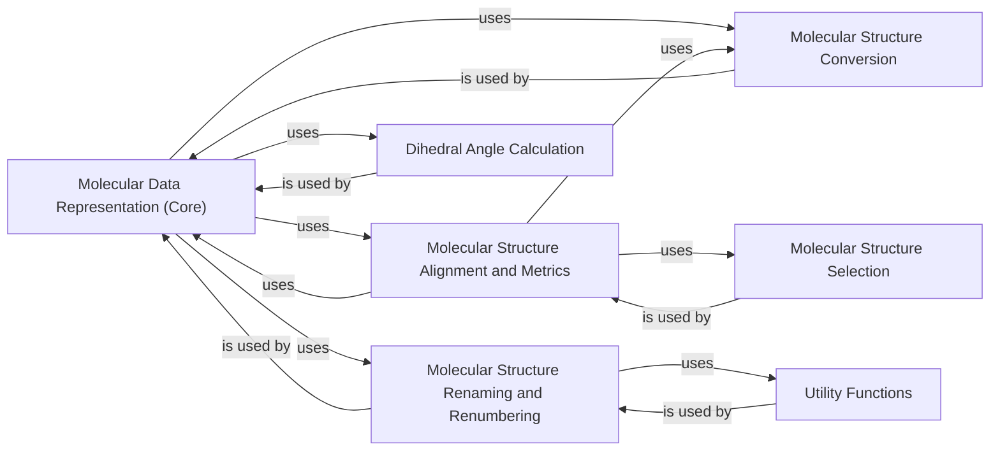

## Component Details

This graph describes the 'Molecular Data Management' subsystem, which is responsible for representing, converting, and manipulating molecular structural data. The core functionality revolves around the `Molecular Data Representation (Core)` component, which handles fundamental data structures like `ResidueArray` and `Rigid`, along with I/O operations. Other components provide specialized functionalities such as `Molecular Structure Conversion` between different atom representations, `Molecular Structure Alignment and Metrics` for structural comparisons, `Molecular Structure Selection` for targeting specific parts of a molecule, and `Molecular Structure Renaming and Renumbering` for modifying structural identifiers. `Dihedral Angle Calculation` is a specific structural analysis tool, and `Utility Functions` provide general support.

### Molecular Data Representation (Core)
This core component defines the fundamental data structures for representing molecular information, primarily `ResidueArray` for sequences and coordinates, and `Rigid` for rigid body transformations. It provides methods for creating, manipulating, and converting between different molecular representations, including I/O operations for PDB and MMCIF formats.

**Related Classes/Methods**:

- <a href="https://github.com/Genentech/beignet/blob/master/src/beignet/structure/_residue_array.py#L47-L488" target="_blank" rel="noopener noreferrer">`beignet.src.beignet.structure._residue_array.ResidueArray` (47:488)</a>
- <a href="https://github.com/Genentech/beignet/blob/master/src/beignet/structure/_residue_array.py#L93-L110" target="_blank" rel="noopener noreferrer">`beignet.src.beignet.structure._residue_array.ResidueArray.sequence` (93:110)</a>
- <a href="https://github.com/Genentech/beignet/blob/master/src/beignet/structure/_residue_array.py#L117-L124" target="_blank" rel="noopener noreferrer">`beignet.src.beignet.structure._residue_array.ResidueArray.backbone_dihedrals` (117:124)</a>
- <a href="https://github.com/Genentech/beignet/blob/master/src/beignet/structure/_residue_array.py#L127-L175" target="_blank" rel="noopener noreferrer">`beignet.src.beignet.structure._residue_array.ResidueArray.from_sequence` (127:175)</a>
- <a href="https://github.com/Genentech/beignet/blob/master/src/beignet/structure/_residue_array.py#L178-L186" target="_blank" rel="noopener noreferrer">`beignet.src.beignet.structure._residue_array.ResidueArray.from_chain_sequences` (178:186)</a>
- <a href="https://github.com/Genentech/beignet/blob/master/src/beignet/structure/_residue_array.py#L189-L204" target="_blank" rel="noopener noreferrer">`beignet.src.beignet.structure._residue_array.ResidueArray.from_atom_array` (189:204)</a>
- <a href="https://github.com/Genentech/beignet/blob/master/src/beignet/structure/_residue_array.py#L206-L221" target="_blank" rel="noopener noreferrer">`beignet.src.beignet.structure._residue_array.ResidueArray.to_atom_array` (206:221)</a>
- <a href="https://github.com/Genentech/beignet/blob/master/src/beignet/structure/_residue_array.py#L224-L240" target="_blank" rel="noopener noreferrer">`beignet.src.beignet.structure._residue_array.ResidueArray.from_pdb` (224:240)</a>
- <a href="https://github.com/Genentech/beignet/blob/master/src/beignet/structure/_residue_array.py#L243-L260" target="_blank" rel="noopener noreferrer">`beignet.src.beignet.structure._residue_array.ResidueArray.from_mmcif` (243:260)</a>
- <a href="https://github.com/Genentech/beignet/blob/master/src/beignet/structure/_residue_array.py#L263-L280" target="_blank" rel="noopener noreferrer">`beignet.src.beignet.structure._residue_array.ResidueArray.from_bcif` (263:280)</a>
- <a href="https://github.com/Genentech/beignet/blob/master/src/beignet/structure/_residue_array.py#L283-L359" target="_blank" rel="noopener noreferrer">`beignet.src.beignet.structure._residue_array.ResidueArray._from_cif` (283:359)</a>
- <a href="https://github.com/Genentech/beignet/blob/master/src/beignet/structure/_residue_array.py#L380-L389" target="_blank" rel="noopener noreferrer">`beignet.src.beignet.structure._residue_array.ResidueArray.to_pdb` (380:389)</a>
- <a href="https://github.com/Genentech/beignet/blob/master/src/beignet/structure/_residue_array.py#L391-L402" target="_blank" rel="noopener noreferrer">`beignet.src.beignet.structure._residue_array.ResidueArray.to_mmcif` (391:402)</a>
- <a href="https://github.com/Genentech/beignet/blob/master/src/beignet/structure/_residue_array.py#L404-L412" target="_blank" rel="noopener noreferrer">`beignet.src.beignet.structure._residue_array.ResidueArray.to_pdb_string` (404:412)</a>
- <a href="https://github.com/Genentech/beignet/blob/master/src/beignet/structure/_residue_array.py#L414-L419" target="_blank" rel="noopener noreferrer">`beignet.src.beignet.structure._residue_array.ResidueArray.pad_to_target_length` (414:419)</a>
- <a href="https://github.com/Genentech/beignet/blob/master/src/beignet/structure/_residue_array.py#L431-L434" target="_blank" rel="noopener noreferrer">`beignet.src.beignet.structure._residue_array.ResidueArray.renumber` (431:434)</a>
- <a href="https://github.com/Genentech/beignet/blob/master/src/beignet/structure/_residue_array.py#L436-L442" target="_blank" rel="noopener noreferrer">`beignet.src.beignet.structure._residue_array.ResidueArray.renumber_from_gapped` (436:442)</a>
- <a href="https://github.com/Genentech/beignet/blob/master/src/beignet/structure/_residue_array.py#L444-L457" target="_blank" rel="noopener noreferrer">`beignet.src.beignet.structure._residue_array.ResidueArray.superimpose` (444:457)</a>
- <a href="https://github.com/Genentech/beignet/blob/master/src/beignet/structure/_residue_array.py#L459-L470" target="_blank" rel="noopener noreferrer">`beignet.src.beignet.structure._residue_array.ResidueArray.rmsd` (459:470)</a>
- <a href="https://github.com/Genentech/beignet/blob/master/src/beignet/structure/_residue_array.py#L472-L473" target="_blank" rel="noopener noreferrer">`beignet.src.beignet.structure._residue_array.ResidueArray.rename_chains` (472:473)</a>
- <a href="https://github.com/Genentech/beignet/blob/master/src/beignet/structure/_residue_array.py#L492-L495" target="_blank" rel="noopener noreferrer">`beignet.src.beignet.structure._residue_array.cat` (492:495)</a>
- <a href="https://github.com/Genentech/beignet/blob/master/src/beignet/structure/_residue_array.py#L499-L502" target="_blank" rel="noopener noreferrer">`beignet.src.beignet.structure._residue_array.stack` (499:502)</a>
- <a href="https://github.com/Genentech/beignet/blob/master/src/beignet/structure/_residue_array.py#L506-L509" target="_blank" rel="noopener noreferrer">`beignet.src.beignet.structure._residue_array.unbind` (506:509)</a>
- <a href="https://github.com/Genentech/beignet/blob/master/src/beignet/structure/_residue_array.py#L513-L518" target="_blank" rel="noopener noreferrer">`beignet.src.beignet.structure._residue_array.unsqueeze` (513:518)</a>
- <a href="https://github.com/Genentech/beignet/blob/master/src/beignet/structure/_residue_array.py#L522-L527" target="_blank" rel="noopener noreferrer">`beignet.src.beignet.structure._residue_array.squeeze` (522:527)</a>
- <a href="https://github.com/Genentech/beignet/blob/master/src/beignet/structure/_rigid.py#L26-L113" target="_blank" rel="noopener noreferrer">`beignet.src.beignet.structure._rigid.Rigid` (26:113)</a>
- <a href="https://github.com/Genentech/beignet/blob/master/src/beignet/structure/_rigid.py#L47-L53" target="_blank" rel="noopener noreferrer">`beignet.src.beignet.structure._rigid.Rigid.rand` (47:53)</a>
- <a href="https://github.com/Genentech/beignet/blob/master/src/beignet/structure/_rigid.py#L56-L59" target="_blank" rel="noopener noreferrer">`beignet.src.beignet.structure._rigid.Rigid.identity` (56:59)</a>
- <a href="https://github.com/Genentech/beignet/blob/master/src/beignet/structure/_rigid.py#L104-L107" target="_blank" rel="noopener noreferrer">`beignet.src.beignet.structure._rigid.Rigid.compose` (104:107)</a>
- <a href="https://github.com/Genentech/beignet/blob/master/src/beignet/structure/_rigid.py#L109-L113" target="_blank" rel="noopener noreferrer">`beignet.src.beignet.structure._rigid.Rigid.inverse` (109:113)</a>
- <a href="https://github.com/Genentech/beignet/blob/master/src/beignet/structure/_rigid.py#L117-L120" target="_blank" rel="noopener noreferrer">`beignet.src.beignet.structure._rigid.cat` (117:120)</a>
- <a href="https://github.com/Genentech/beignet/blob/master/src/beignet/structure/_rigid.py#L124-L127" target="_blank" rel="noopener noreferrer">`beignet.src.beignet.structure._rigid.stack` (124:127)</a>
- <a href="https://github.com/Genentech/beignet/blob/master/src/beignet/structure/_rigid.py#L131-L134" target="_blank" rel="noopener noreferrer">`beignet.src.beignet.structure._rigid.unbind` (131:134)</a>
- <a href="https://github.com/Genentech/beignet/blob/master/src/beignet/structure/_rigid.py#L138-L143" target="_blank" rel="noopener noreferrer">`beignet.src.beignet.structure._rigid.unsqueeze` (138:143)</a>
- <a href="https://github.com/Genentech/beignet/blob/master/src/beignet/structure/_rigid.py#L147-L152" target="_blank" rel="noopener noreferrer">`beignet.src.beignet.structure._rigid.squeeze` (147:152)</a>
- <a href="https://github.com/Genentech/beignet/blob/master/src/beignet/structure/_rigid.py#L14-L22" target="_blank" rel="noopener noreferrer">`beignet.src.beignet.structure._rigid.implements` (14:22)</a>
- <a href="https://github.com/Genentech/beignet/blob/master/src/beignet/_identity_matrix.py#L5-L34" target="_blank" rel="noopener noreferrer">`beignet._identity_matrix.identity_matrix` (5:34)</a>

### Molecular Structure Conversion
This component handles the conversion between different molecular representations, specifically between atom arrays and a 'thin' atom representation, including specific mutations for certain atom types.

**Related Classes/Methods**:

- `beignet.src.beignet.structure._atom_array_to_atom_thin` (full file reference)
- <a href="https://github.com/Genentech/beignet/blob/master/src/beignet/structure/_atom_array_to_atom_thin.py#L40-L43" target="_blank" rel="noopener noreferrer">`beignet.src.beignet.structure._atom_array_to_atom_thin._selenium_to_sulfur` (40:43)</a>
- <a href="https://github.com/Genentech/beignet/blob/master/src/beignet/structure/_atom_array_to_atom_thin.py#L18-L26" target="_blank" rel="noopener noreferrer">`beignet.src.beignet.structure._atom_array_to_atom_thin._mutate_mse_to_met` (18:26)</a>
- <a href="https://github.com/Genentech/beignet/blob/master/src/beignet/structure/_atom_array_to_atom_thin.py#L29-L37" target="_blank" rel="noopener noreferrer">`beignet.src.beignet.structure._atom_array_to_atom_thin._mutate_sec_to_cys` (29:37)</a>
- <a href="https://github.com/Genentech/beignet/blob/master/src/beignet/structure/_atom_thin_to_atom_array.py#L11-L113" target="_blank" rel="noopener noreferrer">`beignet.src.beignet.structure._atom_thin_to_atom_array.atom_thin_to_atom_array` (11:113)</a>

### Molecular Structure Alignment and Metrics
This component provides functionalities for aligning molecular structures and calculating various metrics, including Root Mean Square Deviation (RMSD), superimposition, contact matrices, and docking quality assessment.

**Related Classes/Methods**:

- <a href="https://github.com/Genentech/beignet/blob/master/src/beignet/structure/_superimpose.py#L25-L41" target="_blank" rel="noopener noreferrer">`beignet.src.beignet.structure._superimpose:superimpose_atom_thin` (25:41)</a>
- <a href="https://github.com/Genentech/beignet/blob/master/src/beignet/structure/_superimpose.py#L56-L98" target="_blank" rel="noopener noreferrer">`beignet.src.beignet.structure._superimpose:rmsd` (56:98)</a>
- <a href="https://github.com/Genentech/beignet/blob/master/src/beignet/structure/_superimpose.py#L101-L168" target="_blank" rel="noopener noreferrer">`beignet.src.beignet.structure._superimpose:superimpose` (101:168)</a>
- <a href="https://github.com/Genentech/beignet/blob/master/src/beignet/structure/_superimpose.py#L44-L53" target="_blank" rel="noopener noreferrer">`beignet.src.beignet.structure._superimpose.rmsd_atom_thin` (44:53)</a>
- <a href="https://github.com/Genentech/beignet/blob/master/src/beignet/structure/_dockq.py#L15-L53" target="_blank" rel="noopener noreferrer">`beignet.src.beignet.structure._dockq:dockq_contact_score` (15:53)</a>
- <a href="https://github.com/Genentech/beignet/blob/master/src/beignet/structure/_dockq.py#L56-L80" target="_blank" rel="noopener noreferrer">`beignet.src.beignet.structure._dockq:dockq_irmsd_score` (56:80)</a>
- <a href="https://github.com/Genentech/beignet/blob/master/src/beignet/structure/_dockq.py#L83-L115" target="_blank" rel="noopener noreferrer">`beignet.src.beignet.structure._dockq:dockq_lrmsd_score` (83:115)</a>
- <a href="https://github.com/Genentech/beignet/blob/master/src/beignet/structure/_dockq.py#L130-L178" target="_blank" rel="noopener noreferrer">`beignet.src.beignet.structure._dockq:dockq` (130:178)</a>
- <a href="https://github.com/Genentech/beignet/blob/master/src/beignet/structure/_contact_matrix.py#L85-L100" target="_blank" rel="noopener noreferrer">`beignet.src.beignet.structure._contact_matrix:contact_matrix` (85:100)</a>
- <a href="https://github.com/Genentech/beignet/blob/master/src/beignet/structure/_contact_matrix.py#L15-L82" target="_blank" rel="noopener noreferrer">`beignet.src.beignet.structure._contact_matrix._atom_thin_to_contact_matrix` (15:82)</a>

### Molecular Structure Selection
This component defines and provides mechanisms for selecting specific parts of a molecular structure based on various criteria, such as atom names, residue indices, chain identifiers, and structural features like CDRs or interface residues. It supports logical combinations of selectors and provides a generic invocation mechanism.

**Related Classes/Methods**:

- <a href="https://github.com/Genentech/beignet/blob/master/src/beignet/structure/selectors/_logical.py#L15-L24" target="_blank" rel="noopener noreferrer">`beignet.src.beignet.structure.selectors._logical.AndSelector` (15:24)</a>
- <a href="https://github.com/Genentech/beignet/blob/master/src/beignet/structure/selectors/_logical.py#L28-L37" target="_blank" rel="noopener noreferrer">`beignet.src.beignet.structure.selectors._logical.OrSelector` (28:37)</a>
- <a href="https://github.com/Genentech/beignet/blob/master/src/beignet/structure/selectors/_logical.py#L41-L46" target="_blank" rel="noopener noreferrer">`beignet.src.beignet.structure.selectors._logical.NotSelector` (41:46)</a>
- <a href="https://github.com/Genentech/beignet/blob/master/src/beignet/structure/selectors/_atom.py#L31-L47" target="_blank" rel="noopener noreferrer">`beignet.src.beignet.structure.selectors._atom.AtomNameSelector` (31:47)</a>
- <a href="https://github.com/Genentech/beignet/blob/master/src/beignet/structure/selectors/_atom.py#L51-L53" target="_blank" rel="noopener noreferrer">`beignet.src.beignet.structure.selectors._atom.AlphaCarbonSelector` (51:53)</a>
- <a href="https://github.com/Genentech/beignet/blob/master/src/beignet/structure/selectors/_atom.py#L57-L66" target="_blank" rel="noopener noreferrer">`beignet.src.beignet.structure.selectors._atom.PeptideBackboneSelector` (57:66)</a>
- <a href="https://github.com/Genentech/beignet/blob/master/src/beignet/structure/selectors/_residue.py#L25-L32" target="_blank" rel="noopener noreferrer">`beignet.src.beignet.structure.selectors._residue.ChainSelector` (25:32)</a>
- <a href="https://github.com/Genentech/beignet/blob/master/src/beignet/structure/selectors/_residue.py#L36-L45" target="_blank" rel="noopener noreferrer">`beignet.src.beignet.structure.selectors._residue.ChainFromAnnotationsSelector` (36:45)</a>
- <a href="https://github.com/Genentech/beignet/blob/master/src/beignet/structure/selectors/_residue.py#L49-L63" target="_blank" rel="noopener noreferrer">`beignet.src.beignet.structure.selectors._residue.ResidueIndexSelector` (49:63)</a>
- <a href="https://github.com/Genentech/beignet/blob/master/src/beignet/structure/selectors/_residue.py#L67-L95" target="_blank" rel="noopener noreferrer">`beignet.src.beignet.structure.selectors._residue.CDRResidueSelector` (67:95)</a>
- <a href="https://github.com/Genentech/beignet/blob/master/src/beignet/structure/selectors/_residue.py#L99-L114" target="_blank" rel="noopener noreferrer">`beignet.src.beignet.structure.selectors._residue.InterfaceResidueSelector` (99:114)</a>
- <a href="https://github.com/Genentech/beignet/blob/master/src/beignet/structure/selectors/_residue.py#L18-L21" target="_blank" rel="noopener noreferrer">`beignet.src.beignet.structure.selectors._residue.AllSelector` (18:21)</a>
- <a href="https://github.com/Genentech/beignet/blob/master/src/beignet/structure/_invoke_selector.py#L10-L22" target="_blank" rel="noopener noreferrer">`beignet.src.beignet.structure._invoke_selector.invoke_selector` (10:22)</a>
- <a href="https://github.com/Genentech/beignet/blob/master/src/beignet/structure/selectors/_atom.py#L15-L27" target="_blank" rel="noopener noreferrer">`beignet.src.beignet.structure.selectors._atom._atom_name_mask` (15:27)</a>

### Molecular Structure Renaming and Renumbering
This component provides functionalities for modifying the naming and numbering conventions of molecular structures, including renaming chains, renumbering residues, and handling symmetric atom renaming for consistency.

**Related Classes/Methods**:

- <a href="https://github.com/Genentech/beignet/blob/master/src/beignet/structure/_rename_chains.py#L12-L18" target="_blank" rel="noopener noreferrer">`beignet.src.beignet.structure._rename_chains` (12:18)</a>
- <a href="https://github.com/Genentech/beignet/blob/master/src/beignet/structure/_rename_chains.py#L12-L18" target="_blank" rel="noopener noreferrer">`beignet.src.beignet.structure._rename_chains._rename_chains` (12:18)</a>
- `beignet.src.beignet.structure._rename_symmetric_atoms` (full file reference)
- <a href="https://github.com/Genentech/beignet/blob/master/src/beignet/structure/_rename_symmetric_atoms.py#L44-L66" target="_blank" rel="noopener noreferrer">`beignet.src.beignet.structure._rename_symmetric_atoms.swap_symmetric_atom_thin_atoms` (44:66)</a>
- <a href="https://github.com/Genentech/beignet/blob/master/src/beignet/structure/_rename_symmetric_atoms.py#L19-L29" target="_blank" rel="noopener noreferrer">`beignet.src.beignet.structure._rename_symmetric_atoms._make_symmetric_atom_swap_indices` (19:29)</a>
- <a href="https://github.com/Genentech/beignet/blob/master/src/beignet/structure/_rename_symmetric_atoms.py#L33-L41" target="_blank" rel="noopener noreferrer">`beignet.src.beignet.structure._rename_symmetric_atoms._make_atom_thin_is_symmetric_mask` (33:41)</a>
- <a href="https://github.com/Genentech/beignet/blob/master/src/beignet/structure/_renumber.py#L42-L69" target="_blank" rel="noopener noreferrer">`beignet.src.beignet.structure._renumber` (42:69)</a>
- <a href="https://github.com/Genentech/beignet/blob/master/src/beignet/structure/_renumber.py#L42-L69" target="_blank" rel="noopener noreferrer">`beignet.src.beignet.structure._renumber._renumber` (42:69)</a>
- <a href="https://github.com/Genentech/beignet/blob/master/src/beignet/structure/_renumber.py#L72-L95" target="_blank" rel="noopener noreferrer">`beignet.src.beignet.structure._renumber._renumber_from_gapped` (72:95)</a>
- <a href="https://github.com/Genentech/beignet/blob/master/src/beignet/structure/_renumber.py#L14-L39" target="_blank" rel="noopener noreferrer">`beignet.src.beignet.structure._renumber._gapped_domain_to_numbering` (14:39)</a>

### Dihedral Angle Calculation
This component is responsible for calculating dihedral angles from backbone coordinates, a fundamental operation in structural analysis.

**Related Classes/Methods**:

- `beignet.src.beignet.structure._backbone_coordinates_to_dihedrals` (full file reference)
- <a href="https://github.com/Genentech/beignet/blob/master/src/beignet/_dihedral_angle.py#L5-L41" target="_blank" rel="noopener noreferrer">`beignet._dihedral_angle.dihedral_angle` (5:41)</a>

### Utility Functions
This component provides general utility functions that support various operations across the molecular data management subsystem, such as short string to integer conversions.

**Related Classes/Methods**:

- <a href="https://github.com/Genentech/beignet/blob/master/src/beignet/structure/_short_string.py#L1-L7" target="_blank" rel="noopener noreferrer">`beignet.src.beignet.structure._short_string.short_string_to_int` (1:7)</a>
- <a href="https://github.com/Genentech/beignet/blob/master/src/beignet/structure/_short_string.py#L10-L17" target="_blank" rel="noopener noreferrer">`beignet.src.beignet.structure._short_string.int_to_short_string` (10:17)</a>

### [FAQ](https://github.com/CodeBoarding/GeneratedOnBoardings/tree/main?tab=readme-ov-file#faq)