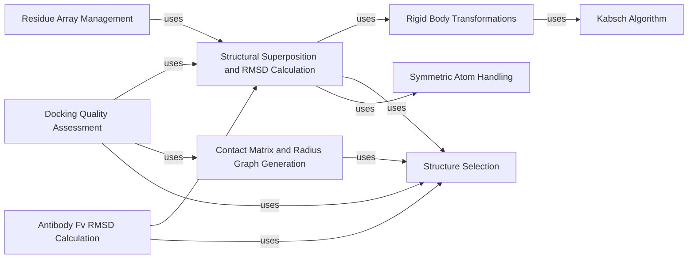

## Component Details

The Molecular Structural Analysis component provides a comprehensive suite of tools for the in-depth examination of molecular structures. Its primary purpose is to facilitate structural comparisons, identify molecular contacts, and assess the quality of protein-protein docking predictions. The main flow involves taking molecular structures, often represented as Residue Arrays, and applying various algorithms such as Kabsch for optimal superposition, calculating RMSD for structural similarity, generating contact matrices to understand interactions, and finally, computing DockQ scores for docking prediction quality. This component heavily relies on efficient data representation, precise geometric transformations, and flexible selection mechanisms to target specific parts of the molecular structures for analysis.

### Structural Superposition and RMSD Calculation
This component provides functionalities for superimposing protein structures and calculating Root Mean Square Deviation (RMSD). It includes methods for atom-level superposition and RMSD, which are then used by higher-level functions that operate on ResidueArray objects, optionally incorporating atom selection and symmetric atom renaming.

**Related Classes/Methods**:

- `beignet.src.beignet.structure._superimpose` (full file reference)
- <a href="https://github.com/Genentech/beignet/blob/master/src/beignet/structure/_superimpose.py#L25-L41" target="_blank" rel="noopener noreferrer">`beignet.src.beignet.structure._superimpose.superimpose_atom_thin` (25:41)</a>
- <a href="https://github.com/Genentech/beignet/blob/master/src/beignet/structure/_superimpose.py#L56-L98" target="_blank" rel="noopener noreferrer">`beignet.src.beignet.structure._superimpose.rmsd` (56:98)</a>
- <a href="https://github.com/Genentech/beignet/blob/master/src/beignet/structure/_superimpose.py#L44-L53" target="_blank" rel="noopener noreferrer">`beignet.src.beignet.structure._superimpose.rmsd_atom_thin` (44:53)</a>

### Kabsch Algorithm
This component implements the Kabsch algorithm, a method for calculating the optimal rigid body transformation (rotation and translation) to superimpose two sets of paired points, minimizing the Root Mean Square Deviation (RMSD) between them. It is a core mathematical utility for structural alignment.

**Related Classes/Methods**:

- `beignet.src.beignet._kabsch` (full file reference)
- <a href="https://github.com/Genentech/beignet/blob/master/src/beignet/_kabsch.py#L5-L9" target="_blank" rel="noopener noreferrer">`beignet.src.beignet._kabsch._weighted_mean` (5:9)</a>

### Rigid Body Transformations
This component defines the Rigid class, which encapsulates rigid body transformations (rotations and translations). It provides methods for creating identity transformations, random transformations, applying Kabsch algorithm for alignment, composing transformations, and inverting transformations. It is fundamental for structural alignment operations.

**Related Classes/Methods**:

- <a href="https://github.com/Genentech/beignet/blob/master/src/beignet/structure/_rigid.py#L62-L87" target="_blank" rel="noopener noreferrer">`beignet.src.beignet.structure._rigid.Rigid.kabsch` (62:87)</a>

### Contact Matrix and Radius Graph Generation
This component is responsible for generating contact matrices and radius graphs between atoms or residues in a protein structure. It utilizes radius-based calculations to determine contacts and is a key dependency for interface-related analyses, such as those performed by the Docking Quality Assessment component.

**Related Classes/Methods**:

- `beignet.src.beignet._radius` (full file reference)
- <a href="https://github.com/Genentech/beignet/blob/master/src/beignet/_radius.py#L76-L85" target="_blank" rel="noopener noreferrer">`beignet.src.beignet._radius.radius_graph` (76:85)</a>
- <a href="https://github.com/Genentech/beignet/blob/master/src/beignet/_radius.py#L8-L73" target="_blank" rel="noopener noreferrer">`beignet.src.beignet._radius.radius` (8:73)</a>
- `beignet.src.beignet.structure._contact_matrix` (full file reference)
- <a href="https://github.com/Genentech/beignet/blob/master/src/beignet/structure/_contact_matrix.py#L15-L82" target="_blank" rel="noopener noreferrer">`beignet.src.beignet.structure._contact_matrix._atom_thin_to_contact_matrix` (15:82)</a>
- <a href="https://github.com/Genentech/beignet/blob/master/src/beignet/structure/_contact_matrix.py#L85-L100" target="_blank" rel="noopener noreferrer">`beignet.src.beignet.structure._contact_matrix.contact_matrix` (85:100)</a>

### Docking Quality Assessment
This component provides functions to calculate DockQ scores, which are metrics used to assess the quality of protein-protein docking predictions. It computes contact scores, interface RMSD (iRMSD), and ligand RMSD (lRMSD) as parts of the overall DockQ calculation.

**Related Classes/Methods**:

- `beignet.src.beignet.structure._dockq` (full file reference)
- <a href="https://github.com/Genentech/beignet/blob/master/src/beignet/structure/_dockq.py#L15-L53" target="_blank" rel="noopener noreferrer">`beignet.src.beignet.structure._dockq.dockq_contact_score` (15:53)</a>
- <a href="https://github.com/Genentech/beignet/blob/master/src/beignet/structure/_dockq.py#L56-L80" target="_blank" rel="noopener noreferrer">`beignet.src.beignet.structure._dockq.dockq_irmsd_score` (56:80)</a>
- <a href="https://github.com/Genentech/beignet/blob/master/src/beignet/structure/_dockq.py#L83-L115" target="_blank" rel="noopener noreferrer">`beignet.src.beignet.structure._dockq.dockq_lrmsd_score` (83:115)</a>
- <a href="https://github.com/Genentech/beignet/blob/master/src/beignet/structure/_dockq.py#L118-L119" target="_blank" rel="noopener noreferrer">`beignet.src.beignet.structure._dockq.f1` (118:119)</a>
- <a href="https://github.com/Genentech/beignet/blob/master/src/beignet/structure/_dockq.py#L122-L127" target="_blank" rel="noopener noreferrer">`beignet.src.beignet.structure._dockq.dockq_formula` (122:127)</a>

### Residue Array Management
This component is responsible for the core data structure representing protein residues and their properties. It handles creation from various sources (sequences, AtomArrays, PDB/mmCIF files), conversion to AtomArrays, and provides methods for structural manipulations like renumbering, renaming chains, and calculating backbone dihedrals. It also integrates with other components for superposition and RMSD calculations.

**Related Classes/Methods**:

- <a href="https://github.com/Genentech/beignet/blob/master/src/beignet/structure/_residue_array.py#L47-L488" target="_blank" rel="noopener noreferrer">`beignet.src.beignet.structure._residue_array.ResidueArray` (47:488)</a>
- <a href="https://github.com/Genentech/beignet/blob/master/src/beignet/structure/_residue_array.py#L444-L457" target="_blank" rel="noopener noreferrer">`beignet.src.beignet.structure._residue_array.ResidueArray.superimpose` (444:457)</a>
- <a href="https://github.com/Genentech/beignet/blob/master/src/beignet/structure/_residue_array.py#L459-L470" target="_blank" rel="noopener noreferrer">`beignet.src.beignet.structure._residue_array.ResidueArray.rmsd` (459:470)</a>

### Structure Selection
This component provides various selector classes and functions to filter and select specific atoms or residues within a protein structure based on criteria such as atom name, residue index, chain ID, or interface contacts. It includes logical selectors (And, Or, Not) to combine selection criteria.

**Related Classes/Methods**:

- <a href="https://github.com/Genentech/beignet/blob/master/src/beignet/structure/_invoke_selector.py#L10-L22" target="_blank" rel="noopener noreferrer">`beignet.src.beignet.structure._invoke_selector.invoke_selector` (10:22)</a>
- <a href="https://github.com/Genentech/beignet/blob/master/src/beignet/structure/selectors/_logical.py#L15-L24" target="_blank" rel="noopener noreferrer">`beignet.src.beignet.structure.selectors._logical.AndSelector` (15:24)</a>
- <a href="https://github.com/Genentech/beignet/blob/master/src/beignet/structure/selectors/_logical.py#L28-L37" target="_blank" rel="noopener noreferrer">`beignet.src.beignet.structure.selectors._logical.OrSelector` (28:37)</a>
- <a href="https://github.com/Genentech/beignet/blob/master/src/beignet/structure/selectors/_logical.py#L41-L46" target="_blank" rel="noopener noreferrer">`beignet.src.beignet.structure.selectors._logical.NotSelector` (41:46)</a>
- <a href="https://github.com/Genentech/beignet/blob/master/src/beignet/structure/selectors/_atom.py#L31-L47" target="_blank" rel="noopener noreferrer">`beignet.src.beignet.structure.selectors._atom.AtomNameSelector` (31:47)</a>
- <a href="https://github.com/Genentech/beignet/blob/master/src/beignet/structure/selectors/_atom.py#L51-L53" target="_blank" rel="noopener noreferrer">`beignet.src.beignet.structure.selectors._atom.AlphaCarbonSelector` (51:53)</a>
- <a href="https://github.com/Genentech/beignet/blob/master/src/beignet/structure/selectors/_atom.py#L57-L66" target="_blank" rel="noopener noreferrer">`beignet.src.beignet.structure.selectors._atom.PeptideBackboneSelector` (57:66)</a>
- <a href="https://github.com/Genentech/beignet/blob/master/src/beignet/structure/selectors/_residue.py#L25-L32" target="_blank" rel="noopener noreferrer">`beignet.src.beignet.structure.selectors._residue.ChainSelector` (25:32)</a>
- <a href="https://github.com/Genentech/beignet/blob/master/src/beignet/structure/selectors/_residue.py#L36-L45" target="_blank" rel="noopener noreferrer">`beignet.src.beignet.structure.selectors._residue.ChainFromAnnotationsSelector` (36:45)</a>
- <a href="https://github.com/Genentech/beignet/blob/master/src/beignet/structure/selectors/_residue.py#L49-L63" target="_blank" rel="noopener noreferrer">`beignet.src.beignet.structure.selectors._residue.ResidueIndexSelector` (49:63)</a>
- <a href="https://github.com/Genentech/beignet/blob/master/src/beignet/structure/selectors/_residue.py#L67-L95" target="_blank" rel="noopener noreferrer">`beignet.src.beignet.structure.selectors._residue.CDRResidueSelector` (67:95)</a>
- <a href="https://github.com/Genentech/beignet/blob/master/src/beignet/structure/selectors/_residue.py#L99-L114" target="_blank" rel="noopener noreferrer">`beignet.src.beignet.structure.selectors._residue.InterfaceResidueSelector` (99:114)</a>
- <a href="https://github.com/Genentech/beignet/blob/master/src/beignet/structure/selectors/_residue.py#L18-L21" target="_blank" rel="noopener noreferrer">`beignet.src.beignet.structure.selectors._residue.AllSelector` (18:21)</a>

### Symmetric Atom Handling
This component focuses on handling symmetric atoms within protein structures, particularly for improving superposition accuracy. It provides functions to identify and swap symmetric atoms to ensure optimal alignment, especially for residues with symmetric side chains.

**Related Classes/Methods**:

- <a href="https://github.com/Genentech/beignet/blob/master/src/beignet/structure/_rename_symmetric_atoms.py#L44-L66" target="_blank" rel="noopener noreferrer">`beignet.src.beignet.structure._rename_symmetric_atoms:swap_symmetric_atom_thin_atoms` (44:66)</a>
- <a href="https://github.com/Genentech/beignet/blob/master/src/beignet/structure/_rename_symmetric_atoms.py#L69-L136" target="_blank" rel="noopener noreferrer">`beignet.src.beignet.structure._rename_symmetric_atoms:rename_symmetric_atoms` (69:136)</a>
- <a href="https://github.com/Genentech/beignet/blob/master/src/beignet/structure/_rename_symmetric_atoms.py#L19-L29" target="_blank" rel="noopener noreferrer">`beignet.src.beignet.structure._rename_symmetric_atoms._make_symmetric_atom_swap_indices` (19:29)</a>
- <a href="https://github.com/Genentech/beignet/blob/master/src/beignet/structure/_rename_symmetric_atoms.py#L33-L41" target="_blank" rel="noopener noreferrer">`beignet.src.beignet.structure._rename_symmetric_atoms._make_atom_thin_is_symmetric_mask` (33:41)</a>

### Antibody Fv RMSD Calculation
This component provides specialized functionality for calculating the Root Mean Square Deviation (RMSD) specifically for antibody Fv regions, which is crucial for analyzing antibody structures and their interactions.

**Related Classes/Methods**:

- `beignet.src.beignet.structure._antibody_fv_rmsd` (full file reference)

### [FAQ](https://github.com/CodeBoarding/GeneratedOnBoardings/tree/main?tab=readme-ov-file#faq)