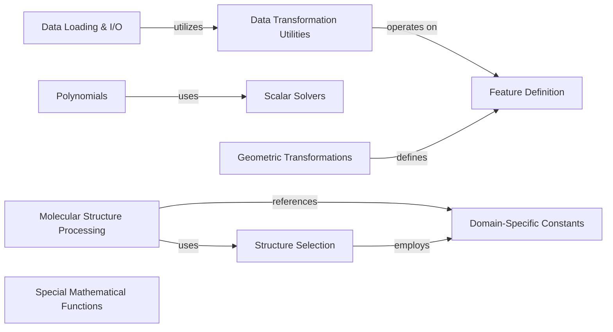

## Component Details

This architecture overview details the 'beignet' project, focusing on its core components for numerical and scientific computing. It encompasses functionalities for polynomial manipulation, geometric transformations, scalar equation solving, data loading and transformation, molecular structure processing, and specialized mathematical functions. The system is designed with modularity, allowing components to interact for complex scientific workflows, such as using scalar solvers for polynomial root finding or applying data transformations during dataset loading.

### Polynomials
Provides comprehensive functionalities for various polynomial types, including arithmetic operations, conversions, root finding, evaluation, calculus (integration, differentiation), and data fitting using methods like Vandermonde matrices and Gaussian quadrature.

**Related Classes/Methods**:

- `beignet.src.beignet._multiply_probabilists_hermite_polynomial` (full file reference)
- <a href="https://github.com/Genentech/beignet/blob/master/src/beignet/_add_probabilists_hermite_polynomial.py#L5-L55" target="_blank" rel="noopener noreferrer">`beignet.src.beignet._add_probabilists_hermite_polynomial.add_probabilists_hermite_polynomial` (5:55)</a>
- <a href="https://github.com/Genentech/beignet/blob/master/src/beignet/_subtract_probabilists_hermite_polynomial.py#L5-L56" target="_blank" rel="noopener noreferrer">`beignet.src.beignet._subtract_probabilists_hermite_polynomial.subtract_probabilists_hermite_polynomial` (5:56)</a>
- <a href="https://github.com/Genentech/beignet/blob/master/src/beignet/_multiply_probabilists_hermite_polynomial_by_x.py#L7-L25" target="_blank" rel="noopener noreferrer">`beignet.src.beignet._multiply_probabilists_hermite_polynomial_by_x.multiply_probabilists_hermite_polynomial_by_x` (7:25)</a>
- `beignet.src.beignet._polynomial_to_legendre_polynomial` (full file reference)
- <a href="https://github.com/Genentech/beignet/blob/master/src/beignet/_multiply_legendre_polynomial_by_x.py#L7-L24" target="_blank" rel="noopener noreferrer">`beignet.src.beignet._multiply_legendre_polynomial_by_x.multiply_legendre_polynomial_by_x` (7:24)</a>
- <a href="https://github.com/Genentech/beignet/blob/master/src/beignet/_add_legendre_polynomial.py#L5-L55" target="_blank" rel="noopener noreferrer">`beignet.src.beignet._add_legendre_polynomial.add_legendre_polynomial` (5:55)</a>
- `beignet.src.beignet._physicists_hermite_polynomial_power` (full file reference)
- `beignet.src.beignet._multiply_physicists_hermite_polynomial` (full file reference)
- `beignet.src.beignet._polynomial_power` (full file reference)
- `beignet.src.beignet._multiply_polynomial` (full file reference)
- `beignet.src.beignet._physicists_hermite_polynomial_to_polynomial` (full file reference)
- <a href="https://github.com/Genentech/beignet/blob/master/src/beignet/_subtract_polynomial.py#L5-L53" target="_blank" rel="noopener noreferrer">`beignet.src.beignet._subtract_polynomial.subtract_polynomial` (5:53)</a>
- <a href="https://github.com/Genentech/beignet/blob/master/src/beignet/_add_polynomial.py#L5-L55" target="_blank" rel="noopener noreferrer">`beignet.src.beignet._add_polynomial.add_polynomial` (5:55)</a>
- <a href="https://github.com/Genentech/beignet/blob/master/src/beignet/_multiply_polynomial_by_x.py#L7-L34" target="_blank" rel="noopener noreferrer">`beignet.src.beignet._multiply_polynomial_by_x.multiply_polynomial_by_x` (7:34)</a>
- `beignet.src.beignet._polynomial_to_chebyshev_polynomial` (full file reference)
- <a href="https://github.com/Genentech/beignet/blob/master/src/beignet/_multiply_chebyshev_polynomial_by_x.py#L7-L25" target="_blank" rel="noopener noreferrer">`beignet.src.beignet._multiply_chebyshev_polynomial_by_x.multiply_chebyshev_polynomial_by_x` (7:25)</a>
- <a href="https://github.com/Genentech/beignet/blob/master/src/beignet/_add_chebyshev_polynomial.py#L5-L55" target="_blank" rel="noopener noreferrer">`beignet.src.beignet._add_chebyshev_polynomial.add_chebyshev_polynomial` (5:55)</a>
- `beignet.src.beignet._legendre_polynomial_to_polynomial` (full file reference)
- `beignet.src.beignet._laguerre_polynomial_power` (full file reference)
- `beignet.src.beignet._multiply_laguerre_polynomial` (full file reference)
- `beignet.src.beignet._polynomial_to_laguerre_polynomial` (full file reference)
- <a href="https://github.com/Genentech/beignet/blob/master/src/beignet/_multiply_laguerre_polynomial_by_x.py#L7-L29" target="_blank" rel="noopener noreferrer">`beignet.src.beignet._multiply_laguerre_polynomial_by_x.multiply_laguerre_polynomial_by_x` (7:29)</a>
- <a href="https://github.com/Genentech/beignet/blob/master/src/beignet/_add_laguerre_polynomial.py#L5-L55" target="_blank" rel="noopener noreferrer">`beignet.src.beignet._add_laguerre_polynomial.add_laguerre_polynomial` (5:55)</a>
- `beignet.src.beignet._polynomial_to_probabilists_hermite_polynomial` (full file reference)
- `beignet.src.beignet._divide_legendre_polynomial` (full file reference)
- `beignet.src.beignet._chebyshev_polynomial_to_polynomial` (full file reference)
- `beignet.src.beignet._divide_laguerre_polynomial` (full file reference)
- `beignet.src.beignet._multiply_chebyshev_polynomial` (full file reference)
- `beignet.src.beignet._probabilists_hermite_polynomial_to_polynomial` (full file reference)
- `beignet.src.beignet._divide_physicists_hermite_polynomial` (full file reference)
- `beignet.src.beignet._divide_polynomial` (full file reference)
- `beignet.src.beignet._multiply_legendre_polynomial` (full file reference)
- `beignet.src.beignet._divide_probabilists_hermite_polynomial` (full file reference)
- `beignet.src.beignet._chebyshev_polynomial_power` (full file reference)
- `beignet.src.beignet._laguerre_polynomial_to_polynomial` (full file reference)
- `beignet.src.beignet._laguerre_polynomial_from_roots` (full file reference)
- <a href="https://github.com/Genentech/beignet/blob/master/src/beignet/_linear_laguerre_polynomial.py#L5-L6" target="_blank" rel="noopener noreferrer">`beignet.src.beignet._linear_laguerre_polynomial.linear_laguerre_polynomial` (5:6)</a>
- `beignet.src.beignet._probabilists_hermite_polynomial_from_roots` (full file reference)
- <a href="https://github.com/Genentech/beignet/blob/master/src/beignet/_linear_probabilists_hermite_polynomial.py#L5-L6" target="_blank" rel="noopener noreferrer">`beignet.src.beignet._linear_probabilists_hermite_polynomial.linear_probabilists_hermite_polynomial` (5:6)</a>
- `beignet.src.beignet._physicists_hermite_polynomial_from_roots` (full file reference)
- <a href="https://github.com/Genentech/beignet/blob/master/src/beignet/_linear_physicists_hermite_polynomial.py#L5-L6" target="_blank" rel="noopener noreferrer">`beignet.src.beignet._linear_physicists_hermite_polynomial.linear_physicists_hermite_polynomial` (5:6)</a>
- `beignet.src.beignet._polynomial_from_roots` (full file reference)
- <a href="https://github.com/Genentech/beignet/blob/master/src/beignet/_linear_polynomial.py#L5-L6" target="_blank" rel="noopener noreferrer">`beignet.src.beignet._linear_polynomial.linear_polynomial` (5:6)</a>
- `beignet.src.beignet._chebyshev_polynomial_from_roots` (full file reference)
- <a href="https://github.com/Genentech/beignet/blob/master/src/beignet/_linear_chebyshev_polynomial.py#L5-L6" target="_blank" rel="noopener noreferrer">`beignet.src.beignet._linear_chebyshev_polynomial.linear_chebyshev_polynomial` (5:6)</a>
- `beignet.src.beignet._legendre_polynomial_from_roots` (full file reference)
- <a href="https://github.com/Genentech/beignet/blob/master/src/beignet/_linear_legendre_polynomial.py#L5-L6" target="_blank" rel="noopener noreferrer">`beignet.src.beignet._linear_legendre_polynomial.linear_legendre_polynomial` (5:6)</a>
- `beignet.src.beignet._integrate_chebyshev_polynomial` (full file reference)
- <a href="https://github.com/Genentech/beignet/blob/master/src/beignet/_evaluate_chebyshev_polynomial.py#L5-L35" target="_blank" rel="noopener noreferrer">`beignet.src.beignet._evaluate_chebyshev_polynomial.evaluate_chebyshev_polynomial` (5:35)</a>
- `beignet.src.beignet._probabilists_hermite_polynomial_roots` (full file reference)
- <a href="https://github.com/Genentech/beignet/blob/master/src/beignet/_probabilists_hermite_polynomial_companion.py#L5-L39" target="_blank" rel="noopener noreferrer">`beignet.src.beignet._probabilists_hermite_polynomial_companion.probabilists_hermite_polynomial_companion` (5:39)</a>
- `beignet.src.beignet._integrate_physicists_hermite_polynomial` (full file reference)
- <a href="https://github.com/Genentech/beignet/blob/master/src/beignet/_evaluate_physicists_hermite_polynomial.py#L5-L40" target="_blank" rel="noopener noreferrer">`beignet.src.beignet._evaluate_physicists_hermite_polynomial.evaluate_physicists_hermite_polynomial` (5:40)</a>
- `beignet.src.beignet._physicists_hermite_polynomial_roots` (full file reference)
- <a href="https://github.com/Genentech/beignet/blob/master/src/beignet/_physicists_hermite_polynomial_companion.py#L5-L40" target="_blank" rel="noopener noreferrer">`beignet.src.beignet._physicists_hermite_polynomial_companion.physicists_hermite_polynomial_companion` (5:40)</a>
- `beignet.src.beignet._evaluate_polynomial_cartesian_3d` (full file reference)
- <a href="https://github.com/Genentech/beignet/blob/master/src/beignet/_evaluate_polynomial.py#L5-L34" target="_blank" rel="noopener noreferrer">`beignet.src.beignet._evaluate_polynomial.evaluate_polynomial` (5:34)</a>
- `beignet.src.beignet._integrate_laguerre_polynomial` (full file reference)
- `beignet.src.beignet._evaluate_probabilists_hermite_polynomial_cartersian_3d` (full file reference)
- <a href="https://github.com/Genentech/beignet/blob/master/src/beignet/_evaluate_probabilists_hermite_polynomial.py#L5-L40" target="_blank" rel="noopener noreferrer">`beignet.src.beignet._evaluate_probabilists_hermite_polynomial.evaluate_probabilists_hermite_polynomial` (5:40)</a>
- `beignet.src.beignet._integrate_polynomial` (full file reference)
- `beignet.src.beignet._evaluate_legendre_polynomial_2d` (full file reference)
- `beignet.src.beignet._evaluate_laguerre_polynomial_cartesian_2d` (full file reference)
- `beignet.src.beignet._evaluate_probabilists_hermite_polynomial_2d` (full file reference)
- `beignet.src.beignet._evaluate_probabilists_hermite_polynomial_cartersian_2d` (full file reference)
- `beignet.src.beignet._integrate_probabilists_hermite_polynomial` (full file reference)
- `beignet.src.beignet._differentiate_laguerre_polynomial` (full file reference)
- `beignet.src.beignet._evaluate_physicists_hermite_polynomial_3d` (full file reference)
- `beignet.src.beignet._evaluate_chebyshev_polynomial_3d` (full file reference)
- `beignet.src.beignet._evaluate_polynomial_3d` (full file reference)
- `beignet.src.beignet._evaluate_laguerre_polynomial_cartesian_3d` (full file reference)
- `beignet.src.beignet._evaluate_laguerre_polynomial_3d` (full file reference)
- `beignet.src.beignet._evaluate_laguerre_polynomial_2d` (full file reference)
- `beignet.src.beignet._legendre_polynomial_roots` (full file reference)
- <a href="https://github.com/Genentech/beignet/blob/master/src/beignet/_legendre_polynomial_companion.py#L5-L32" target="_blank" rel="noopener noreferrer">`beignet.src.beignet._legendre_polynomial_companion.legendre_polynomial_companion` (5:32)</a>
- `beignet.src.beignet._differentiate_legendre_polynomial` (full file reference)
- `beignet.src.beignet._laguerre_polynomial_roots` (full file reference)
- <a href="https://github.com/Genentech/beignet/blob/master/src/beignet/_laguerre_polynomial_companion.py#L5-L28" target="_blank" rel="noopener noreferrer">`beignet.src.beignet._laguerre_polynomial_companion.laguerre_polynomial_companion` (5:28)</a>
- `beignet.src.beignet._evaluate_polynomial_2d` (full file reference)
- `beignet.src.beignet._integrate_legendre_polynomial` (full file reference)
- `beignet.src.beignet._evaluate_physicists_hermite_polynomial_2d` (full file reference)
- `beignet.src.beignet._evaluate_legendre_polynomial_3d` (full file reference)
- `beignet.src.beignet._evaluate_legendre_polynomial_cartesian_3d` (full file reference)
- `beignet.src.beignet._evaluate_chebyshev_polynomial_cartesian_3d` (full file reference)
- `beignet.src.beignet._evaluate_chebyshev_polynomial_2d` (full file reference)
- `beignet.src.beignet._evaluate_physicists_hermite_polynomial_cartesian_2d` (full file reference)
- `beignet.src.beignet._evaluate_physicists_hermite_polynomial_cartesian_3d` (full file reference)
- `beignet.src.beignet._evaluate_chebyshev_polynomial_cartesian_2d` (full file reference)
- `beignet.src.beignet._evaluate_legendre_polynomial_cartesian_2d` (full file reference)
- `beignet.src.beignet._fit_physicists_hermite_polynomial` (full file reference)
- <a href="https://github.com/Genentech/beignet/blob/master/src/beignet/_physicists_hermite_polynomial_vandermonde.py#L5-L25" target="_blank" rel="noopener noreferrer">`beignet.src.beignet._physicists_hermite_polynomial_vandermonde.physicists_hermite_polynomial_vandermonde` (5:25)</a>
- `beignet.src.beignet._fit_legendre_polynomial` (full file reference)
- <a href="https://github.com/Genentech/beignet/blob/master/src/beignet/_legendre_polynomial_vandermonde.py#L5-L30" target="_blank" rel="noopener noreferrer">`beignet.src.beignet._legendre_polynomial_vandermonde.legendre_polynomial_vandermonde` (5:30)</a>
- `beignet.src.beignet._fit_laguerre_polynomial` (full file reference)
- <a href="https://github.com/Genentech/beignet/blob/master/src/beignet/_laguerre_polynomial_vandermonde.py#L5-L30" target="_blank" rel="noopener noreferrer">`beignet.src.beignet._laguerre_polynomial_vandermonde.laguerre_polynomial_vandermonde` (5:30)</a>
- `beignet.src.beignet._fit_chebyshev_polynomial` (full file reference)
- <a href="https://github.com/Genentech/beignet/blob/master/src/beignet/_chebyshev_polynomial_vandermonde.py#L5-L28" target="_blank" rel="noopener noreferrer">`beignet.src.beignet._chebyshev_polynomial_vandermonde.chebyshev_polynomial_vandermonde` (5:28)</a>
- `beignet.src.beignet._fit_polynomial` (full file reference)
- <a href="https://github.com/Genentech/beignet/blob/master/src/beignet/_polynomial_vandermonde.py#L5-L33" target="_blank" rel="noopener noreferrer">`beignet.src.beignet._polynomial_vandermonde.polynomial_vandermonde` (5:33)</a>
- `beignet.src.beignet._fit_probabilists_hermite_polynomial` (full file reference)
- <a href="https://github.com/Genentech/beignet/blob/master/src/beignet/_probabilists_hermite_polynomial_vandermonde.py#L5-L22" target="_blank" rel="noopener noreferrer">`beignet.src.beignet._probabilists_hermite_polynomial_vandermonde.probabilists_hermite_polynomial_vandermonde` (5:22)</a>
- `beignet.src.beignet._gauss_laguerre_quadrature` (full file reference)
- `beignet.src.beignet._gauss_probabilists_hermite_polynomial_quadrature` (full file reference)
- `beignet.src.beignet._gauss_physicists_hermite_polynomial_quadrature` (full file reference)
- `beignet.src.beignet._gauss_legendre_quadrature` (full file reference)
- `beignet.src.beignet._root_scalar` (full file reference)
- <a href="https://github.com/Genentech/beignet/blob/master/src/beignet/func/_custom_scalar_root.py#L8-L79" target="_blank" rel="noopener noreferrer">`beignet.func._custom_scalar_root.custom_scalar_root` (8:79)</a>
- <a href="https://github.com/Genentech/beignet/blob/master/src/beignet/_bisect.py#L8-L114" target="_blank" rel="noopener noreferrer">`beignet._bisect.bisect` (8:114)</a>

### Geometric Transformations
This component provides functionalities for handling 3D geometric transformations, including operations with Euler angles, quaternions, rotation matrices, and rotation vectors. It supports conversions between these representations, composition, inversion, and application of transformations.

**Related Classes/Methods**:

- `beignet._apply_euler_angle` (full file reference)
- `beignet._apply_quaternion` (full file reference)
- `beignet._apply_rotation_matrix` (full file reference)
- `beignet._apply_rotation_vector` (full file reference)
- <a href="https://github.com/Genentech/beignet/blob/master/src/beignet/_apply_transform.py#L6-L33" target="_blank" rel="noopener noreferrer">`beignet._apply_transform` (6:33)</a>
- `beignet._compose_euler_angle` (full file reference)
- `beignet._compose_quaternion` (full file reference)
- `beignet._compose_rotation_matrix` (full file reference)
- `beignet._compose_rotation_vector` (full file reference)
- `beignet._euler_angle_identity` (full file reference)
- `beignet._euler_angle_magnitude` (full file reference)
- `beignet._euler_angle_mean` (full file reference)
- `beignet._euler_angle_to_quaternion` (full file reference)
- `beignet._euler_angle_to_rotation_matrix` (full file reference)
- `beignet._euler_angle_to_rotation_vector` (full file reference)
- `beignet._invert_euler_angle` (full file reference)
- `beignet._invert_quaternion` (full file reference)
- `beignet._invert_rotation_matrix` (full file reference)
- `beignet._invert_rotation_vector` (full file reference)
- `beignet._invert_transform` (full file reference)
- `beignet._quaternion_identity` (full file reference)
- `beignet._quaternion_magnitude` (full file reference)
- `beignet._quaternion_mean` (full file reference)
- `beignet._quaternion_slerp` (full file reference)
- `beignet._quaternion_to_euler_angle` (full file reference)
- `beignet._quaternion_to_rotation_matrix` (full file reference)
- `beignet._quaternion_to_rotation_vector` (full file reference)
- `beignet._random_euler_angle` (full file reference)
- `beignet._random_quaternion` (full file reference)
- `beignet._random_rotation_matrix` (full file reference)
- `beignet._random_rotation_vector` (full file reference)
- `beignet._rotation_matrix_identity` (full file reference)
- `beignet._rotation_matrix_magnitude` (full file reference)
- `beignet._rotation_matrix_mean` (full file reference)
- `beignet._rotation_matrix_to_euler_angle` (full file reference)
- `beignet._rotation_matrix_to_quaternion` (full file reference)
- `beignet._rotation_matrix_to_rotation_vector` (full file reference)
- `beignet._rotation_vector_identity` (full file reference)
- `beignet._rotation_vector_magnitude` (full file reference)
- `beignet._rotation_vector_mean` (full file reference)
- `beignet._rotation_vector_to_euler_angle` (full file reference)
- `beignet._rotation_vector_to_quaternion` (full file reference)
- `beignet._rotation_vector_to_rotation_matrix` (full file reference)
- `beignet._translation_identity` (full file reference)

### Scalar Solvers
This component provides algorithms for finding roots of scalar functions, including bisection and Chandrupatla's method.

**Related Classes/Methods**:

- `beignet._bisect` (full file reference)
- `beignet._chandrupatla` (full file reference)
- `beignet._root_scalar` (full file reference)
- `beignet.func._custom_scalar_root` (full file reference)

### Data Loading & I/O
This component is responsible for loading and managing various types of datasets, including chemical, biological, and general data, from different sources and formats, and handles underlying file I/O operations.

**Related Classes/Methods**:

- `beignet.datasets._aqsoldb_solubility_dataset` (full file reference)
- `beignet.datasets._astrazeneca_clearance_dataset` (full file reference)
- `beignet.datasets._astrazeneca_lipophilicity_dataset` (full file reference)
- `beignet.datasets._astrazeneca_plasma_protein_binding_rate_dataset` (full file reference)
- `beignet.datasets._atom3d_dataset` (full file reference)
- `beignet.datasets._atom3d_msp_dataset` (full file reference)
- `beignet.datasets._atom3d_ppi_dataset` (full file reference)
- `beignet.datasets._atom3d_psr_dataset` (full file reference)
- `beignet.datasets._atom3d_res_dataset` (full file reference)
- `beignet.datasets._atom3d_rsr_dataset` (full file reference)
- `beignet.datasets._atom3d_smp_dataset` (full file reference)
- `beignet.datasets._bindingdb_ic50_dataset` (full file reference)
- `beignet.datasets._bindingdb_kd_dataset` (full file reference)
- `beignet.datasets._bindingdb_ki_dataset` (full file reference)
- `beignet.datasets._broccatelli_p_glycoprotein_inhibition_dataset` (full file reference)
- `beignet.datasets._carbon_mangels_cytochrome_p450_2c9_substrate_dataset` (full file reference)
- `beignet.datasets._carbon_mangels_cytochrome_p450_2d6_substrate_dataset` (full file reference)
- `beignet.datasets._carbon_mangels_cytochrome_p450_3a4_substrate_dataset` (full file reference)
- `beignet.datasets._chembl_dataset` (full file reference)
- `beignet.datasets._clintox_dataset` (full file reference)
- `beignet.datasets._data_frame_dataset` (full file reference)
- `beignet.datasets._davis_dataset` (full file reference)
- `beignet.datasets._disgenet_dataset` (full file reference)
- `beignet.datasets._drugcomb_dataset` (full file reference)
- `beignet.datasets._fasta_dataset` (full file reference)
- `beignet.datasets._freesolv_dataset` (full file reference)
- `beignet.datasets._gdsc1_dataset` (full file reference)
- `beignet.datasets._gdsc2_dataset` (full file reference)
- `beignet.datasets._hdf5_trajectory_dataset` (full file reference)
- `beignet.datasets._hou_human_intestinal_absorption_dataset` (full file reference)
- `beignet.datasets._huri_dataset` (full file reference)
- `beignet.datasets._jespersen_iedb_dataset` (full file reference)
- `beignet.datasets._jespersen_pdb_dataset` (full file reference)
- `beignet.datasets._kiba_dataset` (full file reference)
- `beignet.datasets._lmdb_dataset` (full file reference)
- `beignet.datasets._lombardo_volume_of_distribution_at_steady_state_dataset` (full file reference)
- `beignet.datasets._ma_bioavailability_dataset` (full file reference)
- `beignet.datasets._martins_blood_brain_barrier_dataset` (full file reference)
- `beignet.datasets._moses_dataset` (full file reference)
- `beignet.datasets._ncats_pampa_permeability_dataset` (full file reference)
- `beignet.datasets._obach_half_life_dataset` (full file reference)
- `beignet.datasets._parquet_dataset` (full file reference)
- `beignet.datasets._pdb_trajectory_dataset` (full file reference)
- `beignet.datasets._pdbbind_dataset` (full file reference)
- `beignet.datasets._qm7_dataset` (full file reference)
- `beignet.datasets._qm7b_dataset` (full file reference)
- `beignet.datasets._qm8_dataset` (full file reference)
- `beignet.datasets._qm9_dataset` (full file reference)
- `beignet.datasets._random_euler_angle_dataset` (full file reference)
- `beignet.datasets._random_quaternion_dataset` (full file reference)
- `beignet.datasets._random_rotation_dataset` (full file reference)
- `beignet.datasets._random_rotation_matrix_dataset` (full file reference)
- `beignet.datasets._random_rotation_vector_dataset` (full file reference)
- `beignet.datasets._real_database_dataset` (full file reference)
- `beignet.datasets._sabdab_dataset` (full file reference)
- `beignet.datasets._sequence_dataset` (full file reference)
- `beignet.datasets._sized_sequence_dataset` (full file reference)
- `beignet.datasets._skempi_dataset` (full file reference)
- `beignet.datasets._swissprot_dataset` (full file reference)
- `beignet.datasets._tdc_dataset` (full file reference)
- `beignet.datasets._therapeutic_antibody_profiler_dataset` (full file reference)
- `beignet.datasets._tox21_dataset` (full file reference)
- `beignet.datasets._toxcast_dataset` (full file reference)
- `beignet.datasets._trajectory_dataset` (full file reference)
- `beignet.datasets._trembl_dataset` (full file reference)
- `beignet.datasets._uniprot_dataset` (full file reference)
- `beignet.datasets._uniref100_dataset` (full file reference)
- `beignet.datasets._uniref50_dataset` (full file reference)
- `beignet.datasets._uniref90_dataset` (full file reference)
- `beignet.datasets._uspto_dataset` (full file reference)
- `beignet.datasets._uspto_reaction_product_dataset` (full file reference)
- `beignet.datasets._veith_cytochrome_p450_1a2_inhibition_dataset` (full file reference)
- `beignet.datasets._veith_cytochrome_p450_2c19_inhibition_dataset` (full file reference)
- `beignet.datasets._veith_cytochrome_p450_2c9_inhibition_dataset` (full file reference)
- `beignet.datasets._veith_cytochrome_p450_2d6_inhibition_dataset` (full file reference)
- `beignet.datasets._veith_cytochrome_p450_3a4_inhibition_dataset` (full file reference)
- `beignet.datasets._wang_effective_permeability_dataset` (full file reference)
- `beignet.datasets._zhu_acute_toxicity_ld50_dataset` (full file reference)
- `beignet.datasets._zinc_dataset` (full file reference)
- `beignet.io._thread_safe_file` (full file reference)

### Data Transformation Utilities
This component provides a generic framework for applying various transformations to data, often serving as a pipeline for data preprocessing and feature engineering.

**Related Classes/Methods**:

- `beignet.transforms._lambda` (full file reference)
- `beignet.transforms._transform` (full file reference)

### Feature Definition
This component defines the structure and behavior of different types of features, including those related to geometric transformations.

**Related Classes/Methods**:

- `beignet.features._euler_angle` (full file reference)
- `beignet.features._feature` (full file reference)
- `beignet.features._quaternion` (full file reference)
- `beignet.features._rotation_matrix` (full file reference)
- `beignet.features._rotation_vector` (full file reference)

### Molecular Structure Processing
This component offers a suite of tools for advanced manipulation and analysis of molecular structures, including calculating metrics like RMSD and contact matrices, and managing residue and atom properties.

**Related Classes/Methods**:

- `beignet.structure._antibody_fv_rmsd` (full file reference)
- `beignet.structure._contact_matrix` (full file reference)
- `beignet.structure._dockq` (full file reference)
- <a href="https://github.com/Genentech/beignet/blob/master/src/beignet/structure/_rename_chains.py#L12-L18" target="_blank" rel="noopener noreferrer">`beignet.structure._rename_chains` (12:18)</a>
- `beignet.structure._rename_symmetric_atoms` (full file reference)
- <a href="https://github.com/Genentech/beignet/blob/master/src/beignet/structure/_renumber.py#L42-L69" target="_blank" rel="noopener noreferrer">`beignet.structure._renumber` (42:69)</a>
- `beignet.structure._residue_array` (full file reference)
- `beignet.structure._rigid` (full file reference)
- `beignet.structure._superimpose` (full file reference)
- `beignet.structure._atom_array_to_atom_thin` (full file reference)
- `beignet.structure._atom_thin_to_atom_array` (full file reference)
- `beignet.structure._backbone_coordinates_to_dihedrals` (full file reference)
- `beignet.structure._invoke_selector` (full file reference)
- `beignet.structure._short_string` (full file reference)

### Structure Selection
This component provides mechanisms for precisely selecting specific atoms or residues within complex molecular structures based on defined criteria.

**Related Classes/Methods**:

- `beignet.structure.selectors._atom` (full file reference)
- `beignet.structure.selectors._logical` (full file reference)
- `beignet.structure.selectors._residue` (full file reference)

### Domain-Specific Constants
This component centralizes and provides access to various constants, including those related to amino acids, atoms, and other domain-specific values, used across different modules.

**Related Classes/Methods**:

- `beignet.constants._amino_acid_1_to_3` (full file reference)
- `beignet.constants._amino_acid_3_to_1` (full file reference)
- `beignet.constants._atom_thin_atoms` (full file reference)
- `beignet.constants._cdr_ranges_aho` (full file reference)
- `beignet.constants._standard_residues` (full file reference)

### Special Mathematical Functions
This component implements a collection of specialized mathematical functions, such as error functions and the Faddeeva function, which are often used in scientific and engineering computations.

**Related Classes/Methods**:

- `beignet.special._dawson_integral_f` (full file reference)
- `beignet.special._error_erf` (full file reference)
- `beignet.special._error_erfc` (full file reference)
- `beignet.special._error_erfi` (full file reference)
- `beignet.special._faddeeva_w` (full file reference)

### [FAQ](https://github.com/CodeBoarding/GeneratedOnBoardings/tree/main?tab=readme-ov-file#faq)