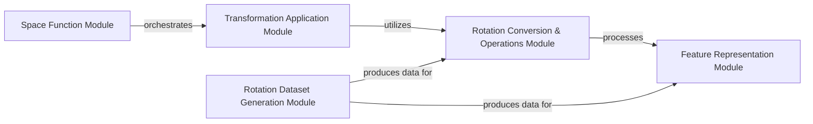

## Component Details

This graph illustrates the architecture of the 'Rotations & Orientations' subsystem, which is responsible for managing 3D rotations and orientations. The core functionality revolves around converting between various rotation representations (Euler angles, quaternions, rotation matrices, and rotation vectors) and performing operations such as composition, inversion, and statistical analysis. It also includes modules for applying transformations to position vectors, defining structured feature representations for machine learning, and generating synthetic rotation datasets. The overall purpose is to provide a robust and flexible framework for handling 3D rotation data within the 'beignet' project.

### Rotation Conversion & Operations Module
This module provides core functionalities for managing 3D rotations and orientations. It includes a comprehensive set of functions for converting between different rotation representations (Euler angles, quaternions, rotation matrices, and rotation vectors), composing rotations, inverting rotations, calculating magnitudes, and computing means. Quaternions often serve as an intermediary for conversions and operations. It also includes functions for generating random instances of these rotation types and identity transformations.

**Related Classes/Methods**:

- `beignet.src.beignet._rotation_vector_to_euler_angle` (full file reference)
- <a href="https://github.com/Genentech/beignet/blob/master/src/beignet/_quaternion_to_euler_angle.py#L8-L143" target="_blank" rel="noopener noreferrer">`beignet.src.beignet._quaternion_to_euler_angle.quaternion_to_euler_angle` (8:143)</a>
- <a href="https://github.com/Genentech/beignet/blob/master/src/beignet/_rotation_vector_to_quaternion.py#L5-L71" target="_blank" rel="noopener noreferrer">`beignet.src.beignet._rotation_vector_to_quaternion.rotation_vector_to_quaternion` (5:71)</a>
- `beignet.src.beignet._rotation_vector_to_rotation_matrix` (full file reference)
- <a href="https://github.com/Genentech/beignet/blob/master/src/beignet/_quaternion_to_rotation_matrix.py#L5-L35" target="_blank" rel="noopener noreferrer">`beignet.src.beignet._quaternion_to_rotation_matrix.quaternion_to_rotation_matrix` (5:35)</a>
- `beignet.src.beignet._compose_euler_angle` (full file reference)
- <a href="https://github.com/Genentech/beignet/blob/master/src/beignet/_compose_quaternion.py#L5-L73" target="_blank" rel="noopener noreferrer">`beignet.src.beignet._compose_quaternion.compose_quaternion` (5:73)</a>
- <a href="https://github.com/Genentech/beignet/blob/master/src/beignet/_euler_angle_to_quaternion.py#L7-L170" target="_blank" rel="noopener noreferrer">`beignet.src.beignet._euler_angle_to_quaternion.euler_angle_to_quaternion` (7:170)</a>
- `beignet.src.beignet._compose_rotation_matrix` (full file reference)
- <a href="https://github.com/Genentech/beignet/blob/master/src/beignet/_rotation_matrix_to_quaternion.py#L5-L88" target="_blank" rel="noopener noreferrer">`beignet.src.beignet._rotation_matrix_to_quaternion.rotation_matrix_to_quaternion` (5:88)</a>
- `beignet.src.beignet._compose_rotation_vector` (full file reference)
- `beignet.src.beignet._rotation_matrix_to_euler_angle` (full file reference)
- `beignet.src.beignet._rotation_matrix_to_rotation_vector` (full file reference)
- <a href="https://github.com/Genentech/beignet/blob/master/src/beignet/_quaternion_to_rotation_vector.py#L5-L57" target="_blank" rel="noopener noreferrer">`beignet.src.beignet._quaternion_to_rotation_vector.quaternion_to_rotation_vector` (5:57)</a>
- `beignet.src.beignet._random_euler_angle` (full file reference)
- <a href="https://github.com/Genentech/beignet/blob/master/src/beignet/_random_quaternion.py#L5-L95" target="_blank" rel="noopener noreferrer">`beignet.src.beignet._random_quaternion.random_quaternion` (5:95)</a>
- `beignet.src.beignet._rotation_vector_identity` (full file reference)
- <a href="https://github.com/Genentech/beignet/blob/master/src/beignet/_quaternion_identity.py#L5-L64" target="_blank" rel="noopener noreferrer">`beignet.src.beignet._quaternion_identity.quaternion_identity` (5:64)</a>
- `beignet.src.beignet._random_rotation_matrix` (full file reference)
- `beignet.src.beignet._euler_angle_mean` (full file reference)
- <a href="https://github.com/Genentech/beignet/blob/master/src/beignet/_quaternion_mean.py#L5-L34" target="_blank" rel="noopener noreferrer">`beignet.src.beignet._quaternion_mean.quaternion_mean` (5:34)</a>
- `beignet.src.beignet._rotation_matrix_magnitude` (full file reference)
- <a href="https://github.com/Genentech/beignet/blob/master/src/beignet/_quaternion_magnitude.py#L5-L37" target="_blank" rel="noopener noreferrer">`beignet.src.beignet._quaternion_magnitude.quaternion_magnitude` (5:37)</a>
- `beignet.src.beignet._rotation_vector_mean` (full file reference)
- `beignet.src.beignet._rotation_matrix_mean` (full file reference)
- `beignet.src.beignet._euler_angle_magnitude` (full file reference)
- `beignet.src.beignet._euler_angle_identity` (full file reference)
- `beignet.src.beignet._random_rotation_vector` (full file reference)
- `beignet.src.beignet._invert_euler_angle` (full file reference)
- <a href="https://github.com/Genentech/beignet/blob/master/src/beignet/_invert_quaternion.py#L4-L31" target="_blank" rel="noopener noreferrer">`beignet.src.beignet._invert_quaternion.invert_quaternion` (4:31)</a>
- `beignet.src.beignet._invert_rotation_matrix` (full file reference)
- `beignet.src.beignet._invert_rotation_vector` (full file reference)

### Transformation Application Module
This module focuses on applying 3D transformations to position vectors. It provides a generic `apply_transform` function and a specialized `_ApplyTransform` class that leverages `torch.autograd.Function` for automatic differentiation, ensuring that transformation operations are compatible with deep learning frameworks. It also includes specific functions for applying rotations in different representations and their inversion.

**Related Classes/Methods**:

- <a href="https://github.com/Genentech/beignet/blob/master/src/beignet/_apply_transform.py#L83-L101" target="_blank" rel="noopener noreferrer">`beignet.src.beignet._apply_transform.apply_transform` (83:101)</a>
- <a href="https://github.com/Genentech/beignet/blob/master/src/beignet/_apply_transform.py#L36-L80" target="_blank" rel="noopener noreferrer">`beignet.src.beignet._apply_transform._ApplyTransform` (36:80)</a>
- <a href="https://github.com/Genentech/beignet/blob/master/src/beignet/_apply_transform.py#L6-L33" target="_blank" rel="noopener noreferrer">`beignet.src.beignet._apply_transform._apply_transform` (6:33)</a>
- <a href="https://github.com/Genentech/beignet/blob/master/src/beignet/_apply_rotation_matrix.py#L5-L47" target="_blank" rel="noopener noreferrer">`beignet.src.beignet._apply_rotation_matrix.apply_rotation_matrix` (5:47)</a>
- `beignet.src.beignet._apply_euler_angle` (full file reference)
- `beignet.src.beignet._apply_rotation_vector` (full file reference)
- `beignet.src.beignet._apply_quaternion` (full file reference)
- <a href="https://github.com/Genentech/beignet/blob/master/src/beignet/_invert_transform.py#L5-L25" target="_blank" rel="noopener noreferrer">`beignet.src.beignet._invert_transform.invert_transform` (5:25)</a>

### Feature Representation Module
This module defines specialized `torch.Tensor` subclasses for different 3D rotation representations (RotationMatrix, Quaternion, EulerAngle, RotationVector). These classes provide a structured way to handle rotation data, including methods for wrapping raw tensors, preserving metadata during tensor operations, and generating informative string representations. The base `Feature` class provides common functionalities for these specialized feature types.

**Related Classes/Methods**:

- <a href="https://github.com/Genentech/beignet/blob/master/src/beignet/features/_rotation_matrix.py#L11-L47" target="_blank" rel="noopener noreferrer">`beignet.src.beignet.features._rotation_matrix.RotationMatrix` (11:47)</a>
- <a href="https://github.com/Genentech/beignet/blob/master/src/beignet/features/_quaternion.py#L11-L44" target="_blank" rel="noopener noreferrer">`beignet.src.beignet.features._quaternion.Quaternion` (11:44)</a>
- <a href="https://github.com/Genentech/beignet/blob/master/src/beignet/features/_euler_angle.py#L11-L47" target="_blank" rel="noopener noreferrer">`beignet.src.beignet.features._euler_angle.EulerAngle` (11:47)</a>
- <a href="https://github.com/Genentech/beignet/blob/master/src/beignet/features/_rotation_vector.py#L11-L47" target="_blank" rel="noopener noreferrer">`beignet.src.beignet.features._rotation_vector.RotationVector` (11:47)</a>
- <a href="https://github.com/Genentech/beignet/blob/master/src/beignet/features/_feature.py#L22-L182" target="_blank" rel="noopener noreferrer">`beignet.src.beignet.features._feature.Feature` (22:182)</a>
- <a href="https://github.com/Genentech/beignet/blob/master/src/beignet/features/_feature.py#L30-L44" target="_blank" rel="noopener noreferrer">`beignet.src.beignet.features._feature.Feature._to_tensor` (30:44)</a>
- <a href="https://github.com/Genentech/beignet/blob/master/src/beignet/features/_rotation_matrix.py#L13-L14" target="_blank" rel="noopener noreferrer">`beignet.src.beignet.features._rotation_matrix.RotationMatrix._wrap` (13:14)</a>
- <a href="https://github.com/Genentech/beignet/blob/master/src/beignet/features/_quaternion.py#L13-L14" target="_blank" rel="noopener noreferrer">`beignet.src.beignet.features._quaternion.Quaternion._wrap` (13:14)</a>
- <a href="https://github.com/Genentech/beignet/blob/master/src/beignet/features/_euler_angle.py#L13-L14" target="_blank" rel="noopener noreferrer">`beignet.src.beignet.features._euler_angle.EulerAngle._wrap` (13:14)</a>
- <a href="https://github.com/Genentech/beignet/blob/master/src/beignet/features/_rotation_vector.py#L13-L14" target="_blank" rel="noopener noreferrer">`beignet.src.beignet.features._rotation_vector.RotationVector._wrap` (13:14)</a>
- <a href="https://github.com/Genentech/beignet/blob/master/src/beignet/features/_feature.py#L118-L124" target="_blank" rel="noopener noreferrer">`beignet.src.beignet.features._feature.Feature._make_repr` (118:124)</a>

### Rotation Dataset Generation Module
This module provides classes for generating synthetic datasets of various 3D rotation representations. It includes a base `RandomRotationDataset` and specific implementations for generating random quaternions, Euler angles, rotation matrices, and rotation vectors. These datasets are designed to be compatible with `torch.utils.data.Dataset` and can incorporate transformations.

**Related Classes/Methods**:

- <a href="https://github.com/Genentech/beignet/blob/master/src/beignet/datasets/_random_rotation_vector_dataset.py#L10-L67" target="_blank" rel="noopener noreferrer">`beignet.src.beignet.datasets._random_rotation_vector_dataset.RandomRotationVectorDataset` (10:67)</a>
- <a href="https://github.com/Genentech/beignet/blob/master/src/beignet/datasets/_random_rotation_dataset.py#L9-L31" target="_blank" rel="noopener noreferrer">`beignet.datasets._random_rotation_dataset.RandomRotationDataset` (9:31)</a>
- <a href="https://github.com/Genentech/beignet/blob/master/src/beignet/datasets/_random_euler_angle_dataset.py#L11-L75" target="_blank" rel="noopener noreferrer">`beignet.src.beignet.datasets._random_euler_angle_dataset.RandomEulerAngleDataset` (11:75)</a>
- <a href="https://github.com/Genentech/beignet/blob/master/src/beignet/datasets/_random_rotation_matrix_dataset.py#L10-L61" target="_blank" rel="noopener noreferrer">`beignet.src.beignet.datasets._random_rotation_matrix_dataset.RandomRotationMatrixDataset` (10:61)</a>
- <a href="https://github.com/Genentech/beignet/blob/master/src/beignet/datasets/_random_quaternion_dataset.py#L11-L72" target="_blank" rel="noopener noreferrer">`beignet.src.beignet.datasets._random_quaternion_dataset.RandomQuaternionDataset` (11:72)</a>

### Space Function Module
This module contains the `space` function, which orchestrates the application and inversion of transformations, likely for specific geometric or physical calculations. It acts as a higher-level utility that combines functionalities from the Transformation Application Module.

**Related Classes/Methods**:

- <a href="https://github.com/Genentech/beignet/blob/master/src/beignet/func/_space.py#L11-L384" target="_blank" rel="noopener noreferrer">`beignet.src.beignet.func._space.space` (11:384)</a>
- `beignet.src.beignet.func._space.space.u` (full file reference)

### [FAQ](https://github.com/CodeBoarding/GeneratedOnBoardings/tree/main?tab=readme-ov-file#faq)