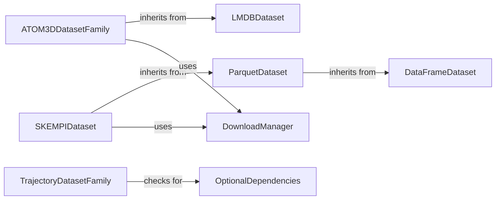

## Component Details

This component overview details the `Structural & Trajectory Datasets` subsystem, which provides a comprehensive suite of dataset management capabilities for molecular machine learning. It encompasses foundational data handling for tabular data, specialized components for structured molecular data like ATOM3D and LMDB, and dedicated classes for molecular dynamics trajectories. The system ensures data integrity and accessibility, leveraging utility components for efficient data downloading and dependency management.

### DataFrameDataset
A foundational dataset component that manages data stored in a pandas DataFrame. It provides basic functionalities for accessing data by index and determining the dataset's length.

**Related Classes/Methods**:

- <a href="https://github.com/Genentech/beignet/blob/master/src/beignet/datasets/_data_frame_dataset.py#L12-L46" target="_blank" rel="noopener noreferrer">`beignet.src.beignet.datasets._data_frame_dataset.DataFrameDataset` (12:46)</a>

### ParquetDataset
A specialized dataset component that extends DataFrameDataset to handle data stored in Parquet file format. It is responsible for reading and loading data from specified Parquet files.

**Related Classes/Methods**:

- <a href="https://github.com/Genentech/beignet/blob/master/src/beignet/datasets/_parquet_dataset.py#L11-L52" target="_blank" rel="noopener noreferrer">`beignet.src.beignet.datasets._parquet_dataset.ParquetDataset` (11:52)</a>

### LMDBDataset
A dataset component designed to interact with LMDB (Lightning Memory-Mapped Database) files. It provides efficient methods for retrieving data entries from LMDB databases.

**Related Classes/Methods**:

- <a href="https://github.com/Genentech/beignet/blob/master/src/beignet/datasets/_lmdb_dataset.py#L12-L73" target="_blank" rel="noopener noreferrer">`beignet.src.beignet.datasets._lmdb_dataset.LMDBDataset` (12:73)</a>

### ATOM3DDatasetFamily
A family of dataset components specifically tailored for ATOM3D data, inheriting from LMDBDataset. These components handle the initialization and data retrieval for various ATOM3D sub-datasets, often involving downloading and extracting archives.

**Related Classes/Methods**:

- <a href="https://github.com/Genentech/beignet/blob/master/src/beignet/datasets/_atom3d_dataset.py#L10-L39" target="_blank" rel="noopener noreferrer">`beignet.src.beignet.datasets._atom3d_dataset.ATOM3DDataset` (10:39)</a>
- <a href="https://github.com/Genentech/beignet/blob/master/src/beignet/datasets/_atom3d_rsr_dataset.py#L13-L172" target="_blank" rel="noopener noreferrer">`beignet.src.beignet.datasets._atom3d_rsr_dataset.ATOM3DRSRDataset` (13:172)</a>
- <a href="https://github.com/Genentech/beignet/blob/master/src/beignet/datasets/_atom3d_msp_dataset.py#L13-L53" target="_blank" rel="noopener noreferrer">`beignet.src.beignet.datasets._atom3d_msp_dataset.ATOM3DMSPDataset` (13:53)</a>
- <a href="https://github.com/Genentech/beignet/blob/master/src/beignet/datasets/_atom3d_smp_dataset.py#L13-L170" target="_blank" rel="noopener noreferrer">`beignet.src.beignet.datasets._atom3d_smp_dataset.ATOM3DSMPDataset` (13:170)</a>
- <a href="https://github.com/Genentech/beignet/blob/master/src/beignet/datasets/_atom3d_psr_dataset.py#L13-L54" target="_blank" rel="noopener noreferrer">`beignet.src.beignet.datasets._atom3d_psr_dataset.ATOM3DPSRDataset` (13:54)</a>
- <a href="https://github.com/Genentech/beignet/blob/master/src/beignet/datasets/_atom3d_res_dataset.py#L11-L85" target="_blank" rel="noopener noreferrer">`beignet.src.beignet.datasets._atom3d_res_dataset.ATOM3DRESDataset` (11:85)</a>
- <a href="https://github.com/Genentech/beignet/blob/master/src/beignet/datasets/_atom3d_ppi_dataset.py#L11-L52" target="_blank" rel="noopener noreferrer">`beignet.src.beignet.datasets._atom3d_ppi_dataset.ATOM3DPPIDataset` (11:52)</a>

### SKEMPIDataset
A specific dataset component for the SKEMPI database, which extends ParquetDataset. It manages the download of both Parquet data and associated PDB structures, and provides methods for accessing sequence and structural information.

**Related Classes/Methods**:

- <a href="https://github.com/Genentech/beignet/blob/master/src/beignet/datasets/_skempi_dataset.py#L15-L237" target="_blank" rel="noopener noreferrer">`beignet.src.beignet.datasets._skempi_dataset.SKEMPIDataset` (15:237)</a>

### TrajectoryDatasetFamily
A family of dataset components for handling molecular trajectory data, with a base class that utilizes the mdtraj library. Subclasses specialize in different trajectory file formats.

**Related Classes/Methods**:

- <a href="https://github.com/Genentech/beignet/blob/master/src/beignet/datasets/_trajectory_dataset.py#L13-L47" target="_blank" rel="noopener noreferrer">`beignet.src.beignet.datasets._trajectory_dataset.TrajectoryDataset` (13:47)</a>
- <a href="https://github.com/Genentech/beignet/blob/master/src/beignet/datasets/_hdf5_trajectory_dataset.py#L13-L31" target="_blank" rel="noopener noreferrer">`beignet.src.beignet.datasets._hdf5_trajectory_dataset.HDF5TrajectoryDataset` (13:31)</a>
- <a href="https://github.com/Genentech/beignet/blob/master/src/beignet/datasets/_pdb_trajectory_dataset.py#L14-L32" target="_blank" rel="noopener noreferrer">`beignet.src.beignet.datasets._pdb_trajectory_dataset.PDBTrajectoryDataset` (14:32)</a>

### DownloadManager
A utility component responsible for handling data downloading and archive extraction operations. It provides functions to fetch resources from specified sources and prepare them for use by dataset components.

**Related Classes/Methods**:

- `beignet.io.download_and_extract_archive` (full file reference)
- `beignet.io.download` (full file reference)

### OptionalDependencies
A utility component that manages and verifies the presence of optional Python dependencies. It ensures that required libraries for specific functionalities are installed, raising an ImportError if a dependency is missing.

**Related Classes/Methods**:

- <a href="https://github.com/Genentech/beignet/blob/master/src/beignet/_optional_dependencies.py#L4-L36" target="_blank" rel="noopener noreferrer">`beignet._optional_dependencies.optional_dependencies` (4:36)</a>

### [FAQ](https://github.com/CodeBoarding/GeneratedOnBoardings/tree/main?tab=readme-ov-file#faq)