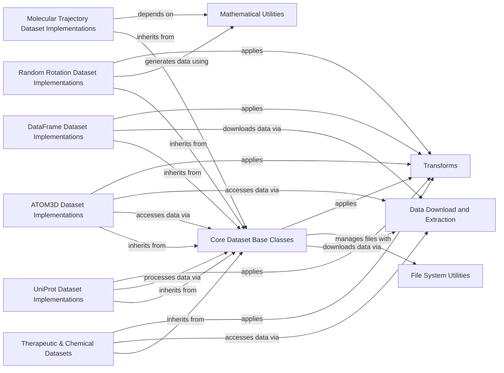

## Component Details

This graph illustrates the structure and interactions within the 'beignet.datasets' subsystem, which is dedicated to managing and providing various therapeutic and chemical datasets. The core functionality revolves around a set of base dataset classes that define common interfaces for data handling. Specific dataset implementations, categorized by their data type (e.g., therapeutic/chemical, ATOM3D, UniProt, DataFrame, random rotation, molecular trajectory), inherit from these base classes. The system relies on utility components for data download, file system operations, mathematical computations, and data transformations, ensuring efficient and flexible data access and processing for drug discovery and development tasks.

### Therapeutic & Chemical Datasets
A collection of datasets from the Therapeutic Data Commons (TDC) for drug discovery and development, covering ADMET properties, binding affinities, and toxicity predictions, supporting various tabular data formats. These datasets inherit from `TDCDataset` and are designed to load and process therapeutic and chemical data.

**Related Classes/Methods**:

- <a href="https://github.com/Genentech/beignet/blob/master/src/beignet/datasets/_tdc_dataset.py#L13-L94" target="_blank" rel="noopener noreferrer">`beignet.src.beignet.datasets._tdc_dataset.TDCDataset` (13:94)</a>
- <a href="https://github.com/Genentech/beignet/blob/master/src/beignet/datasets/_ma_bioavailability_dataset.py#L9-L44" target="_blank" rel="noopener noreferrer">`beignet.src.beignet.datasets._ma_bioavailability_dataset.MaBioavailabilityDataset` (9:44)</a>
- <a href="https://github.com/Genentech/beignet/blob/master/src/beignet/datasets/_lombardo_volume_of_distribution_at_steady_state_dataset.py#L9-L44" target="_blank" rel="noopener noreferrer">`beignet.src.beignet.datasets._lombardo_volume_of_distribution_at_steady_state_dataset.LombardoVolumeOfDistributionAtSteadyStateDataset` (9:44)</a>
- <a href="https://github.com/Genentech/beignet/blob/master/src/beignet/datasets/_pdbbind_dataset.py#L9-L44" target="_blank" rel="noopener noreferrer">`beignet.src.beignet.datasets._pdbbind_dataset.PDBbindDataset` (9:44)</a>
- <a href="https://github.com/Genentech/beignet/blob/master/src/beignet/datasets/_wang_effective_permeability_dataset.py#L9-L44" target="_blank" rel="noopener noreferrer">`beignet.src.beignet.datasets._wang_effective_permeability_dataset.WangEffectivePermeabilityDataset` (9:44)</a>
- <a href="https://github.com/Genentech/beignet/blob/master/src/beignet/datasets/_veith_cytochrome_p450_2d6_inhibition_dataset.py#L9-L44" target="_blank" rel="noopener noreferrer">`beignet.src.beignet.datasets._veith_cytochrome_p450_2d6_inhibition_dataset.VeithCytochromeP4502D6InhibitionDataset` (9:44)</a>
- <a href="https://github.com/Genentech/beignet/blob/master/src/beignet/datasets/_tox21_dataset.py#L9-L57" target="_blank" rel="noopener noreferrer">`beignet.src.beignet.datasets._tox21_dataset.Tox21Dataset` (9:57)</a>
- <a href="https://github.com/Genentech/beignet/blob/master/src/beignet/datasets/_obach_half_life_dataset.py#L9-L44" target="_blank" rel="noopener noreferrer">`beignet.src.beignet.datasets._obach_half_life_dataset.ObachHalfLifeDataset` (9:44)</a>
- <a href="https://github.com/Genentech/beignet/blob/master/src/beignet/datasets/_chen_sabdab_dataset.py#L9-L44" target="_blank" rel="noopener noreferrer">`beignet.src.beignet.datasets._chen_sabdab_dataset.ChenSAbDabDataset` (9:44)</a>
- <a href="https://github.com/Genentech/beignet/blob/master/src/beignet/datasets/_chembl_dataset.py#L9-L39" target="_blank" rel="noopener noreferrer">`beignet.src.beignet.datasets._chembl_dataset.ChEMBLDataset` (9:39)</a>
- <a href="https://github.com/Genentech/beignet/blob/master/src/beignet/datasets/_zinc_dataset.py#L9-L39" target="_blank" rel="noopener noreferrer">`beignet.src.beignet.datasets._zinc_dataset.ZINCDataset` (9:39)</a>
- <a href="https://github.com/Genentech/beignet/blob/master/src/beignet/datasets/_qm9_dataset.py#L9-L44" target="_blank" rel="noopener noreferrer">`beignet.src.beignet.datasets._qm9_dataset.QM9Dataset` (9:44)</a>
- <a href="https://github.com/Genentech/beignet/blob/master/src/beignet/datasets/_bindingdb_ki_dataset.py#L9-L44" target="_blank" rel="noopener noreferrer">`beignet.src.beignet.datasets._bindingdb_ki_dataset.BindingDBKiDataset` (9:44)</a>
- <a href="https://github.com/Genentech/beignet/blob/master/src/beignet/datasets/_moses_dataset.py#L9-L38" target="_blank" rel="noopener noreferrer">`beignet.src.beignet.datasets._moses_dataset.MOSESDataset` (9:38)</a>
- <a href="https://github.com/Genentech/beignet/blob/master/src/beignet/datasets/_broccatelli_p_glycoprotein_inhibition_dataset.py#L9-L44" target="_blank" rel="noopener noreferrer">`beignet.src.beignet.datasets._broccatelli_p_glycoprotein_inhibition_dataset.BroccatelliPGlycoproteinInhibitionDataset` (9:44)</a>
- <a href="https://github.com/Genentech/beignet/blob/master/src/beignet/datasets/_therapeutic_antibody_profiler_dataset.py#L9-L50" target="_blank" rel="noopener noreferrer">`beignet.src.beignet.datasets._therapeutic_antibody_profiler_dataset.TherapeuticAntibodyProfilerDataset` (9:50)</a>
- <a href="https://github.com/Genentech/beignet/blob/master/src/beignet/datasets/_bindingdb_kd_dataset.py#L9-L44" target="_blank" rel="noopener noreferrer">`beignet.src.beignet.datasets._bindingdb_kd_dataset.BindingDBKdDataset` (9:44)</a>
- <a href="https://github.com/Genentech/beignet/blob/master/src/beignet/datasets/_sabdab_dataset.py#L9-L44" target="_blank" rel="noopener noreferrer">`beignet.src.beignet.datasets._sabdab_dataset.SAbDabDataset` (9:44)</a>
- <a href="https://github.com/Genentech/beignet/blob/master/src/beignet/datasets/_huri_dataset.py#L9-L44" target="_blank" rel="noopener noreferrer">`beignet.src.beignet.datasets._huri_dataset.HuRIDataset` (9:44)</a>
- <a href="https://github.com/Genentech/beignet/blob/master/src/beignet/datasets/_hou_human_intestinal_absorption_dataset.py#L9-L44" target="_blank" rel="noopener noreferrer">`beignet.src.beignet.datasets._hou_human_intestinal_absorption_dataset.HouHumanIntestinalAbsorptionDataset` (9:44)</a>
- <a href="https://github.com/Genentech/beignet/blob/master/src/beignet/datasets/_astrazeneca_clearance_dataset.py#L9-L44" target="_blank" rel="noopener noreferrer">`beignet.src.beignet.datasets._astrazeneca_clearance_dataset.AstraZenecaClearanceDataset` (9:44)</a>
- <a href="https://github.com/Genentech/beignet/blob/master/src/beignet/datasets/_qm7_dataset.py#L9-L44" target="_blank" rel="noopener noreferrer">`beignet.src.beignet.datasets._qm7_dataset.QM7Dataset` (9:44)</a>
- <a href="https://github.com/Genentech/beignet/blob/master/src/beignet/datasets/_veith_cytochrome_p450_2c19_inhibition_dataset.py#L9-L44" target="_blank" rel="noopener noreferrer">`beignet.src.beignet.datasets._veith_cytochrome_p450_2c19_inhibition_dataset.VeithCytochromeP4502C19InhibitionDataset` (9:44)</a>
- <a href="https://github.com/Genentech/beignet/blob/master/src/beignet/datasets/_carbon_mangels_cytochrome_p450_3a4_substrate_dataset.py#L9-L44" target="_blank" rel="noopener noreferrer">`beignet.src.beignet.datasets._carbon_mangels_cytochrome_p450_3a4_substrate_dataset.CarbonMangelsCytochromeP4503A4SubstrateDataset` (9:44)</a>
- <a href="https://github.com/Genentech/beignet/blob/master/src/beignet/datasets/_qm8_dataset.py#L9-L44" target="_blank" rel="noopener noreferrer">`beignet.src.beignet.datasets._qm8_dataset.QM8Dataset` (9:44)</a>
- <a href="https://github.com/Genentech/beignet/blob/master/src/beignet/datasets/_gdsc1_dataset.py#L9-L44" target="_blank" rel="noopener noreferrer">`beignet.src.beignet.datasets._gdsc1_dataset.GDSC1Dataset` (9:44)</a>
- <a href="https://github.com/Genentech/beignet/blob/master/src/beignet/datasets/_jespersen_iedb_dataset.py#L9-L44" target="_blank" rel="noopener noreferrer">`beignet.src.beignet.datasets._jespersen_iedb_dataset.JespersenIEDBDataset` (9:44)</a>
- <a href="https://github.com/Genentech/beignet/blob/master/src/beignet/datasets/_veith_cytochrome_p450_3a4_inhibition_dataset.py#L9-L44" target="_blank" rel="noopener noreferrer">`beignet.src.beignet.datasets._veith_cytochrome_p450_3a4_inhibition_dataset.VeithCytochromeP4503A4InhibitionDataset` (9:44)</a>
- <a href="https://github.com/Genentech/beignet/blob/master/src/beignet/datasets/_toxcast_dataset.py#L9-L44" target="_blank" rel="noopener noreferrer">`beignet.src.beignet.datasets._toxcast_dataset.ToxCastDataset` (9:44)</a>
- <a href="https://github.com/Genentech/beignet/blob/master/src/beignet/datasets/_veith_cytochrome_p450_1a2_inhibition_dataset.py#L9-L44" target="_blank" rel="noopener noreferrer">`beignet.src.beignet.datasets._veith_cytochrome_p450_1a2_inhibition_dataset.VeithCytochromeP4501A2InhibitionDataset` (9:44)</a>
- <a href="https://github.com/Genentech/beignet/blob/master/src/beignet/datasets/_clintox_dataset.py#L9-L44" target="_blank" rel="noopener noreferrer">`beignet.src.beignet.datasets._clintox_dataset.ClinToxDataset` (9:44)</a>
- <a href="https://github.com/Genentech/beignet/blob/master/src/beignet/datasets/_martins_blood_brain_barrier_dataset.py#L9-L44" target="_blank" rel="noopener noreferrer">`beignet.src.beignet.datasets._martins_blood_brain_barrier_dataset.MartinsBloodBrainBarrierDataset` (9:44)</a>
- <a href="https://github.com/Genentech/beignet/blob/master/src/beignet/datasets/_astrazeneca_plasma_protein_binding_rate_dataset.py#L9-L44" target="_blank" rel="noopener noreferrer">`beignet.src.beignet.datasets._astrazeneca_plasma_protein_binding_rate_dataset.AstraZenecaPlasmaProteinBindingRateDataset` (9:44)</a>
- <a href="https://github.com/Genentech/beignet/blob/master/src/beignet/datasets/_ncats_pampa_permeability_dataset.py#L9-L44" target="_blank" rel="noopener noreferrer">`beignet.src.beignet.datasets._ncats_pampa_permeability_dataset.NCATSPAMPAPermeabilityDataset` (9:44)</a>
- `beignet.src.beignet.datasets._carbon_mangels_cytochrome_p450_2c9_substrate_dataset.CarbonMangelsCytochromeP4502C9InhibitionDataset` (full file reference)
- <a href="https://github.com/Genentech/beignet/blob/master/src/beignet/datasets/_uspto_dataset.py#L9-L44" target="_blank" rel="noopener noreferrer">`beignet.src.beignet.datasets._uspto_dataset.USPTODataset` (9:44)</a>
- <a href="https://github.com/Genentech/beignet/blob/master/src/beignet/datasets/_uspto_reaction_product_dataset.py#L9-L44" target="_blank" rel="noopener noreferrer">`beignet.src.beignet.datasets._uspto_reaction_product_dataset.USPTOReactionProductDataset` (9:44)</a>
- <a href="https://github.com/Genentech/beignet/blob/master/src/beignet/datasets/_zhu_acute_toxicity_ld50_dataset.py#L9-L44" target="_blank" rel="noopener noreferrer">`beignet.src.beignet.datasets._zhu_acute_toxicity_ld50_dataset.ZhuAcuteToxicityLD50Dataset` (9:44)</a>
- <a href="https://github.com/Genentech/beignet/blob/master/src/beignet/datasets/_bindingdb_ic50_dataset.py#L9-L44" target="_blank" rel="noopener noreferrer">`beignet.src.beignet.datasets._bindingdb_ic50_dataset.BindingDBIC50Dataset` (9:44)</a>
- <a href="https://github.com/Genentech/beignet/blob/master/src/beignet/datasets/_disgenet_dataset.py#L9-L44" target="_blank" rel="noopener noreferrer">`beignet.src.beignet.datasets._disgenet_dataset.DisGeNETDataset` (9:44)</a>
- <a href="https://github.com/Genentech/beignet/blob/master/src/beignet/datasets/_qm7b_dataset.py#L9-L44" target="_blank" rel="noopener noreferrer">`beignet.src.beignet.datasets._qm7b_dataset.QM7bDataset` (9:44)</a>
- <a href="https://github.com/Genentech/beignet/blob/master/src/beignet/datasets/_davis_dataset.py#L9-L44" target="_blank" rel="noopener noreferrer">`beignet.src.beignet.datasets._davis_dataset.DAVISDataset` (9:44)</a>
- <a href="https://github.com/Genentech/beignet/blob/master/src/beignet/datasets/_aqsoldb_solubility_dataset.py#L9-L44" target="_blank" rel="noopener noreferrer">`beignet.src.beignet.datasets._aqsoldb_solubility_dataset.AqSolDBSolubilityDataset` (9:44)</a>
- <a href="https://github.com/Genentech/beignet/blob/master/src/beignet/datasets/_drugcomb_dataset.py#L9-L44" target="_blank" rel="noopener noreferrer">`beignet.src.beignet.datasets._drugcomb_dataset.DrugCombDataset` (9:44)</a>
- <a href="https://github.com/Genentech/beignet/blob/master/src/beignet/datasets/_veith_cytochrome_p450_2c9_inhibition_dataset.py#L9-L44" target="_blank" rel="noopener noreferrer">`beignet.src.beignet.datasets._veith_cytochrome_p450_2c9_inhibition_dataset.VeithCytochromeP4502C9InhibitionDataset` (9:44)</a>
- <a href="https://github.com/Genentech/beignet/blob/master/src/beignet/datasets/_astrazeneca_lipophilicity_dataset.py#L9-L44" target="_blank" rel="noopener noreferrer">`beignet.src.beignet.datasets._astrazeneca_lipophilicity_dataset.AstraZenecaLipophilicityDataset` (9:44)</a>
- <a href="https://github.com/Genentech/beignet/blob/master/src/beignet/datasets/_gdsc2_dataset.py#L9-L44" target="_blank" rel="noopener noreferrer">`beignet.src.beignet.datasets._gdsc2_dataset.GDSC2Dataset` (9:44)</a>
- <a href="https://github.com/Genentech/beignet/blob/master/src/beignet/datasets/_kiba_dataset.py#L9-L44" target="_blank" rel="noopener noreferrer">`beignet.src.beignet.datasets._kiba_dataset.KIBADataset` (9:44)</a>
- <a href="https://github.com/Genentech/beignet/blob/master/src/beignet/datasets/_freesolv_dataset.py#L9-L44" target="_blank" rel="noopener noreferrer">`beignet.src.beignet.datasets._freesolv_dataset.FreeSolvDataset` (9:44)</a>
- <a href="https://github.com/Genentech/beignet/blob/master/src/beignet/datasets/_real_database_dataset.py#L9-L44" target="_blank" rel="noopener noreferrer">`beignet.src.beignet.datasets._real_database_dataset.REALDatabaseDataset` (9:44)</a>
- <a href="https://github.com/Genentech/beignet/blob/master/src/beignet/datasets/_carbon_mangels_cytochrome_p450_2d6_substrate_dataset.py#L9-L44" target="_blank" rel="noopener noreferrer">`beignet.src.beignet.datasets._carbon_mangels_cytochrome_p450_2d6_substrate_dataset.CarbonMangelsCytochromeP4502D6SubstrateDataset` (9:44)</a>

### Core Dataset Base Classes
This component provides the foundational interfaces and common functionalities for various types of datasets within the 'beignet.datasets' module. It includes abstract base classes that define the structure and basic operations for different data storage and access patterns, such as TDC datasets, DataFrame-based datasets, LMDB datasets, FASTA sequence datasets, random rotation datasets, and molecular trajectory datasets.

**Related Classes/Methods**:

- <a href="https://github.com/Genentech/beignet/blob/master/src/beignet/datasets/_tdc_dataset.py#L13-L94" target="_blank" rel="noopener noreferrer">`beignet.src.beignet.datasets._tdc_dataset.TDCDataset` (13:94)</a>
- <a href="https://github.com/Genentech/beignet/blob/master/src/beignet/datasets/_data_frame_dataset.py#L12-L46" target="_blank" rel="noopener noreferrer">`beignet.src.beignet.datasets._data_frame_dataset.DataFrameDataset` (12:46)</a>
- <a href="https://github.com/Genentech/beignet/blob/master/src/beignet/datasets/_lmdb_dataset.py#L12-L73" target="_blank" rel="noopener noreferrer">`beignet.src.beignet.datasets._lmdb_dataset.LMDBDataset` (12:73)</a>
- <a href="https://github.com/Genentech/beignet/blob/master/src/beignet/datasets/_fasta_dataset.py#L16-L103" target="_blank" rel="noopener noreferrer">`beignet.src.beignet.datasets._fasta_dataset.FASTADataset` (16:103)</a>
- <a href="https://github.com/Genentech/beignet/blob/master/src/beignet/datasets/_sequence_dataset.py#L7-L12" target="_blank" rel="noopener noreferrer">`beignet.src.beignet.datasets._sequence_dataset.SequenceDataset` (7:12)</a>
- <a href="https://github.com/Genentech/beignet/blob/master/src/beignet/datasets/_sized_sequence_dataset.py#L8-L21" target="_blank" rel="noopener noreferrer">`beignet.src.beignet.datasets._sized_sequence_dataset.SizedSequenceDataset` (8:21)</a>
- <a href="https://github.com/Genentech/beignet/blob/master/src/beignet/datasets/_random_rotation_dataset.py#L9-L31" target="_blank" rel="noopener noreferrer">`beignet.src.beignet.datasets._random_rotation_dataset.RandomRotationDataset` (9:31)</a>
- <a href="https://github.com/Genentech/beignet/blob/master/src/beignet/datasets/_trajectory_dataset.py#L13-L47" target="_blank" rel="noopener noreferrer">`beignet.src.beignet.datasets._trajectory_dataset.TrajectoryDataset` (13:47)</a>
- <a href="https://github.com/Genentech/beignet/blob/master/src/beignet/datasets/_atom3d_dataset.py#L10-L39" target="_blank" rel="noopener noreferrer">`beignet.src.beignet.datasets._atom3d_dataset.ATOM3DDataset` (10:39)</a>
- <a href="https://github.com/Genentech/beignet/blob/master/src/beignet/datasets/_uniprot_dataset.py#L13-L79" target="_blank" rel="noopener noreferrer">`beignet.src.beignet.datasets._uniprot_dataset.UniProtDataset` (13:79)</a>

### ATOM3D Dataset Implementations
This component includes specific dataset classes that extend 'ATOM3DDataset' to handle various types of 3D atomic structure data. These datasets often rely on LMDB for efficient data storage and retrieval.

**Related Classes/Methods**:

- <a href="https://github.com/Genentech/beignet/blob/master/src/beignet/datasets/_atom3d_rsr_dataset.py#L13-L172" target="_blank" rel="noopener noreferrer">`beignet.src.beignet.datasets._atom3d_rsr_dataset.ATOM3DRSRDataset` (13:172)</a>
- <a href="https://github.com/Genentech/beignet/blob/master/src/beignet/datasets/_atom3d_msp_dataset.py#L13-L53" target="_blank" rel="noopener noreferrer">`beignet.src.beignet.datasets._atom3d_msp_dataset.ATOM3DMSPDataset` (13:53)</a>
- <a href="https://github.com/Genentech/beignet/blob/master/src/beignet/datasets/_atom3d_smp_dataset.py#L13-L170" target="_blank" rel="noopener noreferrer">`beignet.src.beignet.datasets._atom3d_smp_dataset.ATOM3DSMPDataset` (13:170)</a>
- <a href="https://github.com/Genentech/beignet/blob/master/src/beignet/datasets/_atom3d_psr_dataset.py#L13-L54" target="_blank" rel="noopener noreferrer">`beignet.src.beignet.datasets._atom3d_psr_dataset.ATOM3DPSRDataset` (13:54)</a>
- <a href="https://github.com/Genentech/beignet/blob/master/src/beignet/datasets/_atom3d_res_dataset.py#L11-L85" target="_blank" rel="noopener noreferrer">`beignet.src.beignet.datasets._atom3d_res_dataset.ATOM3DRESDataset` (11:85)</a>
- <a href="https://github.com/Genentech/beignet/blob/master/src/beignet/datasets/_atom3d_ppi_dataset.py#L11-L52" target="_blank" rel="noopener noreferrer">`beignet.src.beignet.datasets._atom3d_ppi_dataset.ATOM3DPPIDataset` (11:52)</a>

### UniProt Dataset Implementations
This component contains specific dataset classes that extend 'UniProtDataset' for handling protein sequence data from UniProt and related databases. These datasets typically process data stored in FASTA format.

**Related Classes/Methods**:

- <a href="https://github.com/Genentech/beignet/blob/master/src/beignet/datasets/_uniref50_dataset.py#L9-L39" target="_blank" rel="noopener noreferrer">`beignet.src.beignet.datasets._uniref50_dataset.UniRef50Dataset` (9:39)</a>
- <a href="https://github.com/Genentech/beignet/blob/master/src/beignet/datasets/_trembl_dataset.py#L9-L39" target="_blank" rel="noopener noreferrer">`beignet.src.beignet.datasets._trembl_dataset.TrEMBLDataset` (9:39)</a>
- <a href="https://github.com/Genentech/beignet/blob/master/src/beignet/datasets/_uniref100_dataset.py#L8-L38" target="_blank" rel="noopener noreferrer">`beignet.src.beignet.datasets._uniref100_dataset.UniRef100Dataset` (8:38)</a>
- <a href="https://github.com/Genentech/beignet/blob/master/src/beignet/datasets/_swissprot_dataset.py#L9-L39" target="_blank" rel="noopener noreferrer">`beignet.src.beignet.datasets._swissprot_dataset.SwissProtDataset` (9:39)</a>

### DataFrame Dataset Implementations
This component includes specific dataset classes that extend 'DataFrameDataset' for managing and accessing tabular data, often stored in formats like Parquet. These datasets leverage Pandas DataFrames for in-memory data handling.

**Related Classes/Methods**:

- <a href="https://github.com/Genentech/beignet/blob/master/src/beignet/datasets/_parquet_dataset.py#L11-L52" target="_blank" rel="noopener noreferrer">`beignet.src.beignet.datasets._parquet_dataset.ParquetDataset` (11:52)</a>
- <a href="https://github.com/Genentech/beignet/blob/master/src/beignet/datasets/_skempi_dataset.py#L15-L237" target="_blank" rel="noopener noreferrer">`beignet.src.beignet.datasets._skempi_dataset.SKEMPIDataset` (15:237)</a>

### Random Rotation Dataset Implementations
This component provides specific dataset classes that extend 'RandomRotationDataset' for generating and managing datasets composed of various types of random rotation data, such as rotation vectors, Euler angles, rotation matrices, and quaternions.

**Related Classes/Methods**:

- <a href="https://github.com/Genentech/beignet/blob/master/src/beignet/datasets/_random_rotation_vector_dataset.py#L10-L67" target="_blank" rel="noopener noreferrer">`beignet.src.beignet.datasets._random_rotation_vector_dataset.RandomRotationVectorDataset` (10:67)</a>
- <a href="https://github.com/Genentech/beignet/blob/master/src/beignet/datasets/_random_euler_angle_dataset.py#L11-L75" target="_blank" rel="noopener noreferrer">`beignet.src.beignet.datasets._random_euler_angle_dataset.RandomEulerAngleDataset` (11:75)</a>
- <a href="https://github.com/Genentech/beignet/blob/master/src/beignet/datasets/_random_rotation_matrix_dataset.py#L10-L61" target="_blank" rel="noopener noreferrer">`beignet.src.beignet.datasets._random_rotation_matrix_dataset.RandomRotationMatrixDataset` (10:61)</a>
- <a href="https://github.com/Genentech/beignet/blob/master/src/beignet/datasets/_random_quaternion_dataset.py#L11-L72" target="_blank" rel="noopener noreferrer">`beignet.src.beignet.datasets._random_quaternion_dataset.RandomQuaternionDataset` (11:72)</a>

### Molecular Trajectory Dataset Implementations
This component includes specific dataset classes that extend 'TrajectoryDataset' for handling molecular dynamics trajectory data, supporting formats like HDF5 and PDB. These datasets often rely on external libraries for parsing and manipulating trajectory files.

**Related Classes/Methods**:

- <a href="https://github.com/Genentech/beignet/blob/master/src/beignet/datasets/_hdf5_trajectory_dataset.py#L13-L31" target="_blank" rel="noopener noreferrer">`beignet.src.beignet.datasets._hdf5_trajectory_dataset.HDF5TrajectoryDataset` (13:31)</a>
- <a href="https://github.com/Genentech/beignet/blob/master/src/beignet/datasets/_pdb_trajectory_dataset.py#L14-L32" target="_blank" rel="noopener noreferrer">`beignet.src.beignet.datasets._pdb_trajectory_dataset.PDBTrajectoryDataset` (14:32)</a>

### Data Download and Extraction
This component provides utility functions responsible for downloading data from external sources and extracting archived files. It ensures that necessary datasets are available locally for processing.

**Related Classes/Methods**:

- `beignet.io.download_and_extract_archive` (full file reference)
- `beignet.io.download` (full file reference)

### File System Utilities
This component offers low-level utilities for safe and efficient file system operations, particularly for handling file access in a thread-safe manner.

**Related Classes/Methods**:

- <a href="https://github.com/Genentech/beignet/blob/master/src/beignet/io/_thread_safe_file.py#L9-L56" target="_blank" rel="noopener noreferrer">`beignet.io._thread_safe_file.ThreadSafeFile` (9:56)</a>

### Mathematical Utilities
This component contains utility functions for generating various mathematical objects, specifically random rotation data in different representations (vectors, Euler angles, matrices, quaternions). It also includes functionality for managing optional dependencies required by certain modules.

**Related Classes/Methods**:

- <a href="https://github.com/Genentech/beignet/blob/master/src/beignet/_random_rotation_vector.py#L10-L73" target="_blank" rel="noopener noreferrer">`beignet._random_rotation_vector.random_rotation_vector` (10:73)</a>
- <a href="https://github.com/Genentech/beignet/blob/master/src/beignet/_random_euler_angle.py#L10-L91" target="_blank" rel="noopener noreferrer">`beignet._random_euler_angle.random_euler_angle` (10:91)</a>
- <a href="https://github.com/Genentech/beignet/blob/master/src/beignet/_random_rotation_matrix.py#L10-L69" target="_blank" rel="noopener noreferrer">`beignet._random_rotation_matrix.random_rotation_matrix` (10:69)</a>
- <a href="https://github.com/Genentech/beignet/blob/master/src/beignet/_random_quaternion.py#L5-L95" target="_blank" rel="noopener noreferrer">`beignet._random_quaternion.random_quaternion` (5:95)</a>
- <a href="https://github.com/Genentech/beignet/blob/master/src/beignet/_optional_dependencies.py#L4-L36" target="_blank" rel="noopener noreferrer">`beignet._optional_dependencies.optional_dependencies` (4:36)</a>

### Transforms
This component provides a framework for applying various transformations to data within datasets. It includes a base `Transform` class and specific implementations like `Lambda` for custom transformations.

**Related Classes/Methods**:

- <a href="https://github.com/Genentech/beignet/blob/master/src/beignet/transforms/_lambda.py#L6-L70" target="_blank" rel="noopener noreferrer">`beignet.transforms._lambda.Lambda` (6:70)</a>
- <a href="https://github.com/Genentech/beignet/blob/master/src/beignet/transforms/_transform.py#L11-L195" target="_blank" rel="noopener noreferrer">`beignet.transforms._transform.Transform` (11:195)</a>

### [FAQ](https://github.com/CodeBoarding/GeneratedOnBoardings/tree/main?tab=readme-ov-file#faq)