```mermaid
graph LR
    Polynomials["Polynomials"]
    Rotations_Orientations["Rotations & Orientations"]
    Special_Mathematical_Functions["Special Mathematical Functions"]
    Molecular_Data_Management["Molecular Data Management"]
    Molecular_Structural_Analysis["Molecular Structural Analysis"]
    Generic_Data_Transformations["Generic Data Transformations"]
    Therapeutic_Chemical_Datasets["Therapeutic & Chemical Datasets"]
    Biological_Sequence_Datasets["Biological Sequence Datasets"]
    Structural_Trajectory_Datasets["Structural & Trajectory Datasets"]
    Data_Utilities["Data Utilities"]
    Polynomials -- "provides primitives for" --> Polynomials
    Polynomials -- "can be transformed by" --> Generic_Data_Transformations
    Rotations_Orientations -- "provides core transformations for" --> Molecular_Data_Management
    Rotations_Orientations -- "generates data for" --> Rotations_Orientations
    Rotations_Orientations -- "can be transformed by" --> Generic_Data_Transformations
    Special_Mathematical_Functions -- "provides utilities for" --> Polynomials
    Molecular_Data_Management -- "uses" --> Rotations_Orientations
    Molecular_Data_Management -- "provides data for" --> Molecular_Structural_Analysis
    Molecular_Data_Management -- "uses" --> Data_Utilities
    Molecular_Structural_Analysis -- "operates on" --> Molecular_Data_Management
    Molecular_Structural_Analysis -- "uses" --> Rotations_Orientations
    Generic_Data_Transformations -- "applies to" --> Polynomials
    Generic_Data_Transformations -- "applies to" --> Rotations_Orientations
    Generic_Data_Transformations -- "applies to" --> Therapeutic_Chemical_Datasets
    Generic_Data_Transformations -- "applies to" --> Biological_Sequence_Datasets
    Generic_Data_Transformations -- "applies to" --> Structural_Trajectory_Datasets
    Therapeutic_Chemical_Datasets -- "provides data for" --> Generic_Data_Transformations
    Therapeutic_Chemical_Datasets -- "uses" --> Data_Utilities
    Biological_Sequence_Datasets -- "provides data for" --> Generic_Data_Transformations
    Biological_Sequence_Datasets -- "uses" --> Data_Utilities
    Structural_Trajectory_Datasets -- "provides data for" --> Generic_Data_Transformations
    Structural_Trajectory_Datasets -- "uses" --> Data_Utilities
    Structural_Trajectory_Datasets -- "provides data for" --> Molecular_Data_Management
    Data_Utilities -- "supports" --> Therapeutic_Chemical_Datasets
    Data_Utilities -- "supports" --> Biological_Sequence_Datasets
    Data_Utilities -- "supports" --> Structural_Trajectory_Datasets
    click Polynomials href "https://github.com/CodeBoarding/GeneratedOnBoardings/blob/main/beignet/Polynomials.md" "Details"
    click Rotations_Orientations href "https://github.com/CodeBoarding/GeneratedOnBoardings/blob/main/beignet/Rotations & Orientations.md" "Details"
    click Special_Mathematical_Functions href "https://github.com/CodeBoarding/GeneratedOnBoardings/blob/main/beignet/Special Mathematical Functions.md" "Details"
    click Molecular_Data_Management href "https://github.com/CodeBoarding/GeneratedOnBoardings/blob/main/beignet/Molecular Data Management.md" "Details"
    click Molecular_Structural_Analysis href "https://github.com/CodeBoarding/GeneratedOnBoardings/blob/main/beignet/Molecular Structural Analysis.md" "Details"
    click Generic_Data_Transformations href "https://github.com/CodeBoarding/GeneratedOnBoardings/blob/main/beignet/Generic Data Transformations.md" "Details"
    click Therapeutic_Chemical_Datasets href "https://github.com/CodeBoarding/GeneratedOnBoardings/blob/main/beignet/Therapeutic & Chemical Datasets.md" "Details"
    click Biological_Sequence_Datasets href "https://github.com/CodeBoarding/GeneratedOnBoardings/blob/main/beignet/Biological Sequence Datasets.md" "Details"
    click Structural_Trajectory_Datasets href "https://github.com/CodeBoarding/GeneratedOnBoardings/blob/main/beignet/Structural & Trajectory Datasets.md" "Details"
    click Data_Utilities href "https://github.com/CodeBoarding/GeneratedOnBoardings/blob/main/beignet/Data Utilities.md" "Details"
```

## Component Details

The `beignet` project is a scientific computing library primarily focused on molecular modeling and analysis, with strong capabilities in polynomial mathematics and 3D rotations. It provides tools for handling and transforming molecular structural data, performing complex polynomial operations, and analyzing molecular interactions. The library also includes a comprehensive set of datasets for various machine learning tasks in drug discovery and bioinformatics, supported by robust data I/O utilities.

### Polynomials
Provides comprehensive functionalities for various polynomial types, including arithmetic operations, conversions, root finding, evaluation, calculus (integration, differentiation), and data fitting using methods like Vandermonde matrices and Gaussian quadrature.

**Related Classes/Methods**:

- `beignet.src.beignet._multiply_probabilists_hermite_polynomial` (full file reference)
- <a href="https://github.com/Genentech/beignet/blob/master/src/beignet/_add_probabilists_hermite_polynomial.py#L5-L55" target="_blank" rel="noopener noreferrer">`beignet.src.beignet._add_probabilists_hermite_polynomial.add_probabilists_hermite_polynomial` (5:55)</a>
- <a href="https://github.com/Genentech/beignet/blob/master/src/beignet/_subtract_probabilists_hermite_polynomial.py#L5-L56" target="_blank" rel="noopener noreferrer">`beignet.src.beignet._subtract_probabilists_hermite_polynomial.subtract_probabilists_hermite_polynomial` (5:56)</a>
- <a href="https://github.com/Genentech/beignet/blob/master/src/beignet/_multiply_probabilists_hermite_polynomial_by_x.py#L7-L25" target="_blank" rel="noopener noreferrer">`beignet.src.beignet._multiply_probabilists_hermite_polynomial_by_x.multiply_probabilists_hermite_polynomial_by_x` (7:25)</a>
- `beignet.src.beignet._polynomial_to_legendre_polynomial` (full file reference)
- <a href="https://github.com/Genentech/beignet/blob/master/src/beignet/_multiply_legendre_polynomial_by_x.py#L7-L24" target="_blank" rel="noopener noreferrer">`beignet.src.beignet._multiply_legendre_polynomial_by_x.multiply_legendre_polynomial_by_x` (7:24)</a>
- <a href="https://github.com/Genentech/beignet/blob/master/src/beignet/_add_legendre_polynomial.py#L5-L55" target="_blank" rel="noopener noreferrer">`beignet.src.beignet._add_legendre_polynomial.add_legendre_polynomial` (5:55)</a>
- `beignet.src.beignet._physicists_hermite_polynomial_power` (full file reference)
- `beignet.src.beignet._multiply_physicists_hermite_polynomial` (full file reference)
- `beignet.src.beignet._polynomial_power` (full file reference)
- `beignet.src.beignet._multiply_polynomial` (full file reference)
- `beignet.src.beignet._physicists_hermite_polynomial_to_polynomial` (full file reference)
- <a href="https://github.com/Genentech/beignet/blob/master/src/beignet/_subtract_polynomial.py#L5-L53" target="_blank" rel="noopener noreferrer">`beignet.src.beignet._subtract_polynomial.subtract_polynomial` (5:53)</a>
- <a href="https://github.com/Genentech/beignet/blob/master/src/beignet/_add_polynomial.py#L5-L55" target="_blank" rel="noopener noreferrer">`beignet.src.beignet._add_polynomial.add_polynomial` (5:55)</a>
- <a href="https://github.com/Genentech/beignet/blob/master/src/beignet/_multiply_polynomial_by_x.py#L7-L34" target="_blank" rel="noopener noreferrer">`beignet.src.beignet._multiply_polynomial_by_x.multiply_polynomial_by_x` (7:34)</a>
- `beignet.src.beignet._polynomial_to_chebyshev_polynomial` (full file reference)
- <a href="https://github.com/Genentech/beignet/blob/master/src/beignet/_multiply_chebyshev_polynomial_by_x.py#L7-L25" target="_blank" rel="noopener noreferrer">`beignet.src.beignet._multiply_chebyshev_polynomial_by_x.multiply_chebyshev_polynomial_by_x` (7:25)</a>
- <a href="https://github.com/Genentech/beignet/blob/master/src/beignet/_add_chebyshev_polynomial.py#L5-L55" target="_blank" rel="noopener noreferrer">`beignet.src.beignet._add_chebyshev_polynomial.add_chebyshev_polynomial` (5:55)</a>
- `beignet.src.beignet._legendre_polynomial_to_polynomial` (full file reference)
- `beignet.src.beignet._laguerre_polynomial_power` (full file reference)
- `beignet.src.beignet._multiply_laguerre_polynomial` (full file reference)
- `beignet.src.beignet._polynomial_to_laguerre_polynomial` (full file reference)
- <a href="https://github.com/Genentech/beignet/blob/master/src/beignet/_multiply_laguerre_polynomial_by_x.py#L7-L29" target="_blank" rel="noopener noreferrer">`beignet.src.beignet._multiply_laguerre_polynomial_by_x.multiply_laguerre_polynomial_by_x` (7:29)</a>
- <a href="https://github.com/Genentech/beignet/blob/master/src/beignet/_add_laguerre_polynomial.py#L5-L55" target="_blank" rel="noopener noreferrer">`beignet.src.beignet._add_laguerre_polynomial.add_laguerre_polynomial` (5:55)</a>
- `beignet.src.beignet._polynomial_to_probabilists_hermite_polynomial` (full file reference)
- `beignet.src.beignet._divide_legendre_polynomial` (full file reference)
- `beignet.src.beignet._chebyshev_polynomial_to_polynomial` (full file reference)
- `beignet.src.beignet._divide_laguerre_polynomial` (full file reference)
- `beignet.src.beignet._multiply_chebyshev_polynomial` (full file reference)
- `beignet.src.beignet._probabilists_hermite_polynomial_to_polynomial` (full file reference)
- `beignet.src.beignet._divide_physicists_hermite_polynomial` (full file reference)
- `beignet.src.beignet._divide_polynomial` (full file reference)
- `beignet.src.beignet._multiply_legendre_polynomial` (full file reference)
- `beignet.src.beignet._divide_probabilists_hermite_polynomial` (full file reference)
- `beignet.src.beignet._chebyshev_polynomial_power` (full file reference)
- `beignet.src.beignet._laguerre_polynomial_to_polynomial` (full file reference)
- `beignet.src.beignet._laguerre_polynomial_from_roots` (full file reference)
- <a href="https://github.com/Genentech/beignet/blob/master/src/beignet/_linear_laguerre_polynomial.py#L5-L6" target="_blank" rel="noopener noreferrer">`beignet.src.beignet._linear_laguerre_polynomial.linear_laguerre_polynomial` (5:6)</a>
- `beignet.src.beignet._probabilists_hermite_polynomial_from_roots` (full file reference)
- <a href="https://github.com/Genentech/beignet/blob/master/src/beignet/_linear_probabilists_hermite_polynomial.py#L5-L6" target="_blank" rel="noopener noreferrer">`beignet.src.beignet._linear_probabilists_hermite_polynomial.linear_probabilists_hermite_polynomial` (5:6)</a>
- `beignet.src.beignet._physicists_hermite_polynomial_from_roots` (full file reference)
- <a href="https://github.com/Genentech/beignet/blob/master/src/beignet/_linear_physicists_hermite_polynomial.py#L5-L6" target="_blank" rel="noopener noreferrer">`beignet.src.beignet._linear_physicists_hermite_polynomial.linear_physicists_hermite_polynomial` (5:6)</a>
- `beignet.src.beignet._polynomial_from_roots` (full file reference)
- <a href="https://github.com/Genentech/beignet/blob/master/src/beignet/_linear_polynomial.py#L5-L6" target="_blank" rel="noopener noreferrer">`beignet.src.beignet._linear_polynomial.linear_polynomial` (5:6)</a>
- `beignet.src.beignet._chebyshev_polynomial_from_roots` (full file reference)
- <a href="https://github.com/Genentech/beignet/blob/master/src/beignet/_linear_chebyshev_polynomial.py#L5-L6" target="_blank" rel="noopener noreferrer">`beignet.src.beignet._linear_chebyshev_polynomial.linear_chebyshev_polynomial` (5:6)</a>
- `beignet.src.beignet._legendre_polynomial_from_roots` (full file reference)
- <a href="https://github.com/Genentech/beignet/blob/master/src/beignet/_linear_legendre_polynomial.py#L5-L6" target="_blank" rel="noopener noreferrer">`beignet.src.beignet._linear_legendre_polynomial.linear_legendre_polynomial` (5:6)</a>
- `beignet.src.beignet._integrate_chebyshev_polynomial` (full file reference)
- <a href="https://github.com/Genentech/beignet/blob/master/src/beignet/_evaluate_chebyshev_polynomial.py#L5-L35" target="_blank" rel="noopener noreferrer">`beignet.src.beignet._evaluate_chebyshev_polynomial.evaluate_chebyshev_polynomial` (5:35)</a>
- `beignet.src.beignet._probabilists_hermite_polynomial_roots` (full file reference)
- <a href="https://github.com/Genentech/beignet/blob/master/src/beignet/_probabilists_hermite_polynomial_companion.py#L5-L39" target="_blank" rel="noopener noreferrer">`beignet.src.beignet._probabilists_hermite_polynomial_companion.probabilists_hermite_polynomial_companion` (5:39)</a>
- `beignet.src.beignet._integrate_physicists_hermite_polynomial` (full file reference)
- <a href="https://github.com/Genentech/beignet/blob/master/src/beignet/_evaluate_physicists_hermite_polynomial.py#L5-L40" target="_blank" rel="noopener noreferrer">`beignet.src.beignet._evaluate_physicists_hermite_polynomial.evaluate_physicists_hermite_polynomial` (5:40)</a>
- `beignet.src.beignet._physicists_hermite_polynomial_roots` (full file reference)
- <a href="https://github.com/Genentech/beignet/blob/master/src/beignet/_physicists_hermite_polynomial_companion.py#L5-L40" target="_blank" rel="noopener noreferrer">`beignet.src.beignet._physicists_hermite_polynomial_companion.physicists_hermite_polynomial_companion` (5:40)</a>
- `beignet.src.beignet._evaluate_polynomial_cartesian_3d` (full file reference)
- <a href="https://github.com/Genentech/beignet/blob/master/src/beignet/_evaluate_polynomial.py#L5-L34" target="_blank" rel="noopener noreferrer">`beignet.src.beignet._evaluate_polynomial.evaluate_polynomial` (5:34)</a>
- `beignet.src.beignet._integrate_laguerre_polynomial` (full file reference)
- `beignet.src.beignet._evaluate_probabilists_hermite_polynomial_cartersian_3d` (full file reference)
- <a href="https://github.com/Genentech/beignet/blob/master/src/beignet/_evaluate_probabilists_hermite_polynomial.py#L5-L40" target="_blank" rel="noopener noreferrer">`beignet.src.beignet._evaluate_probabilists_hermite_polynomial.evaluate_probabilists_hermite_polynomial` (5:40)</a>
- `beignet.src.beignet._integrate_polynomial` (full file reference)
- `beignet.src.beignet._evaluate_legendre_polynomial_2d` (full file reference)
- `beignet.src.beignet._evaluate_laguerre_polynomial_cartesian_2d` (full file reference)
- `beignet.src.beignet._evaluate_probabilists_hermite_polynomial_2d` (full file reference)
- `beignet.src.beignet._evaluate_probabilists_hermite_polynomial_cartersian_2d` (full file reference)
- `beignet.src.beignet._integrate_probabilists_hermite_polynomial` (full file reference)
- `beignet.src.beignet._differentiate_laguerre_polynomial` (full file reference)
- `beignet.src.beignet._evaluate_physicists_hermite_polynomial_3d` (full file reference)
- `beignet.src.beignet._evaluate_chebyshev_polynomial_3d` (full file reference)
- `beignet.src.beignet._evaluate_polynomial_3d` (full file reference)
- `beignet.src.beignet._evaluate_laguerre_polynomial_cartesian_3d` (full file reference)
- `beignet.src.beignet._evaluate_laguerre_polynomial_3d` (full file reference)
- `beignet.src.beignet._evaluate_laguerre_polynomial_2d` (full file reference)
- `beignet.src.beignet._legendre_polynomial_roots` (full file reference)
- <a href="https://github.com/Genentech/beignet/blob/master/src/beignet/_legendre_polynomial_companion.py#L5-L32" target="_blank" rel="noopener noreferrer">`beignet.src.beignet._legendre_polynomial_companion.legendre_polynomial_companion` (5:32)</a>
- `beignet.src.beignet._differentiate_legendre_polynomial` (full file reference)
- `beignet.src.beignet._laguerre_polynomial_roots` (full file reference)
- <a href="https://github.com/Genentech/beignet/blob/master/src/beignet/_laguerre_polynomial_companion.py#L5-L28" target="_blank" rel="noopener noreferrer">`beignet.src.beignet._laguerre_polynomial_companion.laguerre_polynomial_companion` (5:28)</a>
- `beignet.src.beignet._evaluate_polynomial_2d` (full file reference)
- `beignet.src.beignet._integrate_legendre_polynomial` (full file reference)
- `beignet.src.beignet._evaluate_physicists_hermite_polynomial_2d` (full file reference)
- `beignet.src.beignet._evaluate_legendre_polynomial_3d` (full file reference)
- `beignet.src.beignet._evaluate_legendre_polynomial_cartesian_3d` (full file reference)
- `beignet.src.beignet._evaluate_chebyshev_polynomial_cartesian_3d` (full file reference)
- `beignet.src.beignet._evaluate_chebyshev_polynomial_2d` (full file reference)
- `beignet.src.beignet._evaluate_physicists_hermite_polynomial_cartesian_2d` (full file reference)
- `beignet.src.beignet._evaluate_physicists_hermite_polynomial_cartesian_3d` (full file reference)
- `beignet.src.beignet._evaluate_chebyshev_polynomial_cartesian_2d` (full file reference)
- `beignet.src.beignet._evaluate_legendre_polynomial_cartesian_2d` (full file reference)
- `beignet.src.beignet._fit_physicists_hermite_polynomial` (full file reference)
- <a href="https://github.com/Genentech/beignet/blob/master/src/beignet/_physicists_hermite_polynomial_vandermonde.py#L5-L25" target="_blank" rel="noopener noreferrer">`beignet.src.beignet._physicists_hermite_polynomial_vandermonde.physicists_hermite_polynomial_vandermonde` (5:25)</a>
- `beignet.src.beignet._fit_legendre_polynomial` (full file reference)
- <a href="https://github.com/Genentech/beignet/blob/master/src/beignet/_legendre_polynomial_vandermonde.py#L5-L30" target="_blank" rel="noopener noreferrer">`beignet.src.beignet._legendre_polynomial_vandermonde.legendre_polynomial_vandermonde` (5:30)</a>
- `beignet.src.beignet._fit_laguerre_polynomial` (full file reference)
- <a href="https://github.com/Genentech/beignet/blob/master/src/beignet/_laguerre_polynomial_vandermonde.py#L5-L30" target="_blank" rel="noopener noreferrer">`beignet.src.beignet._laguerre_polynomial_vandermonde.laguerre_polynomial_vandermonde` (5:30)</a>
- `beignet.src.beignet._fit_chebyshev_polynomial` (full file reference)
- <a href="https://github.com/Genentech/beignet/blob/master/src/beignet/_chebyshev_polynomial_vandermonde.py#L5-L28" target="_blank" rel="noopener noreferrer">`beignet.src.beignet._chebyshev_polynomial_vandermonde.chebyshev_polynomial_vandermonde` (5:28)</a>
- `beignet.src.beignet._fit_polynomial` (full file reference)
- <a href="https://github.com/Genentech/beignet/blob/master/src/beignet/_polynomial_vandermonde.py#L5-L33" target="_blank" rel="noopener noreferrer">`beignet.src.beignet._polynomial_vandermonde.polynomial_vandermonde` (5:33)</a>
- `beignet.src.beignet._fit_probabilists_hermite_polynomial` (full file reference)
- <a href="https://github.com/Genentech/beignet/blob/master/src/beignet/_probabilists_hermite_polynomial_vandermonde.py#L5-L22" target="_blank" rel="noopener noreferrer">`beignet.src.beignet._probabilists_hermite_polynomial_vandermonde.probabilists_hermite_polynomial_vandermonde` (5:22)</a>
- `beignet.src.beignet._gauss_laguerre_quadrature` (full file reference)
- `beignet.src.beignet._gauss_probabilists_hermite_polynomial_quadrature` (full file reference)
- `beignet.src.beignet._gauss_physicists_hermite_polynomial_quadrature` (full file reference)
- `beignet.src.beignet._gauss_legendre_quadrature` (full file reference)
- `beignet.src.beignet._root_scalar` (full file reference)
- <a href="https://github.com/Genentech/beignet/blob/master/src/beignet/func/_custom_scalar_root.py#L8-L79" target="_blank" rel="noopener noreferrer">`beignet.func._custom_scalar_root.custom_scalar_root` (8:79)</a>
- <a href="https://github.com/Genentech/beignet/blob/master/src/beignet/_bisect.py#L8-L114" target="_blank" rel="noopener noreferrer">`beignet._bisect.bisect` (8:114)</a>

### Rotations & Orientations
Manages 3D rotations and orientations, offering conversions between Euler angles, quaternions, rotation matrices, and rotation vectors. It includes functionalities for applying, composing, inverting, and generating random transformations, as well as wrapping rotation data for machine learning features.

**Related Classes/Methods**:

- `beignet.src.beignet._rotation_vector_to_euler_angle` (full file reference)
- <a href="https://github.com/Genentech/beignet/blob/master/src/beignet/_quaternion_to_euler_angle.py#L8-L143" target="_blank" rel="noopener noreferrer">`beignet.src.beignet._quaternion_to_euler_angle.quaternion_to_euler_angle` (8:143)</a>
- <a href="https://github.com/Genentech/beignet/blob/master/src/beignet/_rotation_vector_to_quaternion.py#L5-L71" target="_blank" rel="noopener noreferrer">`beignet.src.beignet._rotation_vector_to_quaternion.rotation_vector_to_quaternion` (5:71)</a>
- `beignet.src.beignet._rotation_vector_to_rotation_matrix` (full file reference)
- <a href="https://github.com/Genentech/beignet/blob/master/src/beignet/_quaternion_to_rotation_matrix.py#L5-L35" target="_blank" rel="noopener noreferrer">`beignet.src.beignet._quaternion_to_rotation_matrix.quaternion_to_rotation_matrix` (5:35)</a>
- `beignet.src.beignet._compose_euler_angle` (full file reference)
- <a href="https://github.com/Genentech/beignet/blob/master/src/beignet/_compose_quaternion.py#L5-L73" target="_blank" rel="noopener noreferrer">`beignet.src.beignet._compose_quaternion.compose_quaternion` (5:73)</a>
- <a href="https://github.com/Genentech/beignet/blob/master/src/beignet/_euler_angle_to_quaternion.py#L7-L170" target="_blank" rel="noopener noreferrer">`beignet.src.beignet._euler_angle_to_quaternion.euler_angle_to_quaternion` (7:170)</a>
- `beignet.src.beignet._compose_rotation_matrix` (full file reference)
- <a href="https://github.com/Genentech/beignet/blob/master/src/beignet/_rotation_matrix_to_quaternion.py#L5-L88" target="_blank" rel="noopener noreferrer">`beignet.src.beignet._rotation_matrix_to_quaternion.rotation_matrix_to_quaternion` (5:88)</a>
- `beignet.src.beignet._compose_rotation_vector` (full file reference)
- `beignet.src.beignet._rotation_matrix_to_euler_angle` (full file reference)
- `beignet.src.beignet._rotation_matrix_to_rotation_vector` (full file reference)
- <a href="https://github.com/Genentech/beignet/blob/master/src/beignet/_quaternion_to_rotation_vector.py#L5-L57" target="_blank" rel="noopener noreferrer">`beignet.src.beignet._quaternion_to_rotation_vector.quaternion_to_rotation_vector` (5:57)</a>
- `beignet.src.beignet._pad` (full file reference)
- <a href="https://github.com/Genentech/beignet/blob/master/src/beignet/_pad.py#L5-L8" target="_blank" rel="noopener noreferrer">`beignet.src.beignet._pad._pad_end` (5:8)</a>
- `beignet.src.beignet._random_euler_angle` (full file reference)
- <a href="https://github.com/Genentech/beignet/blob/master/src/beignet/_random_quaternion.py#L5-L95" target="_blank" rel="noopener noreferrer">`beignet.src.beignet._random_quaternion.random_quaternion` (5:95)</a>
- `beignet.src.beignet._rotation_vector_identity` (full file reference)
- <a href="https://github.com/Genentech/beignet/blob/master/src/beignet/_quaternion_identity.py#L5-L64" target="_blank" rel="noopener noreferrer">`beignet.src.beignet._quaternion_identity.quaternion_identity` (5:64)</a>
- `beignet.src.beignet._apply_rotation_vector` (full file reference)
- <a href="https://github.com/Genentech/beignet/blob/master/src/beignet/_apply_rotation_matrix.py#L5-L47" target="_blank" rel="noopener noreferrer">`beignet.src.beignet._apply_rotation_matrix.apply_rotation_matrix` (5:47)</a>
- `beignet.src.beignet._random_rotation_matrix` (full file reference)
- `beignet.src.beignet._euler_angle_mean` (full file reference)
- <a href="https://github.com/Genentech/beignet/blob/master/src/beignet/_quaternion_mean.py#L5-L34" target="_blank" rel="noopener noreferrer">`beignet.src.beignet._quaternion_mean.quaternion_mean` (5:34)</a>
- `beignet.src.beignet._rotation_matrix_magnitude` (full file reference)
- <a href="https://github.com/Genentech/beignet/blob/master/src/beignet/_quaternion_magnitude.py#L5-L37" target="_blank" rel="noopener noreferrer">`beignet.src.beignet._quaternion_magnitude.quaternion_magnitude` (5:37)</a>
- `beignet.src.beignet._apply_euler_angle` (full file reference)
- `beignet.src.beignet._rotation_vector_mean` (full file reference)
- `beignet.src.beignet._rotation_matrix_mean` (full file reference)
- `beignet.src.beignet._euler_angle_magnitude` (full file reference)
- `beignet.src.beignet._euler_angle_identity` (full file reference)
- `beignet.src.beignet._random_rotation_vector` (full file reference)
- `beignet.src.beignet._invert_euler_angle` (full file reference)
- <a href="https://github.com/Genentech/beignet/blob/master/src/beignet/_invert_quaternion.py#L4-L31" target="_blank" rel="noopener noreferrer">`beignet.src.beignet._invert_quaternion.invert_quaternion` (4:31)</a>
- <a href="https://github.com/Genentech/beignet/blob/master/src/beignet/_invert_transform.py#L5-L25" target="_blank" rel="noopener noreferrer">`beignet.src.beignet._invert_transform.invert_transform` (5:25)</a>
- <a href="https://github.com/Genentech/beignet/blob/master/src/beignet/_apply_transform.py#L83-L101" target="_blank" rel="noopener noreferrer">`beignet.src.beignet._apply_transform.apply_transform` (83:101)</a>
- <a href="https://github.com/Genentech/beignet/blob/master/src/beignet/_apply_transform.py#L36-L80" target="_blank" rel="noopener noreferrer">`beignet.src.beignet._apply_transform._ApplyTransform` (36:80)</a>
- <a href="https://github.com/Genentech/beignet/blob/master/src/beignet/_apply_transform.py#L6-L33" target="_blank" rel="noopener noreferrer">`beignet.src.beignet._apply_transform._apply_transform` (6:33)</a>
- <a href="https://github.com/Genentech/beignet/blob/master/src/beignet/func/_space.py#L11-L384" target="_blank" rel="noopener noreferrer">`beignet.src.beignet.func._space.space` (11:384)</a>
- `beignet.src.beignet.func._space.space.u` (full file reference)
- <a href="https://github.com/Genentech/beignet/blob/master/src/beignet/features/_rotation_matrix.py#L11-L47" target="_blank" rel="noopener noreferrer">`beignet.src.beignet.features._rotation_matrix.RotationMatrix` (11:47)</a>
- <a href="https://github.com/Genentech/beignet/blob/master/src/beignet/features/_quaternion.py#L11-L44" target="_blank" rel="noopener noreferrer">`beignet.src.beignet.features._quaternion.Quaternion` (11:44)</a>
- <a href="https://github.com/Genentech/beignet/blob/master/src/beignet/features/_euler_angle.py#L11-L47" target="_blank" rel="noopener noreferrer">`beignet.src.beignet.features._euler_angle.EulerAngle` (11:47)</a>
- <a href="https://github.com/Genentech/beignet/blob/master/src/beignet/features/_rotation_vector.py#L11-L47" target="_blank" rel="noopener noreferrer">`beignet.src.beignet.features._rotation_vector.RotationVector` (11:47)</a>
- <a href="https://github.com/Genentech/beignet/blob/master/src/beignet/features/_feature.py#L22-L182" target="_blank" rel="noopener noreferrer">`beignet.src.beignet.features._feature.Feature` (22:182)</a>
- <a href="https://github.com/Genentech/beignet/blob/master/src/beignet/features/_feature.py#L30-L44" target="_blank" rel="noopener noreferrer">`beignet.src.beignet.features._feature.Feature._to_tensor` (30:44)</a>
- <a href="https://github.com/Genentech/beignet/blob/master/src/beignet/features/_rotation_matrix.py#L13-L14" target="_blank" rel="noopener noreferrer">`beignet.src.beignet.features._rotation_matrix.RotationMatrix._wrap` (13:14)</a>
- <a href="https://github.com/Genentech/beignet/blob/master/src/beignet/features/_quaternion.py#L13-L14" target="_blank" rel="noopener noreferrer">`beignet.src.beignet.features._quaternion.Quaternion._wrap` (13:14)</a>
- <a href="https://github.com/Genentech/beignet/blob/master/src/beignet/features/_euler_angle.py#L13-L14" target="_blank" rel="noopener noreferrer">`beignet.src.beignet.features._euler_angle.EulerAngle._wrap` (13:14)</a>
- <a href="https://github.com/Genentech/beignet/blob/master/src/beignet/features/_rotation_vector.py#L13-L14" target="_blank" rel="noopener noreferrer">`beignet.src.beignet.features._rotation_vector.RotationVector._wrap` (13:14)</a>
- <a href="https://github.com/Genentech/beignet/blob/master/src/beignet/features/_feature.py#L118-L124" target="_blank" rel="noopener noreferrer">`beignet.src.beignet.features._feature.Feature._make_repr` (118:124)</a>
- <a href="https://github.com/Genentech/beignet/blob/master/src/beignet/datasets/_random_rotation_vector_dataset.py#L10-L67" target="_blank" rel="noopener noreferrer">`beignet.src.beignet.datasets._random_rotation_vector_dataset.RandomRotationVectorDataset` (10:67)</a>
- <a href="https://github.com/Genentech/beignet/blob/master/src/beignet/datasets/_random_rotation_dataset.py#L9-L31" target="_blank" rel="noopener noreferrer">`beignet.datasets._random_rotation_dataset.RandomRotationDataset` (9:31)</a>
- <a href="https://github.com/Genentech/beignet/blob/master/src/beignet/datasets/_random_euler_angle_dataset.py#L11-L75" target="_blank" rel="noopener noreferrer">`beignet.src.beignet.datasets._random_euler_angle_dataset.RandomEulerAngleDataset` (11:75)</a>
- <a href="https://github.com/Genentech/beignet/blob/master/src/beignet/datasets/_random_rotation_matrix_dataset.py#L10-L61" target="_blank" rel="noopener noreferrer">`beignet.src.beignet.datasets._random_rotation_matrix_dataset.RandomRotationMatrixDataset` (10:61)</a>
- <a href="https://github.com/Genentech/beignet/blob/master/src/beignet/datasets/_random_quaternion_dataset.py#L11-L72" target="_blank" rel="noopener noreferrer">`beignet.src.beignet.datasets._random_quaternion_dataset.RandomQuaternionDataset` (11:72)</a>

### Special Mathematical Functions
Implements specific mathematical functions like the Faddeeva W function, various error functions (erf, erfc, erfi), and the Dawson integral, commonly used in scientific computing.

**Related Classes/Methods**:

- `beignet.src.beignet.special._faddeeva_w` (full file reference)
- <a href="https://github.com/Genentech/beignet/blob/master/src/beignet/special/_faddeeva_w.py#L7-L63" target="_blank" rel="noopener noreferrer">`beignet.src.beignet.special._faddeeva_w._voigt_v` (7:63)</a>
- <a href="https://github.com/Genentech/beignet/blob/master/src/beignet/special/_faddeeva_w.py#L66-L121" target="_blank" rel="noopener noreferrer">`beignet.src.beignet.special._faddeeva_w._voigt_l` (66:121)</a>
- `beignet.src.beignet.special._error_erfc` (full file reference)
- `beignet.src.beignet.special._error_erf` (full file reference)
- `beignet.src.beignet.special._error_erfi` (full file reference)
- `beignet.src.beignet.special._dawson_integral_f` (full file reference)

### Molecular Data Management
Manages the representation, conversion, and manipulation of molecular structural data. This includes the `ResidueArray` for sequences and coordinates, `Rigid` for rigid body transformations, and selectors for specific structural parts. It also handles I/O for PDB and MMCIF formats.

**Related Classes/Methods**:

- `beignet.src.beignet.structure._atom_array_to_atom_thin` (full file reference)
- <a href="https://github.com/Genentech/beignet/blob/master/src/beignet/structure/_atom_array_to_atom_thin.py#L40-L43" target="_blank" rel="noopener noreferrer">`beignet.src.beignet.structure._atom_array_to_atom_thin._selenium_to_sulfur` (40:43)</a>
- <a href="https://github.com/Genentech/beignet/blob/master/src/beignet/structure/_atom_array_to_atom_thin.py#L18-L26" target="_blank" rel="noopener noreferrer">`beignet.src.beignet.structure._atom_array_to_atom_thin._mutate_mse_to_met` (18:26)</a>
- <a href="https://github.com/Genentech/beignet/blob/master/src/beignet/structure/_atom_array_to_atom_thin.py#L29-L37" target="_blank" rel="noopener noreferrer">`beignet.src.beignet.structure._atom_array_to_atom_thin._mutate_sec_to_cys` (29:37)</a>
- <a href="https://github.com/Genentech/beignet/blob/master/src/beignet/structure/_atom_thin_to_atom_array.py#L11-L113" target="_blank" rel="noopener noreferrer">`beignet.src.beignet.structure._atom_thin_to_atom_array.atom_thin_to_atom_array` (11:113)</a>
- <a href="https://github.com/Genentech/beignet/blob/master/src/beignet/structure/_residue_array.py#L47-L488" target="_blank" rel="noopener noreferrer">`beignet.src.beignet.structure._residue_array.ResidueArray` (47:488)</a>
- <a href="https://github.com/Genentech/beignet/blob/master/src/beignet/structure/_residue_array.py#L93-L110" target="_blank" rel="noopener noreferrer">`beignet.src.beignet.structure._residue_array.ResidueArray.sequence` (93:110)</a>
- <a href="https://github.com/Genentech/beignet/blob/master/src/beignet/structure/_residue_array.py#L117-L124" target="_blank" rel="noopener noreferrer">`beignet.src.beignet.structure._residue_array.ResidueArray.backbone_dihedrals` (117:124)</a>
- `beignet.src.beignet.structure._backbone_coordinates_to_dihedrals` (full file reference)
- <a href="https://github.com/Genentech/beignet/blob/master/src/beignet/_dihedral_angle.py#L5-L41" target="_blank" rel="noopener noreferrer">`beignet._dihedral_angle.dihedral_angle` (5:41)</a>
- <a href="https://github.com/Genentech/beignet/blob/master/src/beignet/structure/_residue_array.py#L127-L175" target="_blank" rel="noopener noreferrer">`beignet.src.beignet.structure._residue_array.ResidueArray.from_sequence` (127:175)</a>
- <a href="https://github.com/Genentech/beignet/blob/master/src/beignet/structure/_residue_array.py#L178-L186" target="_blank" rel="noopener noreferrer">`beignet.src.beignet.structure._residue_array.ResidueArray.from_chain_sequences` (178:186)</a>
- <a href="https://github.com/Genentech/beignet/blob/master/src/beignet/structure/_residue_array.py#L189-L204" target="_blank" rel="noopener noreferrer">`beignet.src.beignet.structure._residue_array.ResidueArray.from_atom_array` (189:204)</a>
- <a href="https://github.com/Genentech/beignet/blob/master/src/beignet/structure/_residue_array.py#L206-L221" target="_blank" rel="noopener noreferrer">`beignet.src.beignet.structure._residue_array.ResidueArray.to_atom_array` (206:221)</a>
- <a href="https://github.com/Genentech/beignet/blob/master/src/beignet/structure/_residue_array.py#L224-L240" target="_blank" rel="noopener noreferrer">`beignet.src.beignet.structure._residue_array.ResidueArray.from_pdb` (224:240)</a>
- <a href="https://github.com/Genentech/beignet/blob/master/src/beignet/structure/_residue_array.py#L243-L260" target="_blank" rel="noopener noreferrer">`beignet.src.beignet.structure._residue_array.ResidueArray.from_mmcif` (243:260)</a>
- <a href="https://github.com/Genentech/beignet/blob/master/src/beignet/structure/_residue_array.py#L263-L280" target="_blank" rel="noopener noreferrer">`beignet.src.beignet.structure._residue_array.ResidueArray.from_bcif` (263:280)</a>
- <a href="https://github.com/Genentech/beignet/blob/master/src/beignet/structure/_residue_array.py#L283-L359" target="_blank" rel="noopener noreferrer">`beignet.src.beignet.structure._residue_array.ResidueArray._from_cif` (283:359)</a>
- <a href="https://github.com/Genentech/beignet/blob/master/src/beignet/structure/_residue_array.py#L380-L389" target="_blank" rel="noopener noreferrer">`beignet.src.beignet.structure._residue_array.ResidueArray.to_pdb` (380:389)</a>
- <a href="https://github.com/Genentech/beignet/blob/master/src/beignet/structure/_residue_array.py#L391-L402" target="_blank" rel="noopener noreferrer">`beignet.src.beignet.structure._residue_array.ResidueArray.to_mmcif` (391:402)</a>
- <a href="https://github.com/Genentech/beignet/blob/master/src/beignet/structure/_residue_array.py#L404-L412" target="_blank" rel="noopener noreferrer">`beignet.src.beignet.structure._residue_array.ResidueArray.to_pdb_string` (404:412)</a>
- <a href="https://github.com/Genentech/beignet/blob/master/src/beignet/structure/_residue_array.py#L414-L419" target="_blank" rel="noopener noreferrer">`beignet.src.beignet.structure._residue_array.ResidueArray.pad_to_target_length` (414:419)</a>
- <a href="https://github.com/Genentech/beignet/blob/master/src/beignet/structure/_residue_array.py#L431-L434" target="_blank" rel="noopener noreferrer">`beignet.src.beignet.structure._residue_array.ResidueArray.renumber` (431:434)</a>
- <a href="https://github.com/Genentech/beignet/blob/master/src/beignet/structure/_residue_array.py#L436-L442" target="_blank" rel="noopener noreferrer">`beignet.src.beignet.structure._residue_array.ResidueArray.renumber_from_gapped` (436:442)</a>
- <a href="https://github.com/Genentech/beignet/blob/master/src/beignet/structure/_residue_array.py#L444-L457" target="_blank" rel="noopener noreferrer">`beignet.src.beignet.structure._residue_array.ResidueArray.superimpose` (444:457)</a>
- <a href="https://github.com/Genentech/beignet/blob/master/src/beignet/structure/_residue_array.py#L459-L470" target="_blank" rel="noopener noreferrer">`beignet.src.beignet.structure._residue_array.ResidueArray.rmsd` (459:470)</a>
- <a href="https://github.com/Genentech/beignet/blob/master/src/beignet/structure/_residue_array.py#L472-L473" target="_blank" rel="noopener noreferrer">`beignet.src.beignet.structure._residue_array.ResidueArray.rename_chains` (472:473)</a>
- <a href="https://github.com/Genentech/beignet/blob/master/src/beignet/structure/_residue_array.py#L492-L495" target="_blank" rel="noopener noreferrer">`beignet.src.beignet.structure._residue_array.cat` (492:495)</a>
- <a href="https://github.com/Genentech/beignet/blob/master/src/beignet/structure/_residue_array.py#L499-L502" target="_blank" rel="noopener noreferrer">`beignet.src.beignet.structure._residue_array.stack` (499:502)</a>
- <a href="https://github.com/Genentech/beignet/blob/master/src/beignet/structure/_residue_array.py#L506-L509" target="_blank" rel="noopener noreferrer">`beignet.src.beignet.structure._residue_array.unbind` (506:509)</a>
- <a href="https://github.com/Genentech/beignet/blob/master/src/beignet/structure/_residue_array.py#L513-L518" target="_blank" rel="noopener noreferrer">`beignet.src.beignet.structure._residue_array.unsqueeze` (513:518)</a>
- <a href="https://github.com/Genentech/beignet/blob/master/src/beignet/structure/_residue_array.py#L522-L527" target="_blank" rel="noopener noreferrer">`beignet.src.beignet.structure._residue_array.squeeze` (522:527)</a>
- <a href="https://github.com/Genentech/beignet/blob/master/src/beignet/structure/_rename_chains.py#L12-L18" target="_blank" rel="noopener noreferrer">`beignet.src.beignet.structure._rename_chains` (12:18)</a>
- <a href="https://github.com/Genentech/beignet/blob/master/src/beignet/structure/_rename_chains.py#L12-L18" target="_blank" rel="noopener noreferrer">`beignet.src.beignet.structure._rename_chains._rename_chains` (12:18)</a>
- `beignet.src.beignet.structure._rename_symmetric_atoms` (full file reference)
- <a href="https://github.com/Genentech/beignet/blob/master/src/beignet/structure/_rename_symmetric_atoms.py#L44-L66" target="_blank" rel="noopener noreferrer">`beignet.src.beignet.structure._rename_symmetric_atoms.swap_symmetric_atom_thin_atoms` (44:66)</a>
- <a href="https://github.com/Genentech/beignet/blob/master/src/beignet/structure/_rename_symmetric_atoms.py#L19-L29" target="_blank" rel="noopener noreferrer">`beignet.src.beignet.structure._rename_symmetric_atoms._make_symmetric_atom_swap_indices` (19:29)</a>
- <a href="https://github.com/Genentech/beignet/blob/master/src/beignet/structure/_rename_symmetric_atoms.py#L33-L41" target="_blank" rel="noopener noreferrer">`beignet.src.beignet.structure._rename_symmetric_atoms._make_atom_thin_is_symmetric_mask` (33:41)</a>
- <a href="https://github.com/Genentech/beignet/blob/master/src/beignet/structure/_renumber.py#L42-L69" target="_blank" rel="noopener noreferrer">`beignet.src.beignet.structure._renumber` (42:69)</a>
- <a href="https://github.com/Genentech/beignet/blob/master/src/beignet/structure/_renumber.py#L42-L69" target="_blank" rel="noopener noreferrer">`beignet.src.beignet.structure._renumber._renumber` (42:69)</a>
- <a href="https://github.com/Genentech/beignet/blob/master/src/beignet/structure/_renumber.py#L72-L95" target="_blank" rel="noopener noreferrer">`beignet.src.beignet.structure._renumber._renumber_from_gapped` (72:95)</a>
- <a href="https://github.com/Genentech/beignet/blob/master/src/beignet/structure/_renumber.py#L14-L39" target="_blank" rel="noopener noreferrer">`beignet.src.beignet.structure._renumber._gapped_domain_to_numbering` (14:39)</a>
- <a href="https://github.com/Genentech/beignet/blob/master/src/beignet/structure/_short_string.py#L1-L7" target="_blank" rel="noopener noreferrer">`beignet.src.beignet.structure._short_string.short_string_to_int` (1:7)</a>
- <a href="https://github.com/Genentech/beignet/blob/master/src/beignet/structure/_short_string.py#L10-L17" target="_blank" rel="noopener noreferrer">`beignet.src.beignet.structure._short_string.int_to_short_string` (10:17)</a>
- <a href="https://github.com/Genentech/beignet/blob/master/src/beignet/structure/_rigid.py#L26-L113" target="_blank" rel="noopener noreferrer">`beignet.src.beignet.structure._rigid.Rigid` (26:113)</a>
- <a href="https://github.com/Genentech/beignet/blob/master/src/beignet/structure/_rigid.py#L47-L53" target="_blank" rel="noopener noreferrer">`beignet.src.beignet.structure._rigid.Rigid.rand` (47:53)</a>
- <a href="https://github.com/Genentech/beignet/blob/master/src/beignet/structure/_rigid.py#L56-L59" target="_blank" rel="noopener noreferrer">`beignet.src.beignet.structure._rigid.Rigid.identity` (56:59)</a>
- <a href="https://github.com/Genentech/beignet/blob/master/src/beignet/structure/_rigid.py#L104-L107" target="_blank" rel="noopener noreferrer">`beignet.src.beignet.structure._rigid.Rigid.compose` (104:107)</a>
- <a href="https://github.com/Genentech/beignet/blob/master/src/beignet/structure/_rigid.py#L109-L113" target="_blank" rel="noopener noreferrer">`beignet.src.beignet.structure._rigid.Rigid.inverse` (109:113)</a>
- <a href="https://github.com/Genentech/beignet/blob/master/src/beignet/structure/_rigid.py#L117-L120" target="_blank" rel="noopener noreferrer">`beignet.src.beignet.structure._rigid.cat` (117:120)</a>
- <a href="https://github.com/Genentech/beignet/blob/master/src/beignet/structure/_rigid.py#L124-L127" target="_blank" rel="noopener noreferrer">`beignet.src.beignet.structure._rigid.stack` (124:127)</a>
- <a href="https://github.com/Genentech/beignet/blob/master/src/beignet/structure/_rigid.py#L131-L134" target="_blank" rel="noopener noreferrer">`beignet.src.beignet.structure._rigid.unbind` (131:134)</a>
- <a href="https://github.com/Genentech/beignet/blob/master/src/beignet/structure/_rigid.py#L138-L143" target="_blank" rel="noopener noreferrer">`beignet.src.beignet.structure._rigid.unsqueeze` (138:143)</a>
- <a href="https://github.com/Genentech/beignet/blob/master/src/beignet/structure/_rigid.py#L147-L152" target="_blank" rel="noopener noreferrer">`beignet.src.beignet.structure._rigid.squeeze` (147:152)</a>
- <a href="https://github.com/Genentech/beignet/blob/master/src/beignet/structure/_rigid.py#L14-L22" target="_blank" rel="noopener noreferrer">`beignet.src.beignet.structure._rigid.implements` (14:22)</a>
- <a href="https://github.com/Genentech/beignet/blob/master/src/beignet/_identity_matrix.py#L5-L34" target="_blank" rel="noopener noreferrer">`beignet._identity_matrix.identity_matrix` (5:34)</a>
- <a href="https://github.com/Genentech/beignet/blob/master/src/beignet/structure/selectors/_logical.py#L15-L24" target="_blank" rel="noopener noreferrer">`beignet.src.beignet.structure.selectors._logical.AndSelector` (15:24)</a>
- <a href="https://github.com/Genentech/beignet/blob/master/src/beignet/structure/selectors/_logical.py#L28-L37" target="_blank" rel="noopener noreferrer">`beignet.src.beignet.structure.selectors._logical.OrSelector` (28:37)</a>
- <a href="https://github.com/Genentech/beignet/blob/master/src/beignet/structure/selectors/_logical.py#L41-L46" target="_blank" rel="noopener noreferrer">`beignet.src.beignet.structure.selectors._logical.NotSelector` (41:46)</a>
- <a href="https://github.com/Genentech/beignet/blob/master/src/beignet/structure/selectors/_atom.py#L31-L47" target="_blank" rel="noopener noreferrer">`beignet.src.beignet.structure.selectors._atom.AtomNameSelector` (31:47)</a>
- <a href="https://github.com/Genentech/beignet/blob/master/src/beignet/structure/selectors/_atom.py#L51-L53" target="_blank" rel="noopener noreferrer">`beignet.src.beignet.structure.selectors._atom.AlphaCarbonSelector` (51:53)</a>
- <a href="https://github.com/Genentech/beignet/blob/master/src/beignet/structure/selectors/_atom.py#L57-L66" target="_blank" rel="noopener noreferrer">`beignet.src.beignet.structure.selectors._atom.PeptideBackboneSelector` (57:66)</a>
- <a href="https://github.com/Genentech/beignet/blob/master/src/beignet/structure/selectors/_residue.py#L25-L32" target="_blank" rel="noopener noreferrer">`beignet.src.beignet.structure.selectors._residue.ChainSelector` (25:32)</a>
- <a href="https://github.com/Genentech/beignet/blob/master/src/beignet/structure/selectors/_residue.py#L36-L45" target="_blank" rel="noopener noreferrer">`beignet.src.beignet.structure.selectors._residue.ChainFromAnnotationsSelector` (36:45)</a>
- <a href="https://github.com/Genentech/beignet/blob/master/src/beignet/structure/selectors/_residue.py#L49-L63" target="_blank" rel="noopener noreferrer">`beignet.src.beignet.structure.selectors._residue.ResidueIndexSelector` (49:63)</a>
- <a href="https://github.com/Genentech/beignet/blob/master/src/beignet/structure/selectors/_residue.py#L67-L95" target="_blank" rel="noopener noreferrer">`beignet.src.beignet.structure.selectors._residue.CDRResidueSelector` (67:95)</a>
- <a href="https://github.com/Genentech/beignet/blob/master/src/beignet/structure/selectors/_residue.py#L99-L114" target="_blank" rel="noopener noreferrer">`beignet.src.beignet.structure.selectors._residue.InterfaceResidueSelector` (99:114)</a>
- <a href="https://github.com/Genentech/beignet/blob/master/src/beignet/structure/_invoke_selector.py#L10-L22" target="_blank" rel="noopener noreferrer">`beignet.src.beignet.structure._invoke_selector.invoke_selector` (10:22)</a>
- <a href="https://github.com/Genentech/beignet/blob/master/src/beignet/structure/selectors/_atom.py#L15-L27" target="_blank" rel="noopener noreferrer">`beignet.src.beignet.structure.selectors._atom._atom_name_mask` (15:27)</a>

### Molecular Structural Analysis
Provides advanced tools for analyzing molecular structures, including optimal rigid body superimposition (Kabsch algorithm), Root Mean Square Deviation (RMSD) calculation, contact matrix generation, and comprehensive quality assessment for protein-protein docking predictions (DockQ).

**Related Classes/Methods**:

- `beignet.src.beignet.structure._superimpose` (full file reference)
- <a href="https://github.com/Genentech/beignet/blob/master/src/beignet/structure/_superimpose.py#L25-L41" target="_blank" rel="noopener noreferrer">`beignet.src.beignet.structure._superimpose.superimpose_atom_thin` (25:41)</a>
- <a href="https://github.com/Genentech/beignet/blob/master/src/beignet/structure/_superimpose.py#L56-L98" target="_blank" rel="noopener noreferrer">`beignet.src.beignet.structure._superimpose.rmsd` (56:98)</a>
- <a href="https://github.com/Genentech/beignet/blob/master/src/beignet/structure/_superimpose.py#L44-L53" target="_blank" rel="noopener noreferrer">`beignet.src.beignet.structure._superimpose.rmsd_atom_thin` (44:53)</a>
- `beignet.src.beignet._kabsch` (full file reference)
- <a href="https://github.com/Genentech/beignet/blob/master/src/beignet/_kabsch.py#L5-L9" target="_blank" rel="noopener noreferrer">`beignet.src.beignet._kabsch._weighted_mean` (5:9)</a>
- <a href="https://github.com/Genentech/beignet/blob/master/src/beignet/structure/_rigid.py#L62-L87" target="_blank" rel="noopener noreferrer">`beignet.src.beignet.structure._rigid.Rigid.kabsch` (62:87)</a>
- `beignet.src.beignet.structure._antibody_fv_rmsd` (full file reference)
- `beignet.src.beignet._radius` (full file reference)
- <a href="https://github.com/Genentech/beignet/blob/master/src/beignet/_radius.py#L76-L85" target="_blank" rel="noopener noreferrer">`beignet.src.beignet._radius.radius_graph` (76:85)</a>
- <a href="https://github.com/Genentech/beignet/blob/master/src/beignet/_radius.py#L8-L73" target="_blank" rel="noopener noreferrer">`beignet.src.beignet._radius.radius` (8:73)</a>
- `beignet.src.beignet.structure._contact_matrix` (full file reference)
- <a href="https://github.com/Genentech/beignet/blob/master/src/beignet/structure/_contact_matrix.py#L15-L82" target="_blank" rel="noopener noreferrer">`beignet.src.beignet.structure._contact_matrix._atom_thin_to_contact_matrix` (15:82)</a>
- <a href="https://github.com/Genentech/beignet/blob/master/src/beignet/structure/_contact_matrix.py#L85-L100" target="_blank" rel="noopener noreferrer">`beignet.src.beignet.structure._contact_matrix.contact_matrix` (85:100)</a>
- `beignet.src.beignet.structure._dockq` (full file reference)
- <a href="https://github.com/Genentech/beignet/blob/master/src/beignet/structure/_dockq.py#L15-L53" target="_blank" rel="noopener noreferrer">`beignet.src.beignet.structure._dockq.dockq_contact_score` (15:53)</a>
- <a href="https://github.com/Genentech/beignet/blob/master/src/beignet/structure/_dockq.py#L56-L80" target="_blank" rel="noopener noreferrer">`beignet.src.beignet.structure._dockq.dockq_irmsd_score` (56:80)</a>
- <a href="https://github.com/Genentech/beignet/blob/master/src/beignet/structure/_dockq.py#L83-L115" target="_blank" rel="noopener noreferrer">`beignet.src.beignet.structure._dockq.dockq_lrmsd_score` (83:115)</a>
- <a href="https://github.com/Genentech/beignet/blob/master/src/beignet/structure/_dockq.py#L118-L119" target="_blank" rel="noopener noreferrer">`beignet.src.beignet.structure._dockq.f1` (118:119)</a>
- <a href="https://github.com/Genentech/beignet/blob/master/src/beignet/structure/_dockq.py#L122-L127" target="_blank" rel="noopener noreferrer">`beignet.src.beignet.structure._dockq.dockq_formula` (122:127)</a>
- <a href="https://github.com/Genentech/beignet/blob/master/src/beignet/structure/_invoke_selector.py#L10-L22" target="_blank" rel="noopener noreferrer">`beignet.src.beignet.structure._invoke_selector.invoke_selector` (10:22)</a>

### Generic Data Transformations
Provides a foundational framework for defining and applying generic transformations to various data types, including a base `Transform` class and `Lambda` transformation, with mechanisms for input validation and parameter handling.

**Related Classes/Methods**:

- <a href="https://github.com/Genentech/beignet/blob/master/src/beignet/transforms/_transform.py#L11-L195" target="_blank" rel="noopener noreferrer">`beignet.src.beignet.transforms._transform.Transform` (11:195)</a>
- <a href="https://github.com/Genentech/beignet/blob/master/src/beignet/transforms/_lambda.py#L6-L70" target="_blank" rel="noopener noreferrer">`beignet.src.beignet.transforms._lambda.Lambda` (6:70)</a>
- <a href="https://github.com/Genentech/beignet/blob/master/src/beignet/transforms/_transform.py#L25-L32" target="_blank" rel="noopener noreferrer">`beignet.src.beignet.transforms._transform.Transform._check_inputs` (25:32)</a>
- <a href="https://github.com/Genentech/beignet/blob/master/src/beignet/transforms/_transform.py#L113-L171" target="_blank" rel="noopener noreferrer">`beignet.src.beignet.transforms._transform.Transform._transformables` (113:171)</a>
- <a href="https://github.com/Genentech/beignet/blob/master/src/beignet/transforms/_transform.py#L34-L46" target="_blank" rel="noopener noreferrer">`beignet.src.beignet.transforms._transform.Transform._get_params` (34:46)</a>
- <a href="https://github.com/Genentech/beignet/blob/master/src/beignet/transforms/_transform.py#L48-L70" target="_blank" rel="noopener noreferrer">`beignet.src.beignet.transforms._transform.Transform._transform` (48:70)</a>

### Therapeutic & Chemical Datasets
A collection of datasets from the Therapeutic Data Commons (TDC) for drug discovery and development, covering ADMET properties, binding affinities, and toxicity predictions, supporting various tabular data formats.

**Related Classes/Methods**:

- <a href="https://github.com/Genentech/beignet/blob/master/src/beignet/datasets/_tdc_dataset.py#L13-L94" target="_blank" rel="noopener noreferrer">`beignet.src.beignet.datasets._tdc_dataset.TDCDataset` (13:94)</a>
- <a href="https://github.com/Genentech/beignet/blob/master/src/beignet/datasets/_ma_bioavailability_dataset.py#L9-L44" target="_blank" rel="noopener noreferrer">`beignet.src.beignet.datasets._ma_bioavailability_dataset.MaBioavailabilityDataset` (9:44)</a>
- <a href="https://github.com/Genentech/beignet/blob/master/src/beignet/datasets/_lombardo_volume_of_distribution_at_steady_state_dataset.py#L9-L44" target="_blank" rel="noopener noreferrer">`beignet.src.beignet.datasets._lombardo_volume_of_distribution_at_steady_state_dataset.LombardoVolumeOfDistributionAtSteadyStateDataset` (9:44)</a>
- <a href="https://github.com/Genentech/beignet/blob/master/src/beignet/datasets/_pdbbind_dataset.py#L9-L44" target="_blank" rel="noopener noreferrer">`beignet.src.beignet.datasets._pdbbind_dataset.PDBbindDataset` (9:44)</a>
- <a href="https://github.com/Genentech/beignet/blob/master/src/beignet/datasets/_wang_effective_permeability_dataset.py#L9-L44" target="_blank" rel="noopener noreferrer">`beignet.src.beignet.datasets._wang_effective_permeability_dataset.WangEffectivePermeabilityDataset` (9:44)</a>
- <a href="https://github.com/Genentech/beignet/blob/master/src/beignet/datasets/_veith_cytochrome_p450_2d6_inhibition_dataset.py#L9-L44" target="_blank" rel="noopener noreferrer">`beignet.src.beignet.datasets._veith_cytochrome_p450_2d6_inhibition_dataset.VeithCytochromeP4502D6InhibitionDataset` (9:44)</a>
- <a href="https://github.com/Genentech/beignet/blob/master/src/beignet/datasets/_tox21_dataset.py#L9-L57" target="_blank" rel="noopener noreferrer">`beignet.src.beignet.datasets._tox21_dataset.Tox21Dataset` (9:57)</a>
- <a href="https://github.com/Genentech/beignet/blob/master/src/beignet/datasets/_obach_half_life_dataset.py#L9-L44" target="_blank" rel="noopener noreferrer">`beignet.src.beignet.datasets._obach_half_life_dataset.ObachHalfLifeDataset` (9:44)</a>
- <a href="https://github.com/Genentech/beignet/blob/master/src/beignet/datasets/_chen_sabdab_dataset.py#L9-L44" target="_blank" rel="noopener noreferrer">`beignet.src.beignet.datasets._chen_sabdab_dataset.ChenSAbDabDataset` (9:44)</a>
- <a href="https://github.com/Genentech/beignet/blob/master/src/beignet/datasets/_chembl_dataset.py#L9-L39" target="_blank" rel="noopener noreferrer">`beignet.src.beignet.datasets._chembl_dataset.ChEMBLDataset` (9:39)</a>
- <a href="https://github.com/Genentech/beignet/blob/master/src/beignet/datasets/_zinc_dataset.py#L9-L39" target="_blank" rel="noopener noreferrer">`beignet.src.beignet.datasets._zinc_dataset.ZINCDataset` (9:39)</a>
- <a href="https://github.com/Genentech/beignet/blob/master/src/beignet/datasets/_qm9_dataset.py#L9-L44" target="_blank" rel="noopener noreferrer">`beignet.src.beignet.datasets._qm9_dataset.QM9Dataset` (9:44)</a>
- <a href="https://github.com/Genentech/beignet/blob/master/src/beignet/datasets/_bindingdb_ki_dataset.py#L9-L44" target="_blank" rel="noopener noreferrer">`beignet.src.beignet.datasets._bindingdb_ki_dataset.BindingDBKiDataset` (9:44)</a>
- <a href="https://github.com/Genentech/beignet/blob/master/src/beignet/datasets/_moses_dataset.py#L9-L38" target="_blank" rel="noopener noreferrer">`beignet.src.beignet.datasets._moses_dataset.MOSESDataset` (9:38)</a>
- <a href="https://github.com/Genentech/beignet/blob/master/src/beignet/datasets/_broccatelli_p_glycoprotein_inhibition_dataset.py#L9-L44" target="_blank" rel="noopener noreferrer">`beignet.src.beignet.datasets._broccatelli_p_glycoprotein_inhibition_dataset.BroccatelliPGlycoproteinInhibitionDataset` (9:44)</a>
- <a href="https://github.com/Genentech/beignet/blob/master/src/beignet/datasets/_therapeutic_antibody_profiler_dataset.py#L9-L50" target="_blank" rel="noopener noreferrer">`beignet.src.beignet.datasets._therapeutic_antibody_profiler_dataset.TherapeuticAntibodyProfilerDataset` (9:50)</a>
- <a href="https://github.com/Genentech/beignet/blob/master/src/beignet/datasets/_bindingdb_kd_dataset.py#L9-L44" target="_blank" rel="noopener noreferrer">`beignet.src.beignet.datasets._bindingdb_kd_dataset.BindingDBKdDataset` (9:44)</a>
- <a href="https://github.com/Genentech/beignet/blob/master/src/beignet/datasets/_sabdab_dataset.py#L9-L44" target="_blank" rel="noopener noreferrer">`beignet.src.beignet.datasets._sabdab_dataset.SAbDabDataset` (9:44)</a>
- <a href="https://github.com/Genentech/beignet/blob/master/src/beignet/datasets/_huri_dataset.py#L9-L44" target="_blank" rel="noopener noreferrer">`beignet.src.beignet.datasets._huri_dataset.HuRIDataset` (9:44)</a>
- <a href="https://github.com/Genentech/beignet/blob/master/src/beignet/datasets/_hou_human_intestinal_absorption_dataset.py#L9-L44" target="_blank" rel="noopener noreferrer">`beignet.src.beignet.datasets._hou_human_intestinal_absorption_dataset.HouHumanIntestinalAbsorptionDataset` (9:44)</a>
- <a href="https://github.com/Genentech/beignet/blob/master/src/beignet/datasets/_astrazeneca_clearance_dataset.py#L9-L44" target="_blank" rel="noopener noreferrer">`beignet.src.beignet.datasets._astrazeneca_clearance_dataset.AstraZenecaClearanceDataset` (9:44)</a>
- <a href="https://github.com/Genentech/beignet/blob/master/src/beignet/datasets/_qm7_dataset.py#L9-L44" target="_blank" rel="noopener noreferrer">`beignet.src.beignet.datasets._qm7_dataset.QM7Dataset` (9:44)</a>
- <a href="https://github.com/Genentech/beignet/blob/master/src/beignet/datasets/_veith_cytochrome_p450_2c19_inhibition_dataset.py#L9-L44" target="_blank" rel="noopener noreferrer">`beignet.src.beignet.datasets._veith_cytochrome_p450_2c19_inhibition_dataset.VeithCytochromeP4502C19InhibitionDataset` (9:44)</a>
- <a href="https://github.com/Genentech/beignet/blob/master/src/beignet/datasets/_carbon_mangels_cytochrome_p450_3a4_substrate_dataset.py#L9-L44" target="_blank" rel="noopener noreferrer">`beignet.src.beignet.datasets._carbon_mangels_cytochrome_p450_3a4_substrate_dataset.CarbonMangelsCytochromeP4503A4SubstrateDataset` (9:44)</a>
- <a href="https://github.com/Genentech/beignet/blob/master/src/beignet/datasets/_qm8_dataset.py#L9-L44" target="_blank" rel="noopener noreferrer">`beignet.src.beignet.datasets._qm8_dataset.QM8Dataset` (9:44)</a>
- <a href="https://github.com/Genentech/beignet/blob/master/src/beignet/datasets/_gdsc1_dataset.py#L9-L44" target="_blank" rel="noopener noreferrer">`beignet.src.beignet.datasets._gdsc1_dataset.GDSC1Dataset` (9:44)</a>
- <a href="https://github.com/Genentech/beignet/blob/master/src/beignet/datasets/_jespersen_iedb_dataset.py#L9-L44" target="_blank" rel="noopener noreferrer">`beignet.src.beignet.datasets._jespersen_iedb_dataset.JespersenIEDBDataset` (9:44)</a>
- <a href="https://github.com/Genentech/beignet/blob/master/src/beignet/datasets/_veith_cytochrome_p450_3a4_inhibition_dataset.py#L9-L44" target="_blank" rel="noopener noreferrer">`beignet.src.beignet.datasets._veith_cytochrome_p450_3a4_inhibition_dataset.VeithCytochromeP4503A4InhibitionDataset` (9:44)</a>
- <a href="https://github.com/Genentech/beignet/blob/master/src/beignet/datasets/_toxcast_dataset.py#L9-L44" target="_blank" rel="noopener noreferrer">`beignet.src.beignet.datasets._toxcast_dataset.ToxCastDataset` (9:44)</a>
- <a href="https://github.com/Genentech/beignet/blob/master/src/beignet/datasets/_veith_cytochrome_p450_1a2_inhibition_dataset.py#L9-L44" target="_blank" rel="noopener noreferrer">`beignet.src.beignet.datasets._veith_cytochrome_p450_1a2_inhibition_dataset.VeithCytochromeP4501A2InhibitionDataset` (9:44)</a>
- <a href="https://github.com/Genentech/beignet/blob/master/src/beignet/datasets/_clintox_dataset.py#L9-L44" target="_blank" rel="noopener noreferrer">`beignet.src.beignet.datasets._clintox_dataset.ClinToxDataset` (9:44)</a>
- <a href="https://github.com/Genentech/beignet/blob/master/src/beignet/datasets/_martins_blood_brain_barrier_dataset.py#L9-L44" target="_blank" rel="noopener noreferrer">`beignet.src.beignet.datasets._martins_blood_brain_barrier_dataset.MartinsBloodBrainBarrierDataset` (9:44)</a>
- <a href="https://github.com/Genentech/beignet/blob/master/src/beignet/datasets/_astrazeneca_plasma_protein_binding_rate_dataset.py#L9-L44" target="_blank" rel="noopener noreferrer">`beignet.src.beignet.datasets._astrazeneca_plasma_protein_binding_rate_dataset.AstraZenecaPlasmaProteinBindingRateDataset` (9:44)</a>
- <a href="https://github.com/Genentech/beignet/blob/master/src/beignet/datasets/_ncats_pampa_permeability_dataset.py#L9-L44" target="_blank" rel="noopener noreferrer">`beignet.src.beignet.datasets._ncats_pampa_permeability_dataset.NCATSPAMPAPermeabilityDataset` (9:44)</a>
- `beignet.src.beignet.datasets._carbon_mangels_cytochrome_p450_2c9_substrate_dataset.CarbonMangelsCytochromeP4502C9InhibitionDataset` (full file reference)
- <a href="https://github.com/Genentech/beignet/blob/master/src/beignet/datasets/_uspto_dataset.py#L9-L44" target="_blank" rel="noopener noreferrer">`beignet.src.beignet.datasets._uspto_dataset.USPTODataset` (9:44)</a>
- <a href="https://github.com/Genentech/beignet/blob/master/src/beignet/datasets/_uspto_reaction_product_dataset.py#L9-L44" target="_blank" rel="noopener noreferrer">`beignet.src.beignet.datasets._uspto_reaction_product_dataset.USPTOReactionProductDataset` (9:44)</a>
- <a href="https://github.com/Genentech/beignet/blob/master/src/beignet/datasets/_zhu_acute_toxicity_ld50_dataset.py#L9-L44" target="_blank" rel="noopener noreferrer">`beignet.src.beignet.datasets._zhu_acute_toxicity_ld50_dataset.ZhuAcuteToxicityLD50Dataset` (9:44)</a>
- <a href="https://github.com/Genentech/beignet/blob/master/src/beignet/datasets/_bindingdb_ic50_dataset.py#L9-L44" target="_blank" rel="noopener noreferrer">`beignet.src.beignet.datasets._bindingdb_ic50_dataset.BindingDBIC50Dataset` (9:44)</a>
- <a href="https://github.com/Genentech/beignet/blob/master/src/beignet/datasets/_disgenet_dataset.py#L9-L44" target="_blank" rel="noopener noreferrer">`beignet.src.beignet.datasets._disgenet_dataset.DisGeNETDataset` (9:44)</a>
- <a href="https://github.com/Genentech/beignet/blob/master/src/beignet/datasets/_qm7b_dataset.py#L9-L44" target="_blank" rel="noopener noreferrer">`beignet.src.beignet.datasets._qm7b_dataset.QM7bDataset` (9:44)</a>
- <a href="https://github.com/Genentech/beignet/blob/master/src/beignet/datasets/_davis_dataset.py#L9-L44" target="_blank" rel="noopener noreferrer">`beignet.src.beignet.datasets._davis_dataset.DAVISDataset` (9:44)</a>
- <a href="https://github.com/Genentech/beignet/blob/master/src/beignet/datasets/_aqsoldb_solubility_dataset.py#L9-L44" target="_blank" rel="noopener noreferrer">`beignet.src.beignet.datasets._aqsoldb_solubility_dataset.AqSolDBSolubilityDataset` (9:44)</a>
- <a href="https://github.com/Genentech/beignet/blob/master/src/beignet/datasets/_drugcomb_dataset.py#L9-L44" target="_blank" rel="noopener noreferrer">`beignet.src.beignet.datasets._drugcomb_dataset.DrugCombDataset` (9:44)</a>
- <a href="https://github.com/Genentech/beignet/blob/master/src/beignet/datasets/_veith_cytochrome_p450_2c9_inhibition_dataset.py#L9-L44" target="_blank" rel="noopener noreferrer">`beignet.src.beignet.datasets._veith_cytochrome_p450_2c9_inhibition_dataset.VeithCytochromeP4502C9InhibitionDataset` (9:44)</a>
- <a href="https://github.com/Genentech/beignet/blob/master/src/beignet/datasets/_astrazeneca_lipophilicity_dataset.py#L9-L44" target="_blank" rel="noopener noreferrer">`beignet.src.beignet.datasets._astrazeneca_lipophilicity_dataset.AstraZenecaLipophilicityDataset` (9:44)</a>
- <a href="https://github.com/Genentech/beignet/blob/master/src/beignet/datasets/_gdsc2_dataset.py#L9-L44" target="_blank" rel="noopener noreferrer">`beignet.src.beignet.datasets._gdsc2_dataset.GDSC2Dataset` (9:44)</a>
- <a href="https://github.com/Genentech/beignet/blob/master/src/beignet/datasets/_kiba_dataset.py#L9-L44" target="_blank" rel="noopener noreferrer">`beignet.src.beignet.datasets._kiba_dataset.KIBADataset` (9:44)</a>
- <a href="https://github.com/Genentech/beignet/blob/master/src/beignet/datasets/_freesolv_dataset.py#L9-L44" target="_blank" rel="noopener noreferrer">`beignet.src.beignet.datasets._freesolv_dataset.FreeSolvDataset` (9:44)</a>
- <a href="https://github.com/Genentech/beignet/blob/master/src/beignet/datasets/_real_database_dataset.py#L9-L44" target="_blank" rel="noopener noreferrer">`beignet.src.beignet.datasets._real_database_dataset.REALDatabaseDataset` (9:44)</a>
- <a href="https://github.com/Genentech/beignet/blob/master/src/beignet/datasets/_carbon_mangels_cytochrome_p450_2d6_substrate_dataset.py#L9-L44" target="_blank" rel="noopener noreferrer">`beignet.src.beignet.datasets._carbon_mangels_cytochrome_p450_2d6_substrate_dataset.CarbonMangelsCytochromeP4502D6SubstrateDataset` (9:44)</a>

### Biological Sequence Datasets
Provides specialized datasets for protein sequences, including large-scale databases like UniProt and general FASTA files, with functionalities for indexing and efficient retrieval.

**Related Classes/Methods**:

- <a href="https://github.com/Genentech/beignet/blob/master/src/beignet/datasets/_uniref50_dataset.py#L9-L39" target="_blank" rel="noopener noreferrer">`beignet.src.beignet.datasets._uniref50_dataset.UniRef50Dataset` (9:39)</a>
- <a href="https://github.com/Genentech/beignet/blob/master/src/beignet/datasets/_uniprot_dataset.py#L13-L79" target="_blank" rel="noopener noreferrer">`beignet.src.beignet.datasets._uniprot_dataset.UniProtDataset` (13:79)</a>
- <a href="https://github.com/Genentech/beignet/blob/master/src/beignet/datasets/_trembl_dataset.py#L9-L39" target="_blank" rel="noopener noreferrer">`beignet.src.beignet.datasets._trembl_dataset.TrEMBLDataset` (9:39)</a>
- <a href="https://github.com/Genentech/beignet/blob/master/src/beignet/datasets/_uniref100_dataset.py#L8-L38" target="_blank" rel="noopener noreferrer">`beignet.src.beignet.datasets._uniref100_dataset.UniRef100Dataset` (8:38)</a>
- <a href="https://github.com/Genentech/beignet/blob/master/src/beignet/datasets/_swissprot_dataset.py#L9-L39" target="_blank" rel="noopener noreferrer">`beignet.src.beignet.datasets._swissprot_dataset.SwissProtDataset` (9:39)</a>
- <a href="https://github.com/Genentech/beignet/blob/master/src/beignet/datasets/_uniref90_dataset.py#L8-L38" target="_blank" rel="noopener noreferrer">`beignet.src.beignet.datasets._uniref90_dataset.UniRef90Dataset` (8:38)</a>
- <a href="https://github.com/Genentech/beignet/blob/master/src/beignet/datasets/_fasta_dataset.py#L16-L103" target="_blank" rel="noopener noreferrer">`beignet.src.beignet.datasets._fasta_dataset.FASTADataset` (16:103)</a>
- <a href="https://github.com/Genentech/beignet/blob/master/src/beignet/datasets/_fasta_dataset.py#L69-L103" target="_blank" rel="noopener noreferrer">`beignet.src.beignet.datasets._fasta_dataset.FASTADataset._build_index` (69:103)</a>
- <a href="https://github.com/Genentech/beignet/blob/master/src/beignet/datasets/_fasta_dataset.py#L57-L67" target="_blank" rel="noopener noreferrer">`beignet.src.beignet.datasets._fasta_dataset.FASTADataset.get` (57:67)</a>
- <a href="https://github.com/Genentech/beignet/blob/master/src/beignet/datasets/_sized_sequence_dataset.py#L8-L21" target="_blank" rel="noopener noreferrer">`beignet.src.beignet.datasets._sized_sequence_dataset.SizedSequenceDataset` (8:21)</a>

### Structural & Trajectory Datasets
Manages datasets for structured molecular data (ATOM3D, LMDB) and molecular dynamics trajectories (HDF5, PDB), along with general tabular data (Parquet, SKEMPI), providing diverse data sources for molecular machine learning.

**Related Classes/Methods**:

- <a href="https://github.com/Genentech/beignet/blob/master/src/beignet/datasets/_atom3d_rsr_dataset.py#L13-L172" target="_blank" rel="noopener noreferrer">`beignet.src.beignet.datasets._atom3d_rsr_dataset.ATOM3DRSRDataset` (13:172)</a>
- <a href="https://github.com/Genentech/beignet/blob/master/src/beignet/datasets/_atom3d_dataset.py#L10-L39" target="_blank" rel="noopener noreferrer">`beignet.src.beignet.datasets._atom3d_dataset.ATOM3DDataset` (10:39)</a>
- <a href="https://github.com/Genentech/beignet/blob/master/src/beignet/datasets/_lmdb_dataset.py#L12-L73" target="_blank" rel="noopener noreferrer">`beignet.src.beignet.datasets._lmdb_dataset.LMDBDataset` (12:73)</a>
- <a href="https://github.com/Genentech/beignet/blob/master/src/beignet/datasets/_atom3d_msp_dataset.py#L13-L53" target="_blank" rel="noopener noreferrer">`beignet.src.beignet.datasets._atom3d_msp_dataset.ATOM3DMSPDataset` (13:53)</a>
- <a href="https://github.com/Genentech/beignet/blob/master/src/beignet/datasets/_atom3d_smp_dataset.py#L13-L170" target="_blank" rel="noopener noreferrer">`beignet.src.beignet.datasets._atom3d_smp_dataset.ATOM3DSMPDataset` (13:170)</a>
- <a href="https://github.com/Genentech/beignet/blob/master/src/beignet/datasets/_atom3d_psr_dataset.py#L13-L54" target="_blank" rel="noopener noreferrer">`beignet.src.beignet.datasets._atom3d_psr_dataset.ATOM3DPSRDataset` (13:54)</a>
- <a href="https://github.com/Genentech/beignet/blob/master/src/beignet/datasets/_atom3d_res_dataset.py#L11-L85" target="_blank" rel="noopener noreferrer">`beignet.src.beignet.datasets._atom3d_res_dataset.ATOM3DRESDataset` (11:85)</a>
- <a href="https://github.com/Genentech/beignet/blob/master/src/beignet/datasets/_atom3d_ppi_dataset.py#L11-L52" target="_blank" rel="noopener noreferrer">`beignet.src.beignet.datasets._atom3d_ppi_dataset.ATOM3DPPIDataset` (11:52)</a>
- <a href="https://github.com/Genentech/beignet/blob/master/src/beignet/datasets/_parquet_dataset.py#L11-L52" target="_blank" rel="noopener noreferrer">`beignet.src.beignet.datasets._parquet_dataset.ParquetDataset` (11:52)</a>
- <a href="https://github.com/Genentech/beignet/blob/master/src/beignet/datasets/_data_frame_dataset.py#L12-L46" target="_blank" rel="noopener noreferrer">`beignet.src.beignet.datasets._data_frame_dataset.DataFrameDataset` (12:46)</a>
- <a href="https://github.com/Genentech/beignet/blob/master/src/beignet/datasets/_hdf5_trajectory_dataset.py#L13-L31" target="_blank" rel="noopener noreferrer">`beignet.src.beignet.datasets._hdf5_trajectory_dataset.HDF5TrajectoryDataset` (13:31)</a>
- <a href="https://github.com/Genentech/beignet/blob/master/src/beignet/datasets/_trajectory_dataset.py#L13-L47" target="_blank" rel="noopener noreferrer">`beignet.src.beignet.datasets._trajectory_dataset.TrajectoryDataset` (13:47)</a>
- <a href="https://github.com/Genentech/beignet/blob/master/src/beignet/datasets/_pdb_trajectory_dataset.py#L14-L32" target="_blank" rel="noopener noreferrer">`beignet.src.beignet.datasets._pdb_trajectory_dataset.PDBTrajectoryDataset` (14:32)</a>
- <a href="https://github.com/Genentech/beignet/blob/master/src/beignet/datasets/_skempi_dataset.py#L15-L237" target="_blank" rel="noopener noreferrer">`beignet.src.beignet.datasets._skempi_dataset.SKEMPIDataset` (15:237)</a>
- <a href="https://github.com/Genentech/beignet/blob/master/src/beignet/_optional_dependencies.py#L4-L36" target="_blank" rel="noopener noreferrer">`beignet._optional_dependencies.optional_dependencies` (4:36)</a>

### Data Utilities
Provides essential low-level utilities for data input/output, including downloading files, extracting archives, and ensuring thread-safe file access, crucial for managing external data dependencies.

**Related Classes/Methods**:

- `beignet.io.download_and_extract_archive` (full file reference)
- `beignet.io.download` (full file reference)
- <a href="https://github.com/Genentech/beignet/blob/master/src/beignet/io/_thread_safe_file.py#L9-L56" target="_blank" rel="noopener noreferrer">`beignet.io._thread_safe_file.ThreadSafeFile` (9:56)</a>

### [FAQ](https://github.com/CodeBoarding/GeneratedOnBoardings/tree/main?tab=readme-ov-file#faq)